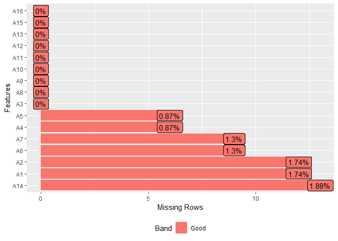
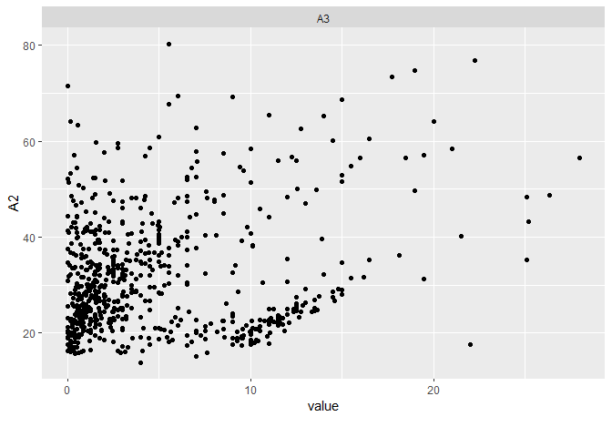
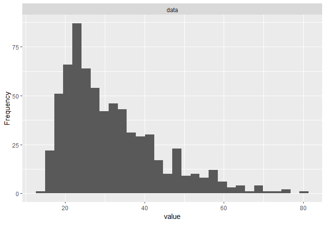
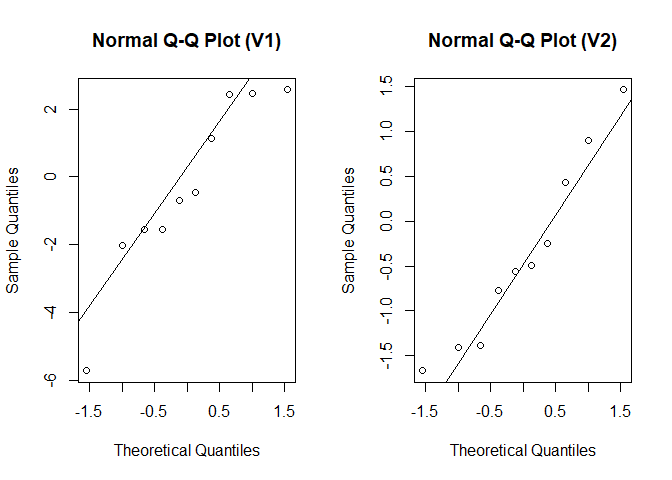

Chapter 2 Data Exploring and Normality
================
Oktsa Dwika Rahmashari
2023-10-20

# DATA EXPLORING AND NORMALITY TEST

## **DATA EXPLORING**

**Data Exploration by DataExplorer package**

``` r
library('DataExplorer')
```

    ## Warning: package 'DataExplorer' was built under R version 4.1.3

1.  **Importing data**

<!-- -->

    # Import Data
    file = ''
    data = read.csv(file)

**Explaination :**

file = ’ ’ is for the location of the data in the device.

**Example:**

``` r
data = read.csv("C:/Users/Avita/Documents/Multivariate-Analysis/Data/CreditApproval.csv", header = TRUE)

head(data)
```

    ##   A1    A2    A3 A4 A5 A6 A7   A8 A9 A10 A11 A12 A13 A14 A15 A16
    ## 1  b 30.83 0.000  u  g  w  v 1.25  t   t   1   f   g 202   0   +
    ## 2  a 58.67 4.460  u  g  q  h 3.04  t   t   6   f   g  43 560   +
    ## 3  a 24.50 0.500  u  g  q  h 1.50  t   f   0   f   g 280 824   +
    ## 4  b 27.83 1.540  u  g  w  v 3.75  t   t   5   t   g 100   3   +
    ## 5  b 20.17 5.625  u  g  w  v 1.71  t   f   0   f   s 120   0   +
    ## 6  b 32.08 4.000  u  g  m  v 2.50  t   f   0   t   g 360   0   +

2.  **Check the information about the data**

``` r
introduce(data)
```

    ##   rows columns discrete_columns continuous_columns all_missing_columns
    ## 1  690      16               10                  6                   0
    ##   total_missing_values complete_rows total_observations memory_usage
    ## 1                   67           653              11040        86304

``` r
miss_val = apply(is.na(data),2,which)
miss_val
```

    ## $A1
    ##  [1] 249 328 347 375 454 480 490 521 599 602 642 674
    ## 
    ## $A2
    ##  [1]  84  87  93  98 255 287 330 446 451 501 516 609
    ## 
    ## $A3
    ## integer(0)
    ## 
    ## $A4
    ## [1] 207 271 331 457 593 623
    ## 
    ## $A5
    ## [1] 207 271 331 457 593 623
    ## 
    ## $A6
    ## [1] 207 271 331 457 480 540 593 602 623
    ## 
    ## $A7
    ## [1] 207 271 331 457 480 540 593 602 623
    ## 
    ## $A8
    ## integer(0)
    ## 
    ## $A9
    ## integer(0)
    ## 
    ## $A10
    ## integer(0)
    ## 
    ## $A11
    ## integer(0)
    ## 
    ## $A12
    ## integer(0)
    ## 
    ## $A13
    ## integer(0)
    ## 
    ## $A14
    ##  [1]  72 203 207 244 271 279 331 407 446 457 593 623 627
    ## 
    ## $A15
    ## integer(0)
    ## 
    ## $A16
    ## integer(0)

3.  **Check the % of missing value for each variable**

``` r
plot_missing(data)
```

<!-- -->

4.  **Filter out the missing value**

``` r
library('tidyr')
```

    ## Warning: package 'tidyr' was built under R version 4.1.3

``` r
dataC = drop_na(data)
introduce(dataC)
```

    ##   rows columns discrete_columns continuous_columns all_missing_columns
    ## 1  653      16               10                  6                   0
    ##   total_missing_values complete_rows total_observations memory_usage
    ## 1                    0           653              10448        82024

5.  **Plotting the data**

<!-- -->

    # Bar Plot
    plot_bar(data[,c()])

    # Scatter Plot
    plot_scatterplot(data[,c()],by ='var')

    # Histogram Plot
    plot_histogram(data$var)
    # or
    plot_histogram(data[,''])

**Example**

``` r
# Bar Plot
plot_bar(data[,c('A1','A4','A5')])
```

<!-- -->

``` r
# Scatter Plot
plot_scatterplot(data[,c('A2','A3')],by ='A2')
```

    ## Warning: Removed 12 rows containing missing values (`geom_point()`).

<!-- -->

``` r
# Histogram Plot
plot_histogram(data$A2)
```

<!-- -->

``` r
# or
plot_histogram(data[,'A2'])
```

<!-- -->

6.  **Descriptive Statistics for each variable**

``` r
summary(data)
```

    ##       A1                  A2              A3              A4           
    ##  Length:690         Min.   :13.75   Min.   : 0.000   Length:690        
    ##  Class :character   1st Qu.:22.60   1st Qu.: 1.000   Class :character  
    ##  Mode  :character   Median :28.46   Median : 2.750   Mode  :character  
    ##                     Mean   :31.57   Mean   : 4.759                     
    ##                     3rd Qu.:38.23   3rd Qu.: 7.207                     
    ##                     Max.   :80.25   Max.   :28.000                     
    ##                     NA's   :12                                         
    ##       A5                 A6                 A7                  A8        
    ##  Length:690         Length:690         Length:690         Min.   : 0.000  
    ##  Class :character   Class :character   Class :character   1st Qu.: 0.165  
    ##  Mode  :character   Mode  :character   Mode  :character   Median : 1.000  
    ##                                                           Mean   : 2.223  
    ##                                                           3rd Qu.: 2.625  
    ##                                                           Max.   :28.500  
    ##                                                                           
    ##       A9                A10                 A11           A12           
    ##  Length:690         Length:690         Min.   : 0.0   Length:690        
    ##  Class :character   Class :character   1st Qu.: 0.0   Class :character  
    ##  Mode  :character   Mode  :character   Median : 0.0   Mode  :character  
    ##                                        Mean   : 2.4                     
    ##                                        3rd Qu.: 3.0                     
    ##                                        Max.   :67.0                     
    ##                                                                         
    ##      A13                 A14            A15               A16           
    ##  Length:690         Min.   :   0   Min.   :     0.0   Length:690        
    ##  Class :character   1st Qu.:  75   1st Qu.:     0.0   Class :character  
    ##  Mode  :character   Median : 160   Median :     5.0   Mode  :character  
    ##                     Mean   : 184   Mean   :  1017.4                     
    ##                     3rd Qu.: 276   3rd Qu.:   395.5                     
    ##                     Max.   :2000   Max.   :100000.0                     
    ##                     NA's   :13

## **MULTIVARIATE NORMAL DISTRIUBUTION**

### **A. Simulating Multivariate Normal Distribution**

``` r
# Installing Packages
library(MASS)
```

    ## Warning: package 'MASS' was built under R version 4.1.3

``` r
library(ggplot2)
library(MVN)
```

    ## Warning: package 'MVN' was built under R version 4.1.3

Here is the computation for simulating multivariate distribution

    # Input Part
    n = 
    mu = 
    sigma =
    tol =
    empirical =

    # Computation Part
    data = mvrnorm(n,mu,sigma)

**Explaination:**

- Ref:<https://www.rdocumentation.org/packages/rockchalk/versions/1.8.110/topics/mvrnorm>

- n =\> a number of samples.

- mu =\> a mean vector of variables. - sigma =\> a covariance matrix.

**Example:**

``` r
n = 10
mu = c(0,0)
sigma = matrix(c(10,3,3,2),2,2)
sigma
```

    ##      [,1] [,2]
    ## [1,]   10    3
    ## [2,]    3    2

``` r
set.seed(1)
data = mvrnorm(n,mu,sigma)
data
```

    ##             [,1]       [,2]
    ##  [1,]  2.4491581 -0.7771712
    ##  [2,] -0.4545410 -0.5624445
    ##  [3,]  2.4327905  1.4657752
    ##  [4,] -5.7197835  0.4279042
    ##  [5,] -0.6810376 -1.4127938
    ##  [6,]  2.5673342  0.9031423
    ##  [7,] -1.5387795 -0.4958605
    ##  [8,] -2.0246172 -1.6697631
    ##  [9,] -1.5519608 -1.3829634
    ## [10,]  1.1486902 -0.2431302

### **B. Normality Test for multivariate variables using ‘energy’**

Test H0: data is multivariate normal distribution vs H1: data is not
multivariate normal distribution For conclusion, we will reject H0 if
p-value \< 0.05

``` r
# computation part
# using multivariate plot to show the chi-square Q-Q plot
results = mvn(data, mvnTest = 'energy', multivariatePlot = 'qq') 
```

<!-- -->

``` r
results
```

    ## $multivariateNormality
    ##          Test Statistic p value MVN
    ## 1 E-statistic 0.8099054   0.096 YES
    ## 
    ## $univariateNormality
    ##               Test  Variable Statistic   p value Normality
    ## 1 Anderson-Darling  Column1     0.3999    0.2935    YES   
    ## 2 Anderson-Darling  Column2     0.2685    0.5982    YES   
    ## 
    ## $Descriptives
    ##    n       Mean  Std.Dev     Median       Min      Max      25th      75th
    ## 1 10 -0.3372747 2.602389 -0.5677893 -5.719783 2.567334 -1.548665 2.1117654
    ## 2 10 -0.3747305 1.036289 -0.5291525 -1.669763 1.465775 -1.231515 0.2601456
    ##         Skew  Kurtosis
    ## 1 -0.5312800 -0.717383
    ## 2  0.4000249 -1.301176

``` r
# using univariate plot
results_U = mvn(data, mvnTest = 'energy', univariatePlot = 'qqplot')
```

<!-- -->

``` r
results_U
```

    ## $multivariateNormality
    ##          Test Statistic p value MVN
    ## 1 E-statistic 0.8099054    0.09 YES
    ## 
    ## $univariateNormality
    ##               Test  Variable Statistic   p value Normality
    ## 1 Anderson-Darling  Column1     0.3999    0.2935    YES   
    ## 2 Anderson-Darling  Column2     0.2685    0.5982    YES   
    ## 
    ## $Descriptives
    ##    n       Mean  Std.Dev     Median       Min      Max      25th      75th
    ## 1 10 -0.3372747 2.602389 -0.5677893 -5.719783 2.567334 -1.548665 2.1117654
    ## 2 10 -0.3747305 1.036289 -0.5291525 -1.669763 1.465775 -1.231515 0.2601456
    ##         Skew  Kurtosis
    ## 1 -0.5312800 -0.717383
    ## 2  0.4000249 -1.301176
