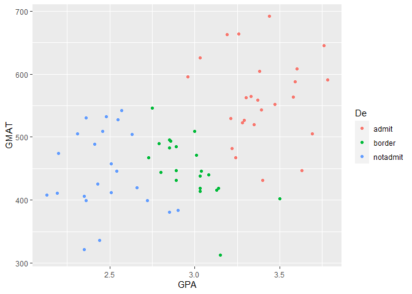

FINAL EXAMINATION GROUP
================
Oktsa Dwika Rahmashari
2023-10-24

# APPLICATION OF DISCRIMINANT ANALYSIS

\##import the data

``` r
url = 'http://www.biz.uiowa.edu/faculty/jledolter/DataMining/admission.csv' 
admit = read.csv(url)
```

## Explore the dataset

``` r
head(admit)
```

    ##    GPA GMAT    De
    ## 1 2.96  596 admit
    ## 2 3.14  473 admit
    ## 3 3.22  482 admit
    ## 4 3.29  527 admit
    ## 5 3.69  505 admit
    ## 6 3.46  693 admit

``` r
summary(admit)
```

    ##       GPA             GMAT            De           
    ##  Min.   :2.130   Min.   :313.0   Length:85         
    ##  1st Qu.:2.600   1st Qu.:425.0   Class :character  
    ##  Median :3.010   Median :482.0   Mode  :character  
    ##  Mean   :2.975   Mean   :488.4                     
    ##  3rd Qu.:3.300   3rd Qu.:538.0                     
    ##  Max.   :3.800   Max.   :693.0

\##Assumption of Normality

``` r
library(MVN)
```

    ## Warning: package 'MVN' was built under R version 4.1.3

``` r
par(mar = c(1, 1, 1, 1))

results = mvn(admit[,1:2],mvnTest = 'energy', multivariatePlot = 'qq') 
```

<!-- -->

``` r
results
```

    ## $multivariateNormality
    ##          Test Statistic p value MVN
    ## 1 E-statistic  1.053846    0.02  NO
    ## 
    ## $univariateNormality
    ##               Test  Variable Statistic   p value Normality
    ## 1 Anderson-Darling    GPA       0.5759    0.1307    YES   
    ## 2 Anderson-Darling   GMAT       0.4648    0.2483    YES   
    ## 
    ## $Descriptives
    ##       n       Mean    Std.Dev Median    Min   Max  25th  75th        Skew
    ## GPA  85   2.974588  0.4289954   3.01   2.13   3.8   2.6   3.3 -0.04826749
    ## GMAT 85 488.447059 81.5223466 482.00 313.00 693.0 425.0 538.0  0.38849916
    ##        Kurtosis
    ## GPA  -1.0091148
    ## GMAT -0.1362411

\##Assumption of Equal Variance - Covariance matrices

``` r
library("biotools")
```

    ## Warning: package 'biotools' was built under R version 4.1.3

    ## Loading required package: MASS

    ## Warning: package 'MASS' was built under R version 4.1.3

    ## ---
    ## biotools version 4.2

``` r
boxM(admit[ ,1:2],admit$De)
```

    ## 
    ##  Box's M-test for Homogeneity of Covariance Matrices
    ## 
    ## data:  admit[, 1:2]
    ## Chi-Sq (approx.) = 16.074, df = 6, p-value = 0.01336

\##Split the Data into Training Set(80%) and Test Set(20%)

``` r
library(tidyverse)
```

    ## Warning: package 'tidyverse' was built under R version 4.1.3

    ## Warning: package 'tibble' was built under R version 4.1.3

    ## Warning: package 'tidyr' was built under R version 4.1.3

    ## Warning: package 'readr' was built under R version 4.1.3

    ## Warning: package 'purrr' was built under R version 4.1.3

    ## Warning: package 'dplyr' was built under R version 4.1.3

    ## Warning: package 'stringr' was built under R version 4.1.3

    ## Warning: package 'forcats' was built under R version 4.1.3

    ## Warning: package 'lubridate' was built under R version 4.1.3

    ## -- Attaching core tidyverse packages ------------------------ tidyverse 2.0.0 --
    ## v dplyr     1.1.2     v readr     2.1.4
    ## v forcats   1.0.0     v stringr   1.5.0
    ## v ggplot2   3.4.3     v tibble    3.2.1
    ## v lubridate 1.9.2     v tidyr     1.3.0
    ## v purrr     1.0.1     
    ## -- Conflicts ------------------------------------------ tidyverse_conflicts() --
    ## x dplyr::filter() masks stats::filter()
    ## x dplyr::lag()    masks stats::lag()
    ## x dplyr::select() masks MASS::select()
    ## i Use the conflicted package (<http://conflicted.r-lib.org/>) to force all conflicts to become errors

``` r
library(caret)
```

    ## Warning: package 'caret' was built under R version 4.1.3

    ## Loading required package: lattice

    ## Warning: package 'lattice' was built under R version 4.1.3

    ## 
    ## Attaching package: 'caret'
    ## 
    ## The following object is masked from 'package:purrr':
    ## 
    ##     lift

``` r
set.seed(123)
training.samples <- admit$De %>% createDataPartition(p = 0.8, list = FALSE)

train.data <- admit[training.samples, ]
head(train.data)
```

    ##    GPA GMAT    De
    ## 1 2.96  596 admit
    ## 3 3.22  482 admit
    ## 4 3.29  527 admit
    ## 5 3.69  505 admit
    ## 7 3.03  626 admit
    ## 8 3.19  663 admit

``` r
test.data <- admit[-training.samples, ]
head(test.data)
```

    ##     GPA GMAT    De
    ## 2  3.14  473 admit
    ## 6  3.46  693 admit
    ## 12 3.40  553 admit
    ## 13 3.50  572 admit
    ## 16 3.48  528 admit
    ## 29 3.80  521 admit

``` r
library('DataExplorer')
```

    ## Warning: package 'DataExplorer' was built under R version 4.1.3

``` r
introduce(train.data)
```

    ##   rows columns discrete_columns continuous_columns all_missing_columns
    ## 1   69       3                1                  2                   0
    ##   total_missing_values complete_rows total_observations memory_usage
    ## 1                    0            69                207         3104

``` r
introduce(test.data)
```

    ##   rows columns discrete_columns continuous_columns all_missing_columns
    ## 1   16       3                1                  2                   0
    ##   total_missing_values complete_rows total_observations memory_usage
    ## 1                    0            16                 48         2040

``` r
ggplot(data = train.data)+
  geom_point(aes(GPA, GMAT, color = De))
```

<!-- -->

``` r
ggplot(data = test.data)+
  geom_point(aes(GPA, GMAT, color = De))
```

<!-- -->

\##Linear Discriminant Analysis (LDA Model)

``` r
model_LDA <- lda(De~., admit)
model_LDA
```

    ## Call:
    ## lda(De ~ ., data = admit)
    ## 
    ## Prior probabilities of groups:
    ##     admit    border  notadmit 
    ## 0.3647059 0.3058824 0.3294118 
    ## 
    ## Group means:
    ##               GPA     GMAT
    ## admit    3.403871 561.2258
    ## border   2.992692 446.2308
    ## notadmit 2.482500 447.0714
    ## 
    ## Coefficients of linear discriminants:
    ##              LD1         LD2
    ## GPA  5.008766354  1.87668220
    ## GMAT 0.008568593 -0.01445106
    ## 
    ## Proportion of trace:
    ##    LD1    LD2 
    ## 0.9673 0.0327

\##Prediction class

``` r
predictions <- model_LDA %>% predict(test.data)
predictions$class
```

    ##  [1] border   admit    admit    admit    admit    admit    notadmit notadmit
    ##  [9] notadmit notadmit notadmit border   border   border   border   border  
    ## Levels: admit border notadmit

\##Model accuracy

``` r
mean(predictions$class==test.data$De)
```

    ## [1] 0.9375

\##Adding predictions\$class

``` r
test.data$De_lda_predi = as.character(predictions$class)
head(test.data)
```

    ##     GPA GMAT    De De_lda_predi
    ## 2  3.14  473 admit       border
    ## 6  3.46  693 admit        admit
    ## 12 3.40  553 admit        admit
    ## 13 3.50  572 admit        admit
    ## 16 3.48  528 admit        admit
    ## 29 3.80  521 admit        admit

\##Adding actual class, predicted class

``` r
test.data$De_actual_predi = paste(test.data$De, test.data$De_lda_predi, sep=",")
head(test.data)
```

    ##     GPA GMAT    De De_lda_predi De_actual_predi
    ## 2  3.14  473 admit       border    admit,border
    ## 6  3.46  693 admit        admit     admit,admit
    ## 12 3.40  553 admit        admit     admit,admit
    ## 13 3.50  572 admit        admit     admit,admit
    ## 16 3.48  528 admit        admit     admit,admit
    ## 29 3.80  521 admit        admit     admit,admit

\##plot LDA

``` r
ggplot(data = test.data)+
  geom_point(aes(GPA, GMAT, color = De_actual_predi))
```

<!-- -->

\###Quadratic Discriminant Analysis (QDA)

``` r
library(MASS)
Model_QDA = qda(De~., train.data)
Model_QDA
```

    ## Call:
    ## qda(De ~ ., data = train.data)
    ## 
    ## Prior probabilities of groups:
    ##     admit    border  notadmit 
    ## 0.3623188 0.3043478 0.3333333 
    ## 
    ## Group means:
    ##               GPA     GMAT
    ## admit    3.389600 562.3200
    ## border   2.973333 450.9524
    ## notadmit 2.474348 444.3913

\##Prediction class

``` r
predictions = Model_QDA %>% predict(test.data)
predictions$class
```

    ##  [1] border   admit    admit    admit    admit    admit    notadmit notadmit
    ##  [9] notadmit notadmit notadmit border   border   border   border   border  
    ## Levels: admit border notadmit

\##Model accuracy

``` r
mean(predictions$class==test.data$De)
```

    ## [1] 0.9375

\##Adding predictions\$class

``` r
test.data$De_QDA_predi = as.character(predictions$class)
head(test.data)
```

    ##     GPA GMAT    De De_lda_predi De_actual_predi De_QDA_predi
    ## 2  3.14  473 admit       border    admit,border       border
    ## 6  3.46  693 admit        admit     admit,admit        admit
    ## 12 3.40  553 admit        admit     admit,admit        admit
    ## 13 3.50  572 admit        admit     admit,admit        admit
    ## 16 3.48  528 admit        admit     admit,admit        admit
    ## 29 3.80  521 admit        admit     admit,admit        admit

\#Adding actual class, predicted class

``` r
test.data$De_actual_predi = paste(test.data$De, test.data$De_QDA_predi, sep=",")
head(test.data)
```

    ##     GPA GMAT    De De_lda_predi De_actual_predi De_QDA_predi
    ## 2  3.14  473 admit       border    admit,border       border
    ## 6  3.46  693 admit        admit     admit,admit        admit
    ## 12 3.40  553 admit        admit     admit,admit        admit
    ## 13 3.50  572 admit        admit     admit,admit        admit
    ## 16 3.48  528 admit        admit     admit,admit        admit
    ## 29 3.80  521 admit        admit     admit,admit        admit

\##plot QDA

``` r
ggplot(data = test.data)+
  geom_point(aes(GPA, GMAT, color = De_actual_predi))
```

<!-- -->

# APPLICATION OF LOGISTIC REGRESSION

## PREPARING THE DATA

### Import Data

``` r
library(mlbench)
```

    ## Warning: package 'mlbench' was built under R version 4.1.3

``` r
data(PimaIndiansDiabetes2)
PID2 = PimaIndiansDiabetes2
head(PID2)
```

    ##   pregnant glucose pressure triceps insulin mass pedigree age diabetes
    ## 1        6     148       72      35      NA 33.6    0.627  50      pos
    ## 2        1      85       66      29      NA 26.6    0.351  31      neg
    ## 3        8     183       64      NA      NA 23.3    0.672  32      pos
    ## 4        1      89       66      23      94 28.1    0.167  21      neg
    ## 5        0     137       40      35     168 43.1    2.288  33      pos
    ## 6        5     116       74      NA      NA 25.6    0.201  30      neg

### Check Missing Value

``` r
library('DataExplorer')
introduce(PID2)
```

    ##   rows columns discrete_columns continuous_columns all_missing_columns
    ## 1  768       9                1                  8                   0
    ##   total_missing_values complete_rows total_observations memory_usage
    ## 1                  652           392               6912        55592

### Drop Missing Value

``` r
library(tidyverse)
PID2 = drop_na(PID2)
introduce(PID2)
```

    ##   rows columns discrete_columns continuous_columns all_missing_columns
    ## 1  392       9                1                  8                   0
    ##   total_missing_values complete_rows total_observations memory_usage
    ## 1                    0           392               3528        30024

### Exploring Data - Descriptive Statistics

``` r
summary(PID2)
```

    ##     pregnant         glucose         pressure         triceps     
    ##  Min.   : 0.000   Min.   : 56.0   Min.   : 24.00   Min.   : 7.00  
    ##  1st Qu.: 1.000   1st Qu.: 99.0   1st Qu.: 62.00   1st Qu.:21.00  
    ##  Median : 2.000   Median :119.0   Median : 70.00   Median :29.00  
    ##  Mean   : 3.301   Mean   :122.6   Mean   : 70.66   Mean   :29.15  
    ##  3rd Qu.: 5.000   3rd Qu.:143.0   3rd Qu.: 78.00   3rd Qu.:37.00  
    ##  Max.   :17.000   Max.   :198.0   Max.   :110.00   Max.   :63.00  
    ##     insulin            mass          pedigree           age        diabetes 
    ##  Min.   : 14.00   Min.   :18.20   Min.   :0.0850   Min.   :21.00   neg:262  
    ##  1st Qu.: 76.75   1st Qu.:28.40   1st Qu.:0.2697   1st Qu.:23.00   pos:130  
    ##  Median :125.50   Median :33.20   Median :0.4495   Median :27.00            
    ##  Mean   :156.06   Mean   :33.09   Mean   :0.5230   Mean   :30.86            
    ##  3rd Qu.:190.00   3rd Qu.:37.10   3rd Qu.:0.6870   3rd Qu.:36.00            
    ##  Max.   :846.00   Max.   :67.10   Max.   :2.4200   Max.   :81.00

### Split data into training (80%) and test (20%) data

``` r
set.seed(123)
library(caret)
theme_set(theme_classic())
```

#### Training data

``` r
training_samples = PID2$diabetes %>% createDataPartition (p=0.8, list=FALSE)
train_data = PID2[training_samples,]
head(train_data)
```

    ##    pregnant glucose pressure triceps insulin mass pedigree age diabetes
    ## 4         1      89       66      23      94 28.1    0.167  21      neg
    ## 5         0     137       40      35     168 43.1    2.288  33      pos
    ## 7         3      78       50      32      88 31.0    0.248  26      pos
    ## 9         2     197       70      45     543 30.5    0.158  53      pos
    ## 14        1     189       60      23     846 30.1    0.398  59      pos
    ## 15        5     166       72      19     175 25.8    0.587  51      pos

``` r
introduce(train_data)
```

    ##   rows columns discrete_columns continuous_columns all_missing_columns
    ## 1  314       9                1                  8                   0
    ##   total_missing_values complete_rows total_observations memory_usage
    ## 1                    0           314               2826        24720

#### Test data

``` r
test_data = PID2[-training_samples,]
head(test_data)
```

    ##    pregnant glucose pressure triceps insulin mass pedigree age diabetes
    ## 19        1     103       30      38      83 43.3    0.183  33      neg
    ## 21        3     126       88      41     235 39.3    0.704  27      neg
    ## 32        3     158       76      36     245 31.6    0.851  28      pos
    ## 55        7     150       66      42     342 34.7    0.718  42      neg
    ## 64        2     141       58      34     128 25.4    0.699  24      neg
    ## 71        2     100       66      20      90 32.9    0.867  28      pos

``` r
introduce(test_data)
```

    ##   rows columns discrete_columns continuous_columns all_missing_columns
    ## 1   78       9                1                  8                   0
    ##   total_missing_values complete_rows total_observations memory_usage
    ## 1                    0            78                702         8672

## LOGISTIC REGRESSION - FULL MODEL

``` r
library(MASS)
full_model = glm(diabetes ~., data= train_data, family = binomial)

summary(full_model)
```

    ## 
    ## Call:
    ## glm(formula = diabetes ~ ., family = binomial, data = train_data)
    ## 
    ## Deviance Residuals: 
    ##     Min       1Q   Median       3Q      Max  
    ## -2.5832  -0.6544  -0.3292   0.6248   2.5968  
    ## 
    ## Coefficients:
    ##               Estimate Std. Error z value Pr(>|z|)    
    ## (Intercept) -1.053e+01  1.440e+00  -7.317 2.54e-13 ***
    ## pregnant     1.005e-01  6.127e-02   1.640  0.10092    
    ## glucose      3.710e-02  6.486e-03   5.719 1.07e-08 ***
    ## pressure    -3.876e-04  1.383e-02  -0.028  0.97764    
    ## triceps      1.418e-02  1.998e-02   0.710  0.47800    
    ## insulin      5.940e-04  1.508e-03   0.394  0.69371    
    ## mass         7.997e-02  3.180e-02   2.515  0.01190 *  
    ## pedigree     1.329e+00  4.823e-01   2.756  0.00585 ** 
    ## age          2.718e-02  2.020e-02   1.346  0.17840    
    ## ---
    ## Signif. codes:  0 '***' 0.001 '**' 0.01 '*' 0.05 '.' 0.1 ' ' 1
    ## 
    ## (Dispersion parameter for binomial family taken to be 1)
    ## 
    ##     Null deviance: 398.80  on 313  degrees of freedom
    ## Residual deviance: 267.18  on 305  degrees of freedom
    ## AIC: 285.18
    ## 
    ## Number of Fisher Scoring iterations: 5

## LOGISTIC REGRESSION - STEPWISE MODEL

``` r
stepwise_model = glm(diabetes ~., data= train_data, family = binomial) %>% stepAIC(trace = FALSE)

summary(stepwise_model)
```

    ## 
    ## Call:
    ## glm(formula = diabetes ~ pregnant + glucose + mass + pedigree + 
    ##     age, family = binomial, data = train_data)
    ## 
    ## Deviance Residuals: 
    ##     Min       1Q   Median       3Q      Max  
    ## -2.6727  -0.6525  -0.3339   0.6247   2.6365  
    ## 
    ## Coefficients:
    ##               Estimate Std. Error z value Pr(>|z|)    
    ## (Intercept) -10.771093   1.301233  -8.278  < 2e-16 ***
    ## pregnant      0.099031   0.060971   1.624  0.10433    
    ## glucose       0.038136   0.005694   6.698 2.12e-11 ***
    ## mass          0.095122   0.024176   3.935 8.33e-05 ***
    ## pedigree      1.362203   0.479359   2.842  0.00449 ** 
    ## age           0.029564   0.019146   1.544  0.12257    
    ## ---
    ## Signif. codes:  0 '***' 0.001 '**' 0.01 '*' 0.05 '.' 0.1 ' ' 1
    ## 
    ## (Dispersion parameter for binomial family taken to be 1)
    ## 
    ##     Null deviance: 398.80  on 313  degrees of freedom
    ## Residual deviance: 267.79  on 308  degrees of freedom
    ## AIC: 279.79
    ## 
    ## Number of Fisher Scoring iterations: 5

There are 2 variable that donot reject H0 then we would to do one more
model

## LOGISTIC REGRESSION - NEW MODEL

``` r
New_model = glm(diabetes ~glucose+mass+pedigree, data= train_data, family = binomial)

summary(New_model)
```

    ## 
    ## Call:
    ## glm(formula = diabetes ~ glucose + mass + pedigree, family = binomial, 
    ##     data = train_data)
    ## 
    ## Deviance Residuals: 
    ##     Min       1Q   Median       3Q      Max  
    ## -2.5262  -0.6984  -0.3927   0.6445   2.5943  
    ## 
    ## Coefficients:
    ##              Estimate Std. Error z value Pr(>|z|)    
    ## (Intercept) -9.524661   1.159907  -8.212  < 2e-16 ***
    ## glucose      0.042445   0.005565   7.628 2.39e-14 ***
    ## mass         0.082817   0.022990   3.602 0.000315 ***
    ## pedigree     1.276572   0.463373   2.755 0.005870 ** 
    ## ---
    ## Signif. codes:  0 '***' 0.001 '**' 0.01 '*' 0.05 '.' 0.1 ' ' 1
    ## 
    ## (Dispersion parameter for binomial family taken to be 1)
    ## 
    ##     Null deviance: 398.80  on 313  degrees of freedom
    ## Residual deviance: 282.64  on 310  degrees of freedom
    ## AIC: 290.64
    ## 
    ## Number of Fisher Scoring iterations: 5

## COMPARE FULL, STEPWISE ,NEW MODEL

### Full Model

#### Prediction of Probability

``` r
prob_full = predict(full_model, test_data, type = "response")
head(prob_full)
```

    ##        19        21        32        55        64        71 
    ## 0.1926284 0.4852623 0.6625272 0.7986815 0.2780734 0.1458773

#### Predicted Class

``` r
predicted_full = ifelse(prob_full > 0.5, "pos", "neg")
predicted_full
```

    ##    19    21    32    55    64    71    72    74    98    99   108   111   115 
    ## "neg" "neg" "pos" "pos" "neg" "neg" "neg" "neg" "neg" "neg" "neg" "pos" "pos" 
    ##   128   154   182   215   216   224   229   260   293   297   313   316   326 
    ## "neg" "pos" "neg" "neg" "pos" "pos" "pos" "pos" "pos" "neg" "neg" "neg" "neg" 
    ##   357   369   376   385   386   393   394   410   429   447   450   453   468 
    ## "neg" "neg" "pos" "neg" "neg" "neg" "neg" "pos" "neg" "neg" "neg" "neg" "neg" 
    ##   470   477   487   541   542   546   552   555   556   562   563   564   577 
    ## "pos" "neg" "pos" "neg" "neg" "pos" "neg" "neg" "neg" "pos" "neg" "neg" "neg" 
    ##   589   592   595   600   609   610   621   634   666   673   674   681   683 
    ## "pos" "neg" "neg" "neg" "pos" "neg" "neg" "neg" "neg" "neg" "pos" "neg" "neg" 
    ##   694   697   699   710   716   717   719   722   731   733   734   746   766 
    ## "pos" "neg" "neg" "neg" "pos" "pos" "neg" "neg" "neg" "pos" "neg" "neg" "neg"

#### Accuracy

``` r
mean(predicted_full == test_data$diabetes)
```

    ## [1] 0.7564103

### Stepwise Model

#### Prediction of Probability

``` r
prob_stepwise = predict(stepwise_model, test_data, type = "response")
head(prob_stepwise)
```

    ##        19        21        32        55        64        71 
    ## 0.1977499 0.4567613 0.6328198 0.7618708 0.2463691 0.1650492

#### Predicted Class

``` r
predicted_stepwise = ifelse(prob_stepwise > 0.5, "pos", "neg")
predicted_stepwise
```

    ##    19    21    32    55    64    71    72    74    98    99   108   111   115 
    ## "neg" "neg" "pos" "pos" "neg" "neg" "neg" "neg" "neg" "neg" "neg" "pos" "pos" 
    ##   128   154   182   215   216   224   229   260   293   297   313   316   326 
    ## "neg" "pos" "neg" "neg" "pos" "pos" "pos" "pos" "pos" "neg" "neg" "neg" "neg" 
    ##   357   369   376   385   386   393   394   410   429   447   450   453   468 
    ## "neg" "neg" "pos" "neg" "neg" "neg" "neg" "pos" "neg" "neg" "neg" "neg" "neg" 
    ##   470   477   487   541   542   546   552   555   556   562   563   564   577 
    ## "pos" "neg" "neg" "neg" "neg" "pos" "neg" "neg" "neg" "pos" "neg" "neg" "neg" 
    ##   589   592   595   600   609   610   621   634   666   673   674   681   683 
    ## "pos" "neg" "neg" "neg" "pos" "neg" "neg" "neg" "neg" "neg" "pos" "neg" "neg" 
    ##   694   697   699   710   716   717   719   722   731   733   734   746   766 
    ## "pos" "pos" "neg" "neg" "pos" "pos" "neg" "neg" "neg" "pos" "neg" "neg" "neg"

#### Accuracy

``` r
mean(predicted_stepwise == test_data$diabetes)
```

    ## [1] 0.7820513

### NEW Model

#### Prediction of Probability

``` r
prob_New = predict(New_model, test_data, type = "response")
head(prob_New)
```

    ##        19        21        32        55        64        71 
    ## 0.2086204 0.4941976 0.7078530 0.6530271 0.3672377 0.1901986

#### Predicted Class

``` r
predicted_New = ifelse(prob_New > 0.5, "pos", "neg")
predicted_New
```

    ##    19    21    32    55    64    71    72    74    98    99   108   111   115 
    ## "neg" "neg" "pos" "pos" "neg" "neg" "neg" "neg" "neg" "neg" "neg" "pos" "pos" 
    ##   128   154   182   215   216   224   229   260   293   297   313   316   326 
    ## "neg" "pos" "neg" "neg" "pos" "neg" "pos" "pos" "pos" "neg" "neg" "neg" "neg" 
    ##   357   369   376   385   386   393   394   410   429   447   450   453   468 
    ## "neg" "neg" "pos" "neg" "neg" "neg" "neg" "pos" "neg" "neg" "neg" "neg" "neg" 
    ##   470   477   487   541   542   546   552   555   556   562   563   564   577 
    ## "pos" "neg" "pos" "neg" "neg" "pos" "neg" "neg" "neg" "pos" "neg" "neg" "neg" 
    ##   589   592   595   600   609   610   621   634   666   673   674   681   683 
    ## "pos" "neg" "neg" "neg" "pos" "neg" "neg" "neg" "neg" "neg" "pos" "neg" "neg" 
    ##   694   697   699   710   716   717   719   722   731   733   734   746   766 
    ## "neg" "pos" "neg" "neg" "pos" "pos" "neg" "neg" "neg" "pos" "neg" "neg" "neg"

#### Accuracy

``` r
mean(predicted_New == test_data$diabetes)
```

    ## [1] 0.7692308

Best Model is stepwise model

### Goodness of Fit (stepwise model)

``` r
library(performance)
performance_hosmer(stepwise_model, n_bins = 10)
```

    ## # Hosmer-Lemeshow Goodness-of-Fit Test
    ## 
    ##   Chi-squared: 4.416
    ##            df: 8    
    ##       p-value: 0.818

    ## Summary: model seems to fit well.

### Assumption and Diagnostic Checking (stepwise model)

``` r
library(tidyverse)
library(ggplot2)
library(broom)
theme_set(theme_classic())
```

#### Linearity

``` r
mydata = train_data %>% dplyr :: select_if(is.numeric)

probabilities_stepwise = predict(stepwise_model, train_data, type = "response")
logit_sw = log(probabilities_stepwise/(1 - probabilities_stepwise))
mydata2 = mydata %>% mutate(logit_sw) %>% gather(key = "predictors", value = "predictors.value",-logit_sw)

head(mydata2,10)
```

    ##      logit_sw predictors predictors.value
    ## 1  -3.7567257   pregnant                1
    ## 2   2.6455862   pregnant                0
    ## 3  -3.4441497   pregnant                3
    ## 4   1.6230501   pregnant                2
    ## 5   1.6851927   pregnant                1
    ## 6   0.8161168   pregnant                5
    ## 7  -0.2474418   pregnant                0
    ## 8  -1.3285851   pregnant                1
    ## 9   1.1068777   pregnant               11
    ## 10 -0.5641521   pregnant               10

``` r
ggplot(mydata2, aes(logit_sw,predictors.value)) + geom_point(size = 0.5, alpha = 0.5) + geom_smooth(method="loess") + theme_bw() + facet_wrap(~predictors,scales="free_y")
```

    ## `geom_smooth()` using formula = 'y ~ x'

<!-- -->

#### Influential Values (stepwise model)

``` r
model_sw_data = augment(stepwise_model) %>% mutate(index=1:n())

model_sw_data %>% top_n(3,.cooksd)
```

    ## # A tibble: 3 x 14
    ##   .rownames diabetes pregnant glucose  mass pedigree   age .fitted .resid   .hat
    ##   <chr>     <fct>       <dbl>   <dbl> <dbl>    <dbl> <dbl>   <dbl>  <dbl>  <dbl>
    ## 1 460       neg             9     134  25.9     0.46    81   0.715  -1.49 0.133 
    ## 2 488       neg             0     173  46.5     1.16    58   3.54   -2.67 0.0167
    ## 3 745       neg            13     153  40.6     1.17    39   2.97   -2.46 0.0246
    ## # i 4 more variables: .sigma <dbl>, .cooksd <dbl>, .std.resid <dbl>,
    ## #   index <int>

``` r
ggplot(model_sw_data,aes(index,.std.resid)) + geom_point(aes(color = diabetes),alpha = 5) + theme_bw()
```

<!-- -->

#### Multicolinearity (stepwise model)

``` r
library(car)
```

    ## Warning: package 'car' was built under R version 4.1.3

    ## Loading required package: carData

    ## Warning: package 'carData' was built under R version 4.1.3

    ## 
    ## Attaching package: 'car'

    ## The following object is masked from 'package:dplyr':
    ## 
    ##     recode

    ## The following object is masked from 'package:purrr':
    ## 
    ##     some

``` r
vif(stepwise_model)
```

    ## pregnant  glucose     mass pedigree      age 
    ## 1.852701 1.068065 1.063285 1.061509 1.805989

## ODD RATIO (stepwise model)

``` r
model.OR <- exp(stepwise_model$coefficients)
round(model.OR, 3)
```

    ## (Intercept)    pregnant     glucose        mass    pedigree         age 
    ##       0.000       1.104       1.039       1.100       3.905       1.030
