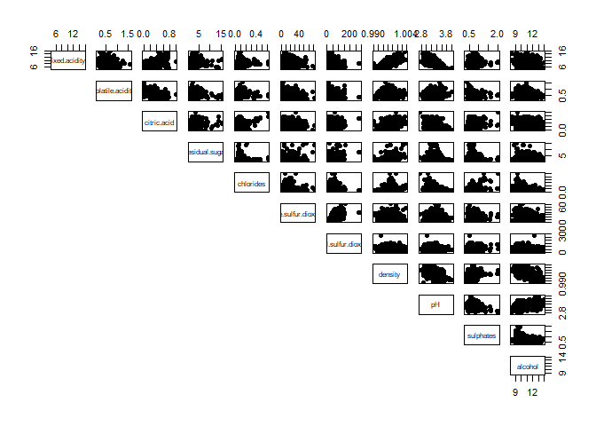
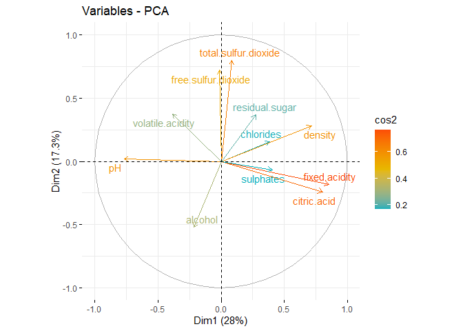
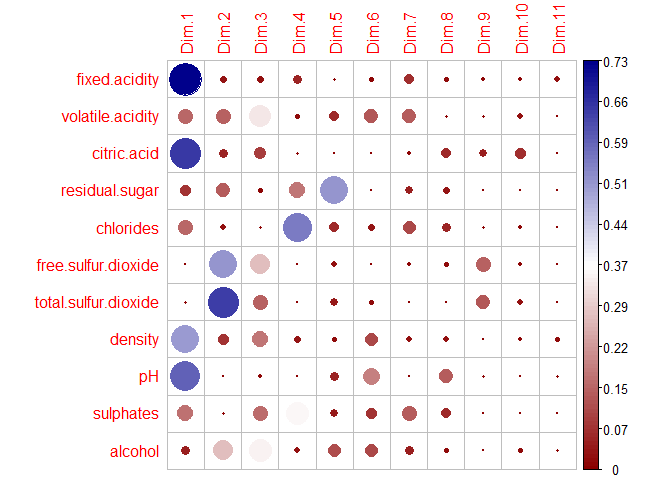
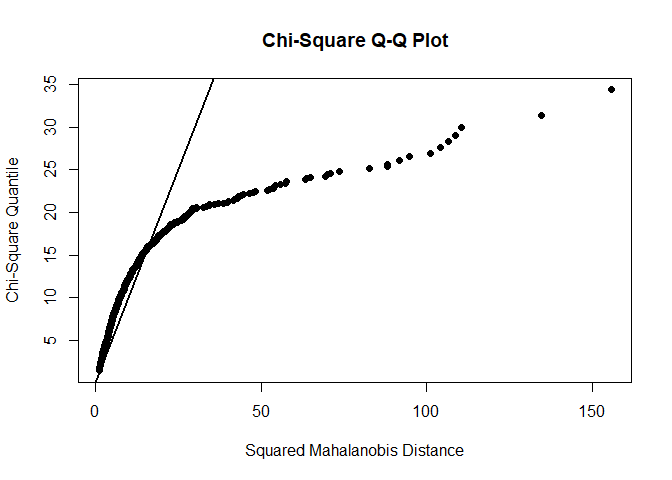
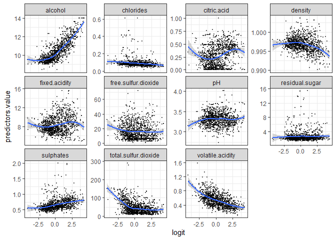
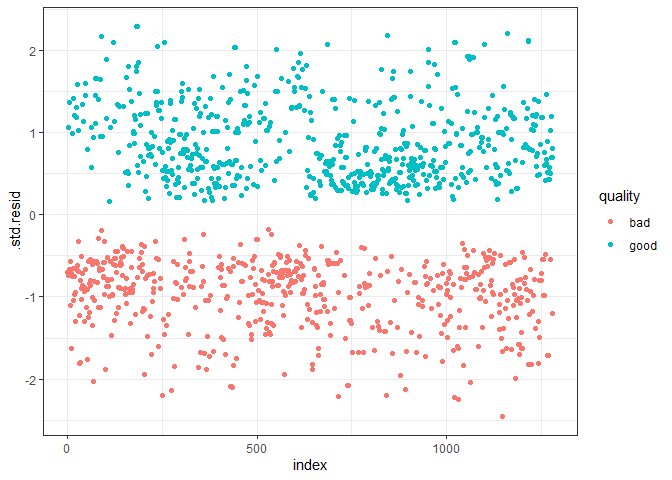
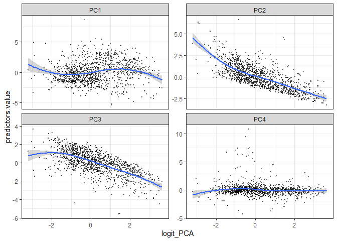
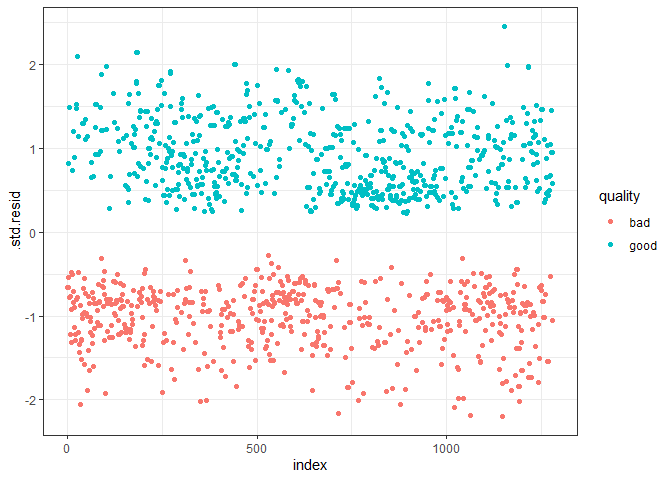

FINAL EXAMINATION INDIVIDUAL
================
Oktsa Dwika Rahmashari
2023-10-20

# FINAL EXAMINATION INDIVIDUAL

**Description**

1.  Application of Discriminant Analysis with PCA and without PCA

2.  Application of Logistic Regression with PCA and without PCA

For these application, I will use **Wine Quality Red Variants Data**,
the datasets are related to red variants of the Portuguese “Vinho Verde”
wine.

Source: <https://archive.ics.uci.edu/dataset/186/wine+quality>

# I. Data Pre-processing

## 1.1 Import the data

``` r
library('DataExplorer')
```

    ## Warning: package 'DataExplorer' was built under R version 4.1.3

``` r
file ='D:/KKU/COURSE/1ST SEM/MULTIVARIATE ANALYSIS/FINAL EXAMINATION/Individual/winequality_red.csv'
data = read.csv(file,sep=';')
head(data)
```

    ##   fixed.acidity volatile.acidity citric.acid residual.sugar chlorides
    ## 1           7.4             0.70        0.00            1.9     0.076
    ## 2           7.8             0.88        0.00            2.6     0.098
    ## 3           7.8             0.76        0.04            2.3     0.092
    ## 4          11.2             0.28        0.56            1.9     0.075
    ## 5           7.4             0.70        0.00            1.9     0.076
    ## 6           7.4             0.66        0.00            1.8     0.075
    ##   free.sulfur.dioxide total.sulfur.dioxide density   pH sulphates alcohol
    ## 1                  11                   34  0.9978 3.51      0.56     9.4
    ## 2                  25                   67  0.9968 3.20      0.68     9.8
    ## 3                  15                   54  0.9970 3.26      0.65     9.8
    ## 4                  17                   60  0.9980 3.16      0.58     9.8
    ## 5                  11                   34  0.9978 3.51      0.56     9.4
    ## 6                  13                   40  0.9978 3.51      0.56     9.4
    ##   quality
    ## 1       5
    ## 2       5
    ## 3       5
    ## 4       6
    ## 5       5
    ## 6       5

## 1.2 Encoding Quality

In this case, I use Quality as Classes or Labels. The quality will be
divided into 2 classes, quality value that less than or equal to 5
indicates bad wine and quality value greater than 5 indicates good wine.
Then re-code bad wine as 0 and good wine as 1.

``` r
data$quality <- ifelse(data$quality > 5,"good","bad")


head(data)
```

    ##   fixed.acidity volatile.acidity citric.acid residual.sugar chlorides
    ## 1           7.4             0.70        0.00            1.9     0.076
    ## 2           7.8             0.88        0.00            2.6     0.098
    ## 3           7.8             0.76        0.04            2.3     0.092
    ## 4          11.2             0.28        0.56            1.9     0.075
    ## 5           7.4             0.70        0.00            1.9     0.076
    ## 6           7.4             0.66        0.00            1.8     0.075
    ##   free.sulfur.dioxide total.sulfur.dioxide density   pH sulphates alcohol
    ## 1                  11                   34  0.9978 3.51      0.56     9.4
    ## 2                  25                   67  0.9968 3.20      0.68     9.8
    ## 3                  15                   54  0.9970 3.26      0.65     9.8
    ## 4                  17                   60  0.9980 3.16      0.58     9.8
    ## 5                  11                   34  0.9978 3.51      0.56     9.4
    ## 6                  13                   40  0.9978 3.51      0.56     9.4
    ##   quality
    ## 1     bad
    ## 2     bad
    ## 3     bad
    ## 4    good
    ## 5     bad
    ## 6     bad

## 1.3 Exploring the data

``` r
introduce(data)
```

    ##   rows columns discrete_columns continuous_columns all_missing_columns
    ## 1 1599      12                1                 11                   0
    ##   total_missing_values complete_rows total_observations memory_usage
    ## 1                    0          1599              19188       157112

Based on the output, we know that the data contains of 12 features and
1599 records with no missing value. There are 11 features as predictor
and 1 features as target or classes (quality).

**Check Missing Value**

``` r
miss_val = apply(is.na(data),2,which)
miss_val
```

    ## integer(0)

From the output above, we know that there is no missing value in the
data.

**Descriptive Statistics**

``` r
summary(data)
```

    ##  fixed.acidity   volatile.acidity  citric.acid    residual.sugar  
    ##  Min.   : 4.60   Min.   :0.1200   Min.   :0.000   Min.   : 0.900  
    ##  1st Qu.: 7.10   1st Qu.:0.3900   1st Qu.:0.090   1st Qu.: 1.900  
    ##  Median : 7.90   Median :0.5200   Median :0.260   Median : 2.200  
    ##  Mean   : 8.32   Mean   :0.5278   Mean   :0.271   Mean   : 2.539  
    ##  3rd Qu.: 9.20   3rd Qu.:0.6400   3rd Qu.:0.420   3rd Qu.: 2.600  
    ##  Max.   :15.90   Max.   :1.5800   Max.   :1.000   Max.   :15.500  
    ##    chlorides       free.sulfur.dioxide total.sulfur.dioxide    density      
    ##  Min.   :0.01200   Min.   : 1.00       Min.   :  6.00       Min.   :0.9901  
    ##  1st Qu.:0.07000   1st Qu.: 7.00       1st Qu.: 22.00       1st Qu.:0.9956  
    ##  Median :0.07900   Median :14.00       Median : 38.00       Median :0.9968  
    ##  Mean   :0.08747   Mean   :15.87       Mean   : 46.47       Mean   :0.9967  
    ##  3rd Qu.:0.09000   3rd Qu.:21.00       3rd Qu.: 62.00       3rd Qu.:0.9978  
    ##  Max.   :0.61100   Max.   :72.00       Max.   :289.00       Max.   :1.0037  
    ##        pH          sulphates         alcohol        quality         
    ##  Min.   :2.740   Min.   :0.3300   Min.   : 8.40   Length:1599       
    ##  1st Qu.:3.210   1st Qu.:0.5500   1st Qu.: 9.50   Class :character  
    ##  Median :3.310   Median :0.6200   Median :10.20   Mode  :character  
    ##  Mean   :3.311   Mean   :0.6581   Mean   :10.42                     
    ##  3rd Qu.:3.400   3rd Qu.:0.7300   3rd Qu.:11.10                     
    ##  Max.   :4.010   Max.   :2.0000   Max.   :14.90

Output above shows the descriptive statistics of the data.

- fixed.acidity has mean value 8.32, minimum value 4.60, and maximum
  value 15.90.

- volatile.acidity has mean value 0.5200, minimum value 0.1200, and
  maximum value 1.5800.

- citric.acid has mean value 0.271, minimum value 0, and maximum value

  1.  

- residual.sugar has mean value 2.539, minimum value 0.900, and maximum
  value 15.500.

- chlorides has mean value 0.08747, minimum value 0.01200, and maximum
  value 0.61100.

- free.sulfur.dioxide has mean value 15.87, minimum value 1, and maximum
  value 72.

- total.sulfur.dioxide has mean value 46.47, minimum value 6, and
  maximum value 289.

- density has mean value 0.9967, minimum value 0.9901, and maximum value
  1.0037.

- pH has mean value 3.311, minimum value 2.740, and maximum value 4.010

- sulphates has mean value 0.6581, minimum value 0.3300, and maximum
  value 2.0000.

- alchohol has mean value 10.42, minimum value 8.40, and maximum value
  14.90.

## 1.4 Split the data into Train data and Test data

Let 80% of the data be a train data and 20% of the data be a test data.

``` r
### Split data into training (80%) and test (20%) data

set.seed(100)
library(tidyverse)
```

    ## Warning: package 'tidyverse' was built under R version 4.1.3

    ## Warning: package 'tibble' was built under R version 4.1.3

    ## Warning: package 'tidyr' was built under R version 4.1.3

    ## Warning: package 'readr' was built under R version 4.1.3

    ## Warning: package 'purrr' was built under R version 4.1.3

    ## Warning: package 'dplyr' was built under R version 4.1.3

    ## Warning: package 'stringr' was built under R version 4.1.3

    ## Warning: package 'forcats' was built under R version 4.1.3

    ## Warning: package 'lubridate' was built under R version 4.1.3

    ## -- Attaching core tidyverse packages ------------------------ tidyverse 2.0.0 --
    ## v dplyr     1.1.2     v readr     2.1.4
    ## v forcats   1.0.0     v stringr   1.5.0
    ## v ggplot2   3.4.3     v tibble    3.2.1
    ## v lubridate 1.9.2     v tidyr     1.3.0
    ## v purrr     1.0.1     
    ## -- Conflicts ------------------------------------------ tidyverse_conflicts() --
    ## x dplyr::filter() masks stats::filter()
    ## x dplyr::lag()    masks stats::lag()
    ## i Use the conflicted package (<http://conflicted.r-lib.org/>) to force all conflicts to become errors

``` r
library(caret)
```

    ## Warning: package 'caret' was built under R version 4.1.3

    ## Loading required package: lattice

    ## Warning: package 'lattice' was built under R version 4.1.3

    ## 
    ## Attaching package: 'caret'
    ## 
    ## The following object is masked from 'package:purrr':
    ## 
    ##     lift

``` r
theme_set(theme_classic())

#### Train data
training_samples = data$quality %>% createDataPartition (p=0.8, list=FALSE)
train_data = data[training_samples,]

#### Test data
test_data = data[-training_samples,]
```

**Train data**

``` r
introduce(train_data)
```

    ##   rows columns discrete_columns continuous_columns all_missing_columns
    ## 1 1280      12                1                 11                   0
    ##   total_missing_values complete_rows total_observations memory_usage
    ## 1                    0          1280              15360       126488

The train data consists of 1280 records.

Then split the train data based on the predictor variable and target
variable.

``` r
x_train = train_data[,1:11]
y_train = train_data[,12]
```

``` r
head(x_train)
```

    ##   fixed.acidity volatile.acidity citric.acid residual.sugar chlorides
    ## 1           7.4             0.70        0.00            1.9     0.076
    ## 2           7.8             0.88        0.00            2.6     0.098
    ## 4          11.2             0.28        0.56            1.9     0.075
    ## 5           7.4             0.70        0.00            1.9     0.076
    ## 7           7.9             0.60        0.06            1.6     0.069
    ## 9           7.8             0.58        0.02            2.0     0.073
    ##   free.sulfur.dioxide total.sulfur.dioxide density   pH sulphates alcohol
    ## 1                  11                   34  0.9978 3.51      0.56     9.4
    ## 2                  25                   67  0.9968 3.20      0.68     9.8
    ## 4                  17                   60  0.9980 3.16      0.58     9.8
    ## 5                  11                   34  0.9978 3.51      0.56     9.4
    ## 7                  15                   59  0.9964 3.30      0.46     9.4
    ## 9                   9                   18  0.9968 3.36      0.57     9.5

``` r
head(y_train)
```

    ## [1] "bad"  "bad"  "good" "bad"  "bad"  "good"

**Test data**

``` r
introduce(test_data)
```

    ##   rows columns discrete_columns continuous_columns all_missing_columns
    ## 1  319      12                1                 11                   0
    ##   total_missing_values complete_rows total_observations memory_usage
    ## 1                    0           319               3828        34232

The test data consists of 319 records.

Then split the test data based on the predictor variable and target
variable.

``` r
x_test = test_data[,1:11]
y_test = test_data[,12]

head(x_test)
```

    ##    fixed.acidity volatile.acidity citric.acid residual.sugar chlorides
    ## 3            7.8             0.76        0.04            2.3     0.092
    ## 6            7.4             0.66        0.00            1.8     0.075
    ## 8            7.3             0.65        0.00            1.2     0.065
    ## 23           7.9             0.43        0.21            1.6     0.106
    ## 25           6.9             0.40        0.14            2.4     0.085
    ## 27           7.6             0.41        0.24            1.8     0.080
    ##    free.sulfur.dioxide total.sulfur.dioxide density   pH sulphates alcohol
    ## 3                   15                   54  0.9970 3.26      0.65     9.8
    ## 6                   13                   40  0.9978 3.51      0.56     9.4
    ## 8                   15                   21  0.9946 3.39      0.47    10.0
    ## 23                  10                   37  0.9966 3.17      0.91     9.5
    ## 25                  21                   40  0.9968 3.43      0.63     9.7
    ## 27                   4                   11  0.9962 3.28      0.59     9.5

``` r
head(y_test)
```

    ## [1] "bad"  "bad"  "good" "bad"  "good" "bad"

# II. PCA

## 2.1 Check Correlation

``` r
pairs(x_train, pch = 19, lower.panel = NULL)
```

<!-- -->

Two variables have linear correlation if we can draw a diagonal line in
the graph. From the output, we can see some of pairs have linear
correlation, such as density and fixed.acidity have positive
correlation, citric.acid and fixed.acidity have positive correlation, pH
and fixed.acidity have negative correlation, and etc.

## 2.2 Apply PCA

``` r
res.pca = prcomp(x_train,scale=TRUE)
```

Build the principle components using all predictor features of the train
data.

### 2.2.1 Summary

``` r
summary(res.pca)
```

    ## Importance of components:
    ##                           PC1    PC2    PC3    PC4     PC5     PC6     PC7
    ## Standard deviation     1.7539 1.3807 1.2548 1.1071 0.97013 0.81574 0.77155
    ## Proportion of Variance 0.2796 0.1733 0.1431 0.1114 0.08556 0.06049 0.05412
    ## Cumulative Proportion  0.2796 0.4530 0.5961 0.7075 0.79307 0.85356 0.90768
    ##                            PC8     PC9    PC10    PC11
    ## Standard deviation     0.65115 0.58894 0.43217 0.24064
    ## Proportion of Variance 0.03854 0.03153 0.01698 0.00526
    ## Cumulative Proportion  0.94622 0.97776 0.99474 1.00000

The output above show the standard deviation, proportion of variance,
and cumulative proportion of each Principle Components. There are 11 PC
for this data because we have 11 predictor features.

### 2.2.2 Eigen Vector

``` r
res.pca$rotation
```

    ##                               PC1         PC2         PC3         PC4
    ## fixed.acidity         0.488367966 -0.13191403  0.13331721 -0.21088406
    ## volatile.acidity     -0.218981938  0.27055752  0.45915281  0.12647341
    ## citric.acid           0.458256636 -0.17484306 -0.24302495 -0.08081655
    ## residual.sugar        0.158561963  0.26541428 -0.09231264 -0.37778989
    ## chlorides             0.219644287  0.11222987  0.07042020  0.67147770
    ## free.sulfur.dioxide  -0.007024987  0.52252026 -0.41547746 -0.04320024
    ## total.sulfur.dioxide  0.049093091  0.57887359 -0.30107908 -0.03429571
    ## density               0.408124129  0.20375488  0.33142193 -0.16489099
    ## pH                   -0.438527175  0.01564177 -0.08457128 -0.01714421
    ## sulphates             0.230991824 -0.04814141 -0.31501588  0.53921969
    ## alcohol              -0.124382056 -0.37892819 -0.46836474 -0.13457446
    ##                              PC5           PC6         PC7          PC8
    ## fixed.acidity         0.07997811 -1.415264e-01 -0.34240565  0.186504511
    ## volatile.acidity     -0.25273786 -4.403753e-01 -0.47753148  0.110937002
    ## citric.acid           0.05931548 -5.847008e-02  0.12834234  0.375499869
    ## residual.sugar       -0.73876842 -9.913068e-05  0.27916021 -0.291962097
    ## chlorides            -0.26111269 -2.187653e-01  0.41755034  0.350470737
    ## free.sulfur.dioxide   0.16997164 -2.113982e-02 -0.11753138  0.197793818
    ## total.sulfur.dioxide  0.20144187 -1.653855e-01 -0.07068539  0.004222832
    ## density              -0.14246485  3.945603e-01 -0.21472789  0.231431318
    ## pH                   -0.24237755  5.306449e-01 -0.07597954  0.566542094
    ## sulphates            -0.20491601  3.385631e-01 -0.48124046 -0.379104484
    ## alcohol              -0.34892302 -3.937979e-01 -0.28928914  0.215514405
    ##                              PC9         PC10         PC11
    ## fixed.acidity         0.18531845 -0.244764220  0.639644910
    ## volatile.acidity     -0.12601061  0.371431898 -0.006180462
    ## citric.acid          -0.36638180  0.623757462 -0.078232612
    ## residual.sugar        0.01748560  0.095237168  0.186653696
    ## chlorides             0.12257764 -0.230526449  0.043996439
    ## free.sulfur.dioxide   0.63992982  0.240160487 -0.054543107
    ## total.sulfur.dioxide -0.60122021 -0.362846706  0.067834437
    ## density               0.02276294 -0.237407076 -0.567773053
    ## pH                   -0.14967487 -0.007475627  0.332371606
    ## sulphates            -0.06762381  0.111824862  0.072982166
    ## alcohol               0.04173896 -0.304278314 -0.319656970

Output above shows the Eigen Vector between the PC and original
Features.

### 2.2.3 Eigen Value

``` r
eigen_value = (res.pca$sdev)^2
eigen_value
```

    ##  [1] 3.07605758 1.90637608 1.57445446 1.22570632 0.94115197 0.66543282
    ##  [7] 0.59529654 0.42399135 0.34685302 0.18677411 0.05790574

``` r
sum(eigen_value)
```

    ## [1] 11

Output above shows the Eigen Value of the PC and the summation of the
eigen value is equal to the number of features, which has 11 features.

## 2.3 Correlation Circle

``` r
library("factoextra")
```

    ## Warning: package 'factoextra' was built under R version 4.1.3

    ## Welcome! Want to learn more? See two factoextra-related books at https://goo.gl/ve3WBa

``` r
var = get_pca_var(res.pca)
var
```

    ## Principal Component Analysis Results for variables
    ##  ===================================================
    ##   Name       Description                                    
    ## 1 "$coord"   "Coordinates for the variables"                
    ## 2 "$cor"     "Correlations between variables and dimensions"
    ## 3 "$cos2"    "Cos2 for the variables"                       
    ## 4 "$contrib" "contributions of the variables"

``` r
fviz_pca_var(res.pca,col.var = "cos2",              
             gradient.cols = c("#00AFBB","#E7B800","#FC4E07"),             
             repel = TRUE #avoid text overlapping             
)
```

<!-- -->

From the correlation circle of variable and PC, we know that pH is good
represented by PC1. Sulphates, fixed.acidity, citric.acid, density,
chlorides, and volatile.acidity are quite good represented by PC1.
Alcohol, residual.sugar, free.sulfur.dioxide, and total.sulfur.dioxide
are quire good represented by PC2

## 2.4 Correlation plot

``` r
library("corrplot") 
```

    ## Warning: package 'corrplot' was built under R version 4.1.3

    ## corrplot 0.92 loaded

``` r
corrplot(var$cos2, is.corr = FALSE, col = colorRampPalette(c("darkred","white","darkblue"))(100))
```

<!-- -->

From the correlation plot, we know that

- fixed.acidity, citric.acid, density, and pH are quite good represented
  by PC1

- free.sulfur.dioxide and total.sulfur.dioxide are quite good
  represented by PC2

- volatile.acidity and alcohol are quite good represented by PC3

- chlorides and sulphates are quite good represented by PC4

- residual.sugar is quite good represented by PC5

## 2.5 Selecting PC

Using mean of Eigen Value

``` r
res_eig = get_eigenvalue(res.pca)
mean(res_eig$eigenvalue)
```

    ## [1] 1

The mean of Eigen Value is 1. So, we will choose PC with Eigen Value is
greater than 1.

``` r
res_eig$eigenvalue >= 1
```

    ##  [1]  TRUE  TRUE  TRUE  TRUE FALSE FALSE FALSE FALSE FALSE FALSE FALSE

### 2.5.1 Conclusion of Selecting PC

Since, PC1, PC2, PC3, and PC4 have eigen value greater than 1, then we
select PC1, PC2, PC3, and PC4 to be used in the Classification Analysis.

# III. Discriminant Analysis

Before doing the discriminant analysis, we should check the Assumptions.

## 3.1 Assumption Checking

### 3.1.1 Normality

``` r
library(MVN)
```

    ## Warning: package 'MVN' was built under R version 4.1.3

``` r
results = mvn(data[,1:11],mvnTest = 'energy', multivariatePlot = 'qq')
```

<!-- -->

``` r
results
```

    ## $multivariateNormality
    ##          Test Statistic p value MVN
    ## 1 E-statistic  41.74653       0  NO
    ## 
    ## $univariateNormality
    ##                Test             Variable Statistic   p value Normality
    ## 1  Anderson-Darling    fixed.acidity       28.1430  <0.001      NO    
    ## 2  Anderson-Darling   volatile.acidity      5.6831  <0.001      NO    
    ## 3  Anderson-Darling     citric.acid        17.5421  <0.001      NO    
    ## 4  Anderson-Darling    residual.sugar     188.0644  <0.001      NO    
    ## 5  Anderson-Darling      chlorides        210.4492  <0.001      NO    
    ## 6  Anderson-Darling free.sulfur.dioxide    38.6099  <0.001      NO    
    ## 7  Anderson-Darling total.sulfur.dioxide   52.4887  <0.001      NO    
    ## 8  Anderson-Darling       density           3.8676  <0.001      NO    
    ## 9  Anderson-Darling          pH             1.8641   1e-04      NO    
    ## 10 Anderson-Darling      sulphates         46.9322  <0.001      NO    
    ## 11 Anderson-Darling       alcohol          34.9171  <0.001      NO    
    ## 
    ## $Descriptives
    ##                         n        Mean      Std.Dev   Median     Min       Max
    ## fixed.acidity        1599  8.31963727  1.741096318  7.90000 4.60000  15.90000
    ## volatile.acidity     1599  0.52782051  0.179059704  0.52000 0.12000   1.58000
    ## citric.acid          1599  0.27097561  0.194801137  0.26000 0.00000   1.00000
    ## residual.sugar       1599  2.53880550  1.409928060  2.20000 0.90000  15.50000
    ## chlorides            1599  0.08746654  0.047065302  0.07900 0.01200   0.61100
    ## free.sulfur.dioxide  1599 15.87492183 10.460156970 14.00000 1.00000  72.00000
    ## total.sulfur.dioxide 1599 46.46779237 32.895324478 38.00000 6.00000 289.00000
    ## density              1599  0.99674668  0.001887334  0.99675 0.99007   1.00369
    ## pH                   1599  3.31111320  0.154386465  3.31000 2.74000   4.01000
    ## sulphates            1599  0.65814884  0.169506980  0.62000 0.33000   2.00000
    ## alcohol              1599 10.42298311  1.065667582 10.20000 8.40000  14.90000
    ##                         25th      75th       Skew   Kurtosis
    ## fixed.acidity         7.1000  9.200000 0.98090840  1.1196987
    ## volatile.acidity      0.3900  0.640000 0.67033307  1.2126893
    ## citric.acid           0.0900  0.420000 0.31774029 -0.7930455
    ## residual.sugar        1.9000  2.600000 4.53213992 28.4850200
    ## chlorides             0.0700  0.090000 5.66969370 41.5259635
    ## free.sulfur.dioxide   7.0000 21.000000 1.24822199  2.0072212
    ## total.sulfur.dioxide 22.0000 62.000000 1.51268904  3.7856764
    ## density               0.9956  0.997835 0.07115397  0.9225000
    ## pH                    3.2100  3.400000 0.19332027  0.7959191
    ## sulphates             0.5500  0.730000 2.42411764 11.6615285
    ## alcohol               9.5000 11.100000 0.85921442  0.1916586

**Hypotheses :**

H0 = data normally distributed

H1 = data is not normally distributed

**Significant Level**

alpha = 0.05

**Comparison**

Reject H0 if p-value \< alpha

**Conclusion:**

Since p-value is less than 0.05, then reject H0. So we can conclude that
data is not multivariate normal distribution. ***But, for this case I
assumed that data is normally distributed*** because the data has large
size (n\>30) and using Central Limit Theorem, we can assume that the
data is normally distributed.

### 3.1.2 Equality of Variance

``` r
library("biotools")
```

    ## Warning: package 'biotools' was built under R version 4.1.3

    ## Loading required package: MASS

    ## Warning: package 'MASS' was built under R version 4.1.3

    ## 
    ## Attaching package: 'MASS'

    ## The following object is masked from 'package:dplyr':
    ## 
    ##     select

    ## ---
    ## biotools version 4.2

``` r
boxM(data[,1:11],data[,12])
```

    ## 
    ##  Box's M-test for Homogeneity of Covariance Matrices
    ## 
    ## data:  data[, 1:11]
    ## Chi-Sq (approx.) = 591.07, df = 66, p-value < 2.2e-16

**Hypotheses**

H0 : Cov matrix of bad quality wine = Cov matrix of good quality wine

H1 : Cov matrix of bad quality wine != Cov matrix of good quality wine

**Significant Level**

alpha = 0.05

**Comparison**

Reject H0 if p-value \< alpha

**Conclusion**

Since p-value \< 0.05, then reject H0. So we can conclude that
Covariance matrix of bad wine quality and good wine quality are not
equal.

So, we will use **Quadratic discriminant analysis** (**QDA**)

## 3.2 Discriminant Analysis without PCA

**Quadratic discriminant analysis** (**QDA**)

``` r
library(MASS)
Model_QDA = qda(quality~., train_data)
Model_QDA
```

    ## Call:
    ## qda(quality ~ ., data = train_data)
    ## 
    ## Prior probabilities of groups:
    ##      bad     good 
    ## 0.465625 0.534375 
    ## 
    ## Group means:
    ##      fixed.acidity volatile.acidity citric.acid residual.sugar  chlorides
    ## bad       8.085403         0.589203   0.2366611       2.536997 0.09287416
    ## good      8.504532         0.476864   0.3035819       2.572734 0.08336988
    ##      free.sulfur.dioxide total.sulfur.dioxide  density       pH sulphates
    ## bad             16.42450             54.91191 0.997037 3.312500 0.6219631
    ## good            15.51974             39.97368 0.996524 3.310599 0.6946345
    ##       alcohol
    ## bad   9.90948
    ## good 10.85770

**Prior probabilities of group:** These represent the proportions of
each quality in the training set. From the output, we know that 53.4% of
all records in training set were good quality wine and 46.6% of all
records in training set were bad quality wine

**Group means:** These display the mean values for each predictor
variable for each quality.

## 3.3 Discriminant Analysis with PCA

### 3.3.1 Prepare the PC value

``` r
train_pcs = as.data.frame(res.pca$x)
head(train_pcs)
```

    ##          PC1        PC2        PC3         PC4         PC5         PC6
    ## 1 -1.6033032  0.4711211  1.7451930  0.07460560 -0.06660042  0.92930540
    ## 2 -0.7213649  1.8489322  0.9657790  0.64364775 -0.06150729 -1.00535838
    ## 4  2.3424814 -0.3640987 -0.1954135 -0.94883357  1.50428042  0.08402494
    ## 5 -1.6033032  0.4711211  1.7451930  0.07460560 -0.06660042  0.92930540
    ## 7 -1.0767702  0.6506900  1.1305260 -0.31805857  1.07139296 -0.18946834
    ## 9 -1.1152209 -0.2860186  1.5036149  0.01276791  0.22654940  0.54686420
    ##          PC7        PC8         PC9        PC10        PC11
    ## 1 -0.2539203  0.2935428  0.01630042 -0.27311553  0.04252312
    ## 2 -0.8936473 -0.6930744  0.50798755  0.04499798 -0.13890749
    ## 4  0.3283533  0.4321666 -0.10516228 -0.12147234  0.34404842
    ## 5 -0.2539203  0.2935428  0.01630042 -0.27311553  0.04252312
    ## 7  0.2785158 -0.2209984  0.01973064 -0.40376490  0.12283565
    ## 9  0.1779077 -0.4481324  0.39798838 -0.25138153  0.12949011

``` r
train_pcs = cbind(train_pcs[,1:4],y_train)
colnames(train_pcs)[5] <- "quality" 
head(train_pcs)
```

    ##          PC1        PC2        PC3         PC4 quality
    ## 1 -1.6033032  0.4711211  1.7451930  0.07460560     bad
    ## 2 -0.7213649  1.8489322  0.9657790  0.64364775     bad
    ## 4  2.3424814 -0.3640987 -0.1954135 -0.94883357    good
    ## 5 -1.6033032  0.4711211  1.7451930  0.07460560     bad
    ## 7 -1.0767702  0.6506900  1.1305260 -0.31805857     bad
    ## 9 -1.1152209 -0.2860186  1.5036149  0.01276791    good

Based on PC selection in previous section, now we only have 4 variable
predictors using Principle Components (PC1, PC2, PC3, and PC4) for QDA
analysis.

### **3.3.2 QDA with PCA**

``` r
Model_QDA_PCA = qda(quality~., train_pcs)

Model_QDA_PCA
```

    ## Call:
    ## qda(quality ~ ., data = train_pcs)
    ## 
    ## Prior probabilities of groups:
    ##      bad     good 
    ## 0.465625 0.534375 
    ## 
    ## Group means:
    ##             PC1       PC2        PC3         PC4
    ## bad  -0.1259406  0.530022  0.4368443  0.06714251
    ## good  0.1097377 -0.461832 -0.3806421 -0.05850429

From the output, we know that 53.4% of all records in training set were
good quality wine and 46.6% of all records in training set were bad
quality wine.

## 3.4 Compare Discriminant Analysis with and without PCA

### 3.4.1 Predict Classes of Test Data using QDA without PCA

First, we predict the wine quality for test data by using QDA model
without PCA

#### 3.4.1.1 Predicting Wine Quality

``` r
predictions_QDA = predict(Model_QDA,x_test)
head(predictions_QDA$class)
```

    ## [1] bad  bad  bad  bad  good bad 
    ## Levels: bad good

The output above shows the predicted wine quality of test data using QDA
without PCA model. Then we make the confusion matrix and calculate the
accuracy to know the performance of this model.

#### 3.4.1.2 Accuracy of QDA without PCA

``` r
confusionMatrix(predictions_QDA$class, as.factor(y_test))
```

    ## Confusion Matrix and Statistics
    ## 
    ##           Reference
    ## Prediction bad good
    ##       bad   88   26
    ##       good  60  145
    ##                                           
    ##                Accuracy : 0.7304          
    ##                  95% CI : (0.6781, 0.7783)
    ##     No Information Rate : 0.5361          
    ##     P-Value [Acc > NIR] : 8.086e-13       
    ##                                           
    ##                   Kappa : 0.4495          
    ##                                           
    ##  Mcnemar's Test P-Value : 0.000373        
    ##                                           
    ##             Sensitivity : 0.5946          
    ##             Specificity : 0.8480          
    ##          Pos Pred Value : 0.7719          
    ##          Neg Pred Value : 0.7073          
    ##              Prevalence : 0.4639          
    ##          Detection Rate : 0.2759          
    ##    Detection Prevalence : 0.3574          
    ##       Balanced Accuracy : 0.7213          
    ##                                           
    ##        'Positive' Class : bad             
    ## 

The output shows the confusion matrix and statistics of QDA model
without PCA. Based on the confusion matrix, we know that 88 records of
bad quality wine were predicted correctly by the model, 26 records of
good quality wine were wrongly predicted as bad quality wine, 60 records
of bad quality wine were wrongly predicted as good quality wine, and 145
records of good quality wine were predicted correctly by the model. The
accuracy of QDA without PCA model is 0.7304 or 73%, this indicates that
the model is moderately good to predict Wine Quality.

### 3.4.2 Predict Classes of Test Data using QDA with PCA

#### 3.4.2.1 Preparing Test PCA data

``` r
Test_PCA = predict(res.pca, newdata = x_test)
Test_PCA = data.frame(Test_PCA[,1:4])

head(Test_PCA)
```

    ##           PC1        PC2         PC3         PC4
    ## 3  -0.7194273  0.8754077  1.19235317 0.470256918
    ## 6  -1.5625611  0.5952152  1.51440993 0.043519869
    ## 8  -2.2626783 -0.3168729  1.00806559 0.003752772
    ## 23  0.6334974 -0.4392949  0.19169628 1.476225059
    ## 25 -0.8821264  0.4063872 -0.09290059 0.099023712
    ## 27 -0.3181979 -1.1934054  0.96518337 0.128433991

``` r
introduce(Test_PCA)
```

    ##   rows columns discrete_columns continuous_columns all_missing_columns
    ## 1  319       4                0                  4                   0
    ##   total_missing_values complete_rows total_observations memory_usage
    ## 1                    0           319               1276        11912

First, we prepare the predicted Principle Components value for test data
based on the Principle Component Analysis of train data. Thus, we use
this predicted Principle Components value of test data to do the
Quadratic discriminant analysis with Principle Component Analysis.

#### 3.4.2.2 Predict Classes QDA with PCA

``` r
predictions_QDA_PCA = predict(Model_QDA_PCA,Test_PCA)
head(predictions_QDA_PCA$class)
```

    ## [1] bad  bad  bad  bad  good good
    ## Levels: bad good

#### 3.4.2.3 Accuracy of QDA with PCA

``` r
confusionMatrix(predictions_QDA_PCA$class, as.factor(y_test))
```

    ## Confusion Matrix and Statistics
    ## 
    ##           Reference
    ## Prediction bad good
    ##       bad  104   39
    ##       good  44  132
    ##                                          
    ##                Accuracy : 0.7398         
    ##                  95% CI : (0.688, 0.7871)
    ##     No Information Rate : 0.5361         
    ##     P-Value [Acc > NIR] : 5.709e-14      
    ##                                          
    ##                   Kappa : 0.4757         
    ##                                          
    ##  Mcnemar's Test P-Value : 0.6606         
    ##                                          
    ##             Sensitivity : 0.7027         
    ##             Specificity : 0.7719         
    ##          Pos Pred Value : 0.7273         
    ##          Neg Pred Value : 0.7500         
    ##              Prevalence : 0.4639         
    ##          Detection Rate : 0.3260         
    ##    Detection Prevalence : 0.4483         
    ##       Balanced Accuracy : 0.7373         
    ##                                          
    ##        'Positive' Class : bad            
    ## 

The output shows the confusion matrix and statistics of QDA model with
PCA. Based on the confusion matrix, we know that 104 records of bad
quality wine were predicted correctly by the model, 39 records of good
quality wine were wrongly predicted as bad quality wine, 44 records of
bad quality wine were wrongly predicted as good quality wine, and 132
records of good quality wine were predicted correctly by the model. The
accuracy of QDA with PCA model is 0.7398 or 73.98%, this indicates that
the model is moderately good to predict Wine Quality.

### 3.4.3 Conclusion of Comparison of QDA models

The accuracy of QDA model with PCA is greater than DQA model without
PCA. Then we can conclude that between these two model, QDA model with
PCA is the best model to predict Wine Quality.

# IV. Logistic Regression

In this case, I will only use full model regression without PCA for the
classification because we want to compare it with logistic regression
with PCA model.

``` r
library(MASS)
```

## 4.1 Logistic Regression without PCA

### 4.1.1 Build the Model

``` r
train_data2 = train_data
train_data2$quality = as.factor(train_data2$quality)
```

``` r
full_model = glm(quality~., data= train_data2, family = binomial)

summary(full_model)
```

    ## 
    ## Call:
    ## glm(formula = quality ~ ., family = binomial, data = train_data2)
    ## 
    ## Deviance Residuals: 
    ##     Min       1Q   Median       3Q      Max  
    ## -2.4431  -0.8509   0.3013   0.8166   2.2790  
    ## 
    ## Coefficients:
    ##                        Estimate Std. Error z value Pr(>|z|)    
    ## (Intercept)           56.112850  89.912502   0.624  0.53257    
    ## fixed.acidity          0.229749   0.111909   2.053  0.04007 *  
    ## volatile.acidity      -3.036346   0.532243  -5.705 1.16e-08 ***
    ## citric.acid           -1.294605   0.625808  -2.069  0.03857 *  
    ## residual.sugar         0.070841   0.056835   1.246  0.21261    
    ## chlorides             -3.266536   1.735109  -1.883  0.05975 .  
    ## free.sulfur.dioxide    0.027762   0.009098   3.052  0.00228 ** 
    ## total.sulfur.dioxide  -0.016812   0.003144  -5.348 8.89e-08 ***
    ## density              -65.905299  91.748140  -0.718  0.47255    
    ## pH                    -0.132099   0.787472  -0.168  0.86678    
    ## sulphates              2.557729   0.489062   5.230 1.70e-07 ***
    ## alcohol                0.871458   0.117700   7.404 1.32e-13 ***
    ## ---
    ## Signif. codes:  0 '***' 0.001 '**' 0.01 '*' 0.05 '.' 0.1 ' ' 1
    ## 
    ## (Dispersion parameter for binomial family taken to be 1)
    ## 
    ##     Null deviance: 1768.4  on 1279  degrees of freedom
    ## Residual deviance: 1323.8  on 1268  degrees of freedom
    ## AIC: 1347.8
    ## 
    ## Number of Fisher Scoring iterations: 4

**Hypotheses**

H0 : Intercept or Variable Predictor is not significant to the model

H1 : Intercept or Variable Predictor is significant to the model

**Comparisons**

Reject H0 if p-value \< significance alpha

**Conclusion**

- fixed.acidity, volatile.acidity, citric.acid, free.sulfur.dioxide,
  total.sulfur.dioxide, sulphates, and alcohol are significant to the
  model (p-value \< 0.05)

- intercept, residual.sugar, chlorides, density and pH are not
  significant to the model (p-value \> 0.05)

### 4.1.2 Goodness of Fit

``` r
library(performance)
performance_hosmer(full_model, n_bins = 8)
```

    ## # Hosmer-Lemeshow Goodness-of-Fit Test
    ## 
    ##   Chi-squared: 11.483
    ##            df:  6    
    ##       p-value:  0.075

    ## Summary: model seems to fit well.

The null hypothesis for the Hosmer-Lemeshow Goodness of Fit test is that
the model is a good fit of the data; the alternative hypothesis is that
the model is not a good fit. Since p-value = 0.075 \> 0.05, then do not
reject H0. We can conclude that the full model is a good fit for the
data.

### 4.1.3 Diagnostic Checking

``` r
library(tidyverse)
library(ggplot2)
library(broom)
theme_set(theme_classic())
```

- Linearity

  ``` r
  mydata = train_data[,1:11] %>% dplyr :: select_if(is.numeric)

  predictors = colnames(mydata)
  predictors
  ```

      ##  [1] "fixed.acidity"        "volatile.acidity"     "citric.acid"         
      ##  [4] "residual.sugar"       "chlorides"            "free.sulfur.dioxide" 
      ##  [7] "total.sulfur.dioxide" "density"              "pH"                  
      ## [10] "sulphates"            "alcohol"

  ``` r
  probabilities_full = predict(full_model, train_data[,1:11], type = "response")
  logit = log(probabilities_full/(1 - probabilities_full))
  mydata1 = mydata %>% mutate(logit) %>% gather(key = "predictors", value = "predictors.value",-logit)

  head(mydata1,10)
  ```

      ##         logit    predictors predictors.value
      ## 1  -1.2922921 fixed.acidity              7.4
      ## 2  -1.1729902 fixed.acidity              7.8
      ## 3   0.2965467 fixed.acidity             11.2
      ## 4  -1.2922921 fixed.acidity              7.4
      ## 5  -1.3948746 fixed.acidity              7.9
      ## 6  -0.4331204 fixed.acidity              7.8
      ## 7  -0.1973227 fixed.acidity              7.5
      ## 8  -1.7479871 fixed.acidity              6.7
      ## 9  -0.1973227 fixed.acidity              7.5
      ## 10 -1.2381299 fixed.acidity              5.6

  ``` r
  ggplot(mydata1, aes(logit,predictors.value)) + geom_point(size = 0.5, alpha = 0.5) + geom_smooth(method="loess") + theme_bw() + facet_wrap(~predictors,scales="free_y")
  ```

      ## `geom_smooth()` using formula = 'y ~ x'

  <!-- -->

  Output above is the smoothed scatter plots between the numeric
  features with the logit. It shows that variables some of features,
  such as alcohol, sulphate and volatile.acidity are all quite linearly
  associated with the quality outcome in logit scale.

- Influential Values

  ``` r
  model_full_data = augment(full_model) %>% mutate(index=1:n())

  model_full_data %>% top_n(3,.cooksd)
  ```

      ## # A tibble: 3 x 20
      ##   .rownames quality fixed.acidity volatile.acidity citric.acid residual.sugar
      ##   <chr>     <fct>           <dbl>            <dbl>       <dbl>          <dbl>
      ## 1 93        bad               8.6             0.49        0.29            2  
      ## 2 152       bad               9.2             0.52        1               3.4
      ## 3 1082      good              7.9             0.3         0.68            8.3
      ## # i 14 more variables: chlorides <dbl>, free.sulfur.dioxide <dbl>,
      ## #   total.sulfur.dioxide <dbl>, density <dbl>, pH <dbl>, sulphates <dbl>,
      ## #   alcohol <dbl>, .fitted <dbl>, .resid <dbl>, .hat <dbl>, .sigma <dbl>,
      ## #   .cooksd <dbl>, .std.resid <dbl>, index <int>

  ``` r
  ggplot(model_full_data,aes(index,.std.resid)) + geom_point(aes(colour = quality),alpha = 5) + theme_bw()
  ```

  <!-- -->

  To check whether the data contains potential influential observations,
  the standardized residual error can be inspected. Data points with an
  absolute standardized residuals above 3 represent possible outliers
  and may deserve closer attention. From the plot above, it shows that
  there is no data points with an absolute standardized residuals
  above 3. So, there is no influential observations in the data.

- Multicolinearity

  ``` r
  library(car)
  ```

      ## Warning: package 'car' was built under R version 4.1.3

      ## Loading required package: carData

      ## Warning: package 'carData' was built under R version 4.1.3

      ## 
      ## Attaching package: 'car'

      ## The following object is masked from 'package:dplyr':
      ## 
      ##     recode

      ## The following object is masked from 'package:purrr':
      ## 
      ##     some

  ``` r
  vif(full_model)
  ```

      ##        fixed.acidity     volatile.acidity          citric.acid 
      ##             7.873773             1.744983             3.163541 
      ##       residual.sugar            chlorides  free.sulfur.dioxide 
      ##             1.778426             1.559073             1.998796 
      ## total.sulfur.dioxide              density                   pH 
      ##             2.168122             5.905004             3.404155 
      ##            sulphates              alcohol 
      ##             1.478380             2.363548

  A VIF less than 5 indicates a low correlation of that predictor with
  other predictors. A value between 5 and 10 indicates a moderate
  correlation. By reading their score above, we see that fixed.acidity
  and density, i.e. 7.87 and 5.91. Fortunately, such score is still
  lower than 10. Therefore, in case of multicollinearity, our model
  performs satisfactorily.

## 4.2 Logistic Regression with PCA

### 4.2.1 Build the Model

``` r
train_pcs2 = train_pcs
train_pcs2$quality = as.factor(train_pcs2$quality)
```

``` r
full_model_PCA = glm(quality~., data = train_pcs2, family = binomial)

summary(full_model_PCA)
```

    ## 
    ## Call:
    ## glm(formula = quality ~ ., family = binomial, data = train_pcs2)
    ## 
    ## Deviance Residuals: 
    ##     Min       1Q   Median       3Q      Max  
    ## -2.1880  -0.9193   0.3526   0.9227   2.4391  
    ## 
    ## Coefficients:
    ##             Estimate Std. Error z value Pr(>|z|)    
    ## (Intercept)  0.22939    0.06580   3.486  0.00049 ***
    ## PC1          0.08027    0.03682   2.180  0.02923 *  
    ## PC2         -0.68736    0.05566 -12.348  < 2e-16 ***
    ## PC3         -0.68229    0.05894 -11.576  < 2e-16 ***
    ## PC4         -0.12330    0.05604  -2.200  0.02779 *  
    ## ---
    ## Signif. codes:  0 '***' 0.001 '**' 0.01 '*' 0.05 '.' 0.1 ' ' 1
    ## 
    ## (Dispersion parameter for binomial family taken to be 1)
    ## 
    ##     Null deviance: 1768.4  on 1279  degrees of freedom
    ## Residual deviance: 1415.9  on 1275  degrees of freedom
    ## AIC: 1425.9
    ## 
    ## Number of Fisher Scoring iterations: 4

**Hypotheses**

H0 : Intercept or Variable Predictor is not significant to the model

H1 : Intercept or Variable Predictor is significant to the model

**Comparisons**

Reject H0 if p-value \< significance alpha

**Conclusion**

intercept, PC1, PC2, PC3, and PC4 are significant to the model (p-value
\< 0.05)

### 4.2.2 Goodness of Fit

``` r
performance_hosmer(full_model_PCA, n_bins = 8)
```

    ## # Hosmer-Lemeshow Goodness-of-Fit Test
    ## 
    ##   Chi-squared: 12.099
    ##            df:  6    
    ##       p-value:  0.060

    ## Summary: model seems to fit well.

The null hypothesis for the Hosmer-Lemeshow Goodness of Fit test is that
the model is a good fit of the data; the alternative hypothesis is that
the model is not a good fit. Since p-value = 0.060 \> 0.05, then do not
reject H0. We can conclude that the logistic regression model with PCA
is a good fit for the data.

### 4.2.3 Diagnostic Checking

- Linearity

  ``` r
  mydata = train_pcs[,1:4] %>% dplyr :: select_if(is.numeric)

  predictors = colnames(mydata)
  predictors
  ```

      ## [1] "PC1" "PC2" "PC3" "PC4"

  ``` r
  probabilities_full_PCA = predict(full_model_PCA, train_pcs[,1:4], type = "response")
  logit_PCA = log(probabilities_full_PCA/(1 - probabilities_full_PCA))
  mydata1 = mydata %>% mutate(logit_PCA) %>% gather(key = "predictors", value = "predictors.value",-logit_PCA)

  head(mydata1,10)
  ```

      ##      logit_PCA predictors predictors.value
      ## 1  -1.42306879        PC1       -1.6033032
      ## 2  -1.83769465        PC1       -0.7213649
      ## 3   0.91801393        PC1        2.3424814
      ## 4  -1.42306879        PC1       -1.6033032
      ## 5  -1.03643387        PC1       -1.0767702
      ## 6  -0.69101324        PC1       -1.1152209
      ## 7   0.08692589        PC1        0.6916188
      ## 8  -1.07581892        PC1       -1.1044144
      ## 9   0.08692589        PC1        0.6916188
      ## 10 -0.64288753        PC1       -3.0095546

  ``` r
  ggplot(mydata1, aes(logit_PCA,predictors.value)) + geom_point(size = 0.5, alpha = 0.5) + geom_smooth(method="loess") + theme_bw() + facet_wrap(~predictors,scales="free_y")
  ```

      ## `geom_smooth()` using formula = 'y ~ x'

  <!-- -->

  Output above is the smoothed scatter plots between the all principle
  components with the logit. It shows that all principle components
  (PC1, PC2, PC3, and PC4) are quite linearly associated with the
  quality outcome in logit scale.

- Influential Values

  ``` r
  model_full_data_PCA = augment(full_model_PCA) %>% mutate(index=1:n())

  model_full_data_PCA %>% top_n(3,.cooksd)
  ```

      ## # A tibble: 3 x 13
      ##   .rownames quality   PC1   PC2    PC3   PC4 .fitted .resid    .hat .sigma
      ##   <chr>     <fct>   <dbl> <dbl>  <dbl> <dbl>   <dbl>  <dbl>   <dbl>  <dbl>
      ## 1 1245      good    0.647  6.64 -4.38  -3.69  -0.836   1.55 0.0448    1.05
      ## 2 1435      good    4.93   6.37 -0.852 -2.04  -2.92    2.44 0.00821   1.05
      ## 3 1436      good    4.93   6.37 -0.852 -2.04  -2.92    2.44 0.00821   1.05
      ## # i 3 more variables: .cooksd <dbl>, .std.resid <dbl>, index <int>

  ``` r
  ggplot(model_full_data_PCA,aes(index,.std.resid)) + geom_point(aes(color = quality),alpha = 5) + theme_bw()
  ```

  <!-- -->

  From the plot above, it shows that there is no data points with an
  absolute standardized residuals above 3. So, there is no influential
  observations in the data.

- Multicolinearity

  ``` r
  vif(full_model_PCA)
  ```

      ##      PC1      PC2      PC3      PC4 
      ## 1.001958 1.053146 1.055283 1.003825

  As a rule of thumb, a VIF value that exceeds 5 indicates a problematic
  amount of collinearity. In our data, there is no collinearity: all
  principle components have value of VIF below 5.

## 4.3 Compare Logistic Regression with and without PCA

### 4.3.1 Predict Classes of Test Data using Logistic Regression without PCA

#### 4.3.1.1 Prediction of Probability

``` r
prob_full = predict(full_model, x_test, type = "response")
head(prob_full)
```

    ##         3         6         8        23        25        27 
    ## 0.2652300 0.2279352 0.4187103 0.5694071 0.5055518 0.4490291

First, predict the probability of each records and we got the prediction
of probability as shown at output above.

#### 4.3.1.2 Predicted Class

``` r
predicted_full = ifelse(prob_full > 0.5, "good", "bad")
head(predicted_full)
```

    ##      3      6      8     23     25     27 
    ##  "bad"  "bad"  "bad" "good" "good"  "bad"

Using the predicted probability, we set cut point as 0.5. Thus, for the
predicted probability that greater than 0.5 then it belongs to the first
class or good wine quality and for the predicted probability that less
than or equal to 0.5 than it belongs to the zero class or bad wine
quality.

#### 4.3.1.3 Accuracy of Logistic Regression without PCA

``` r
confusionMatrix(as.factor(predicted_full), as.factor(y_test))
```

    ## Confusion Matrix and Statistics
    ## 
    ##           Reference
    ## Prediction bad good
    ##       bad  105   32
    ##       good  43  139
    ##                                           
    ##                Accuracy : 0.7649          
    ##                  95% CI : (0.7144, 0.8103)
    ##     No Information Rate : 0.5361          
    ##     P-Value [Acc > NIR] : <2e-16          
    ##                                           
    ##                   Kappa : 0.5249          
    ##                                           
    ##  Mcnemar's Test P-Value : 0.2482          
    ##                                           
    ##             Sensitivity : 0.7095          
    ##             Specificity : 0.8129          
    ##          Pos Pred Value : 0.7664          
    ##          Neg Pred Value : 0.7637          
    ##              Prevalence : 0.4639          
    ##          Detection Rate : 0.3292          
    ##    Detection Prevalence : 0.4295          
    ##       Balanced Accuracy : 0.7612          
    ##                                           
    ##        'Positive' Class : bad             
    ## 

The output shows the confusion matrix and statistics of Logistic
Regression model without PCA. Based on the confusion matrix, we know
that 105 records of bad quality wine were predicted correctly by the
model, 32 records of good quality wine were wrongly predicted as bad
quality wine, 43 records of bad quality wine were wrongly predicted as
good quality wine, and 139 records of good quality wine were predicted
correctly by the model. The accuracy of Logistic Regression without PCA
model is 0.7649 or 76.5%, this indicates that the model is good to
predict Wine Quality.

### 4.3.2 Predict Classes of Test Data using Logistic Regression with PCA

#### 4.3.2.1 Prediction of Probability

``` r
prob_full_PCA = predict(full_model_PCA, Test_PCA, type = "response")
head(prob_full_PCA)
```

    ##         3         6         8        23        25        27 
    ## 0.2138973 0.2068856 0.3958713 0.5669419 0.4826116 0.5865617

First, predict the probability of each records using 4 principle
components and we got the prediction of probability as shown at output
above.

#### 4.3.2.2 Predicted Class

``` r
predicted_full_PCA = ifelse(prob_full_PCA > 0.5, "good", "bad")
head(predicted_full_PCA)
```

    ##      3      6      8     23     25     27 
    ##  "bad"  "bad"  "bad" "good"  "bad" "good"

Using the predicted probability, we set cut point as 0.5. Thus, for the
predicted probability that greater than 0.5 then it belongs to the first
class or good wine quality and for the predicted probability that less
than or equal to 0.5 than it belongs to the zero class or bad wine
quality.

#### 4.3.2.3 Accuracy of Logistic Regression with PCA

``` r
confusionMatrix(as.factor(predicted_full_PCA), as.factor(y_test))
```

    ## Confusion Matrix and Statistics
    ## 
    ##           Reference
    ## Prediction bad good
    ##       bad  107   43
    ##       good  41  128
    ##                                           
    ##                Accuracy : 0.7367          
    ##                  95% CI : (0.6847, 0.7842)
    ##     No Information Rate : 0.5361          
    ##     P-Value [Acc > NIR] : 1.403e-13       
    ##                                           
    ##                   Kappa : 0.4711          
    ##                                           
    ##  Mcnemar's Test P-Value : 0.9131          
    ##                                           
    ##             Sensitivity : 0.7230          
    ##             Specificity : 0.7485          
    ##          Pos Pred Value : 0.7133          
    ##          Neg Pred Value : 0.7574          
    ##              Prevalence : 0.4639          
    ##          Detection Rate : 0.3354          
    ##    Detection Prevalence : 0.4702          
    ##       Balanced Accuracy : 0.7358          
    ##                                           
    ##        'Positive' Class : bad             
    ## 

The output shows the confusion matrix and statistics of Logistic
Regression model with PCA. Based on the confusion matrix, we know that
107 records of bad quality wine were predicted correctly by the model,
43 records of good quality wine were wrongly predicted as bad quality
wine, 41 records of bad quality wine were wrongly predicted as good
quality wine, and 128 records of good quality wine were predicted
correctly by the model. The accuracy of Logistic Regression with PCA
model is 0.7367 or 73.67%, this indicates that the model is moderately
good to predict Wine Quality.

### 4.3.3 Conclusion of Comparison

The accuracy of logistic regression model without PCA is greater than
logistic regression model with PCA. Then we can conclude that between
these two model, logistic regression model without PCA is the best model
to predict Wine Quality.

## 4.4 Explanation of Logistic Regression Model without PCA

``` r
model.OR <- exp(full_model$coefficients)
round(model.OR, 3)
```

    ##          (Intercept)        fixed.acidity     volatile.acidity 
    ##         2.341538e+24         1.258000e+00         4.800000e-02 
    ##          citric.acid       residual.sugar            chlorides 
    ##         2.740000e-01         1.073000e+00         3.800000e-02 
    ##  free.sulfur.dioxide total.sulfur.dioxide              density 
    ##         1.028000e+00         9.830000e-01         0.000000e+00 
    ##                   pH            sulphates              alcohol 
    ##         8.760000e-01         1.290600e+01         2.390000e+00

Since logistic regression model without PCA better than logistic
regression model with PCA, then calculate the odds ratio.

- The regression coefficient for fixed.acidity is 0.2297. This indicates
  that one unit increase in the fixed.acidity will increase the odds of
  being good wine quality by 1.258 times.

- The regression coefficient for volatile.acidity is -3.0363. This
  indicates that one unit increase in the volatile.acidity will increase
  the odds of being good wine quality by 0.048 times.

- The regression coefficient for citric.acid is -1.2946. This indicates
  that one unit increase in the citric.acid will increase the odds of
  being good wine quality by 0.274 times.

- The regression coefficient for residual.sugar is 0.0708. This
  indicates that one unit increase in the residual.sugar will increase
  the odds of being good wine quality by 1.073 times.

- The regression coefficient for chlorides is -3.2665. This indicates
  that one unit increase in the chlorides will increase the odds of
  being good wine quality by 0.038 times.

- The regression coefficient for free.sulfur.dioxide is 0.0277. This
  indicates that one unit increase in the free.sulfur.dioxide will
  increase the odds of being good wine quality by 0.102 times.

- The regression coefficient for total.sulfur.dioxide is -0.0168. This
  indicates that one unit increase in the total.sulfur.dioxide will
  increase the odds of being good wine quality by 0.983 times.

- The regression coefficient for density is -65.9052 and odd ratio is 0,
  it means that one unit increase in the density, the good wine quality
  is less likely to occurs.

- The regression coefficient for pH is -0.1321. This indicates that one
  unit increase in the pH will increase the odds of being good wine
  quality by 0.876 times.

- The regression coefficient for sulphates is 2.5578. This indicates
  that one unit increase in the sulphates will increase the odds of
  being good wine quality by 1.291 times

- The regression coefficient for alcohol is 0.8715. This indicates that
  one unit increase in the alcohol will increase the odds of being good
  wine quality by 2.39 times

# V. Conclusion

Based on the analysis, we can conclude that by applying PCA in Quadratic
Discriminant Analysis for Wine Quality can predict wine quality better
than without applying PCA. However, for logistic regression analysis,
model without applying PCA can predict wine quality better than the
modal with PCA. If we compare Quadratic Discriminant Analysis with
applying PCA and Logistic Regression without applying PCA, we can
conclude that Logistic Regression without applying PCA can predict
better than the Quadratic Discriminant Analysis, because the regression
model has greater accuracy.
