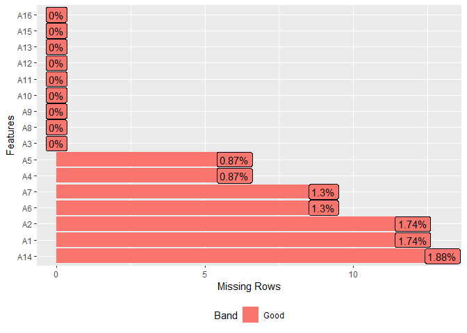
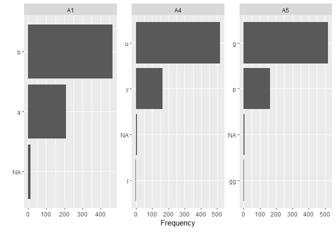
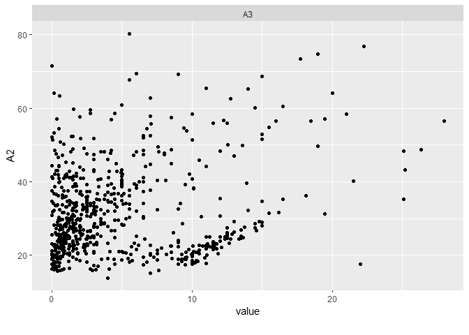
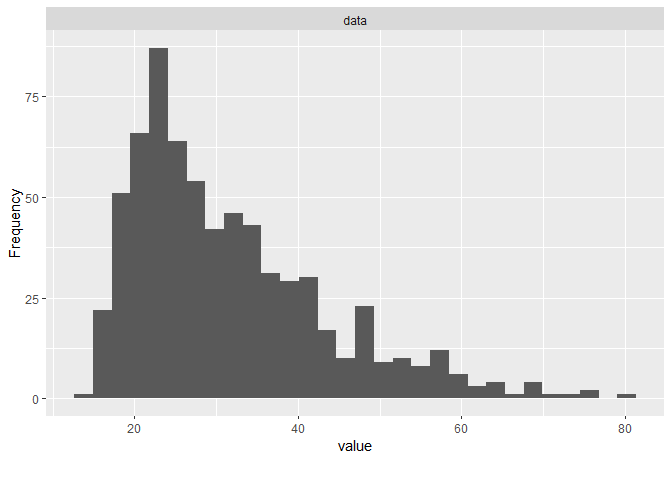
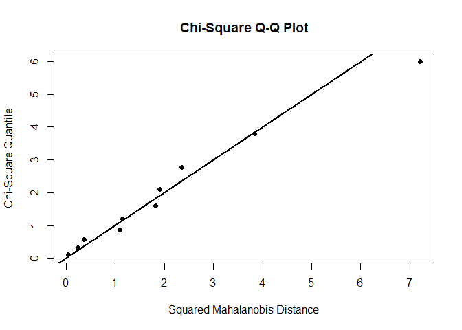
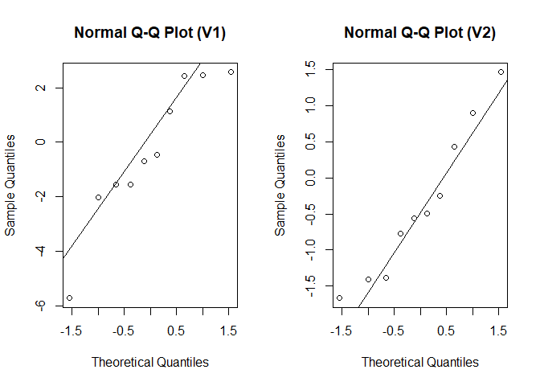

Multivariate Analysis Chapter 1 - 3
================
Oktsa Dwika R
2023-08-20

# **CHAPTER 1**

## **A. Vectors and Matrices**

**The computation:**

    X = matrix(c(), nrow, ncol)

**Explaination:**

- c() is used to input the elements of the matrix

- nrow = the number of rows from the matrix, ex: 1, 2, 3, etc

- ncol = the number of columns from the matrix, ex: 1, 2, 3, etc

  So, the size of the matrix is nrow x ncol.

**Example:**

``` r
X = matrix(c(2,3,7,4),4,1)
X
```

    ##      [,1]
    ## [1,]    2
    ## [2,]    3
    ## [3,]    7
    ## [4,]    4

## **B. Expectation**

### **1. Using Manual Way**

    # Input Part
    X = c()
    prob = c()

    # Computation Part
    Exp_X = X %*% prob

**Explaination:**

- X = the value of the vector X

- prob = probability function of X

**Example:**

``` r
X = c(-1,0,1)
X
```

    ## [1] -1  0  1

``` r
prob = c(0.3,0.3,0.4)
prob
```

    ## [1] 0.3 0.3 0.4

``` r
Exp_X = X%*%prob
Exp_X
```

    ##      [,1]
    ## [1,]  0.1

### 2. Using Function

    # Input Part
    vals = c()
    probs = c()

    # calculate expected value
    weighted.mean(vals, probs)

**Explaination:**

- vals = the value of data or observation

- probs = probability function of observation

**Example:**

``` r
vals = c(-1,0,1)
probs = c(0.3,0.3,0.4)
weighted.mean(vals, probs)
```

    ## [1] 0.1

## **C. Covariance Matrix**

**The computation:**

    # Input Part
    data = data.frame(V1 = c()
                      V2 = c()
                      ...
                      Vn = c())

    # Computation Part
    cov(data)

**Explaination:**

- data = data frame

- Vi = the value of variable i, where i = 1,2,…,n

**Example:**

``` r
data = data.frame(V1 = c(84, 82, 81, 89, 73, 94, 92, 70, 88, 95),
                  V2 = c(85, 82, 72, 77, 75, 89, 95, 84, 77, 94),
                  V3 = c(97, 94, 93, 95, 88, 82, 78, 84, 69, 78))

cov(data)
```

    ##           V1        V2        V3
    ## V1  72.17778  36.88889 -27.15556
    ## V2  36.88889  62.66667 -26.77778
    ## V3 -27.15556 -26.77778  83.95556

## **D. Mean Vector and Covariance Matrix for Linear Combination of Random Variables**

In general, consider the q linear combinations of the p random variables
1,2,…,p. The computation:

    # Input Part
    mu = matrix(c(),,)
    sigma = matrix(c(),,)
    C = matrix(c(),,)

    # Computation Part
    MuZ = C%*%mu
    MuZ

    SigZ = C%*%sigma%*%t(C)
    SigZ

**Explaination:**

- mu = the expectation or mean vector

- sigma = the covariance matrix

- C = the combination matrix

- MuZ = the mean vector for Linear Combination

- SigZ = the covariance matrix for Linear Combination

**Example:**

``` r
mu = matrix(c(2,3,-1,5),4,1)
sigma = matrix(c(11,-8,3,9,-8,9,-3,-6,3,-3,2,3,9,6,3,9),4,4)
C = matrix(c(3,-1,2,1,-3,-2,-4,1,4,-1,-2,-5),3,4)

MuZ = C%*%mu
paste("so the mean vector for linear combination is")
```

    ## [1] "so the mean vector for linear combination is"

``` r
MuZ
```

    ##      [,1]
    ## [1,]    8
    ## [2,]  -22
    ## [3,]  -31

``` r
SigZ = C%*%sigma%*%t(C)
paste("so the covariance matrix for linear combination is")
```

    ## [1] "so the covariance matrix for linear combination is"

``` r
SigZ
```

    ##      [,1] [,2] [,3]
    ## [1,]   23  -42  -78
    ## [2,]   18  118  234
    ## [3,]    6  102  197

## **E. Data Manipulation**

For data manipulation, we will use ‘dplyr’ and ‘tidyverse’ packages.

``` r
# Installing the package
library('dplyr')
```

    ## Warning: package 'dplyr' was built under R version 4.1.3

    ## 
    ## Attaching package: 'dplyr'

    ## The following objects are masked from 'package:stats':
    ## 
    ##     filter, lag

    ## The following objects are masked from 'package:base':
    ## 
    ##     intersect, setdiff, setequal, union

``` r
library('tidyverse')
```

    ## Warning: package 'tidyverse' was built under R version 4.1.3

    ## Warning: package 'tibble' was built under R version 4.1.3

    ## Warning: package 'tidyr' was built under R version 4.1.3

    ## Warning: package 'readr' was built under R version 4.1.3

    ## Warning: package 'purrr' was built under R version 4.1.3

    ## Warning: package 'stringr' was built under R version 4.1.3

    ## Warning: package 'forcats' was built under R version 4.1.3

    ## Warning: package 'lubridate' was built under R version 4.1.3

    ## -- Attaching core tidyverse packages ------------------------ tidyverse 2.0.0 --
    ## v forcats   1.0.0     v readr     2.1.4
    ## v ggplot2   3.4.3     v stringr   1.5.0
    ## v lubridate 1.9.2     v tibble    3.2.1
    ## v purrr     1.0.1     v tidyr     1.3.0

    ## -- Conflicts ------------------------------------------ tidyverse_conflicts() --
    ## x dplyr::filter() masks stats::filter()
    ## x dplyr::lag()    masks stats::lag()
    ## i Use the conflicted package (<http://conflicted.r-lib.org/>) to force all conflicts to become errors

Create Data Frame for the data that will be manipulated.

    # Input Part
    df1 = data.frame((V1 = c()
                      V2 = c()
                      ...
                      Vn = c())
    df2 = data.frame((V1 = c()
                      V2 = c()
                      ...
                      Vn = c())
    )

1.  **Inner Join Function**

<!-- -->

    # Computation Part
    df_ij = inner_join(df1, df2, by = " ")
    df_ij

**Explaination :**

Merge 2 dataframe by variable inside ” “, then the output will show only
for the same value of variable inside” ”

2.  **Left Join using Inner Join**

<!-- -->

    # Computation Part
    df_ij2= df1 %>% inner_join(df2,by=" ")
    df_ij2

3.  **Outer Join**

<!-- -->

    # Computation Part
    df_U = full_join(df1,df2,by = "")
    df_U

**Explaination:**

Merge 2 dataframe by variable inside ” “, then the output will show all
of the data and the missing data will show NA.

4.  **Left Join**

<!-- -->

    # Computation Part
    df_L = left_join(df1, df2, by=" ")
    df_L

**Explaination:**

Combine right table (df2) to the left table (df1) by variable inside ” ”
from the left table (df1)

5.  **Right Join**

<!-- -->

    # Computation Part
    df_R = right_join(df1, df2, by=" ")
    df_R

**Explaination:**

Combine left table (df1) to the right table (df2) by variable inside ” ”
from the right table (df2).

**Example 1- 5:**

``` r
# Input part
df1=data.frame(CustomerId=c(1:6),Product=c("Oven","Television","Mobile","WashingMachine","Lightings","Ipad"),NumbProduct=c(10,5,16,2,22,7))
df1
```

    ##   CustomerId        Product NumbProduct
    ## 1          1           Oven          10
    ## 2          2     Television           5
    ## 3          3         Mobile          16
    ## 4          4 WashingMachine           2
    ## 5          5      Lightings          22
    ## 6          6           Ipad           7

``` r
df2=data.frame(CustomerId=c(2,4,6,7,8),State=c("California","Newyork","Santiago","Texas","Indiana"))
df2
```

    ##   CustomerId      State
    ## 1          2 California
    ## 2          4    Newyork
    ## 3          6   Santiago
    ## 4          7      Texas
    ## 5          8    Indiana

``` r
# Inner Join Function
df_ij=inner_join(df1,df2,by="CustomerId") 
df_ij
```

    ##   CustomerId        Product NumbProduct      State
    ## 1          2     Television           5 California
    ## 2          4 WashingMachine           2    Newyork
    ## 3          6           Ipad           7   Santiago

``` r
# Left Join using Inner Join
df_ij2= df1 %>% inner_join(df2,by="CustomerId")
df_ij2
```

    ##   CustomerId        Product NumbProduct      State
    ## 1          2     Television           5 California
    ## 2          4 WashingMachine           2    Newyork
    ## 3          6           Ipad           7   Santiago

``` r
# Outer Join
df_U = full_join(df1,df2,by="CustomerId")
df_U
```

    ##   CustomerId        Product NumbProduct      State
    ## 1          1           Oven          10       <NA>
    ## 2          2     Television           5 California
    ## 3          3         Mobile          16       <NA>
    ## 4          4 WashingMachine           2    Newyork
    ## 5          5      Lightings          22       <NA>
    ## 6          6           Ipad           7   Santiago
    ## 7          7           <NA>          NA      Texas
    ## 8          8           <NA>          NA    Indiana

``` r
# Left Join
df_L = left_join(df1, df2, by="CustomerId")
df_L
```

    ##   CustomerId        Product NumbProduct      State
    ## 1          1           Oven          10       <NA>
    ## 2          2     Television           5 California
    ## 3          3         Mobile          16       <NA>
    ## 4          4 WashingMachine           2    Newyork
    ## 5          5      Lightings          22       <NA>
    ## 6          6           Ipad           7   Santiago

``` r
# Right Join
df_R = right_join(df1, df2, by="CustomerId")
df_R
```

    ##   CustomerId        Product NumbProduct      State
    ## 1          2     Television           5 California
    ## 2          4 WashingMachine           2    Newyork
    ## 3          6           Ipad           7   Santiago
    ## 4          7           <NA>          NA      Texas
    ## 5          8           <NA>          NA    Indiana

6.  **Check Information of data**

``` r
# Computation Part
df_U %>% glimpse()
```

    ## Rows: 8
    ## Columns: 4
    ## $ CustomerId  <dbl> 1, 2, 3, 4, 5, 6, 7, 8
    ## $ Product     <chr> "Oven", "Television", "Mobile", "WashingMachine", "Lightin~
    ## $ NumbProduct <dbl> 10, 5, 16, 2, 22, 7, NA, NA
    ## $ State       <chr> NA, "California", NA, "Newyork", NA, "Santiago", "Texas", ~

``` r
glimpse(df_U)
```

    ## Rows: 8
    ## Columns: 4
    ## $ CustomerId  <dbl> 1, 2, 3, 4, 5, 6, 7, 8
    ## $ Product     <chr> "Oven", "Television", "Mobile", "WashingMachine", "Lightin~
    ## $ NumbProduct <dbl> 10, 5, 16, 2, 22, 7, NA, NA
    ## $ State       <chr> NA, "California", NA, "Newyork", NA, "Santiago", "Texas", ~

``` r
df1 %>% full_join(df2, by="CustomerId") %>% glimpse()
```

    ## Rows: 8
    ## Columns: 4
    ## $ CustomerId  <dbl> 1, 2, 3, 4, 5, 6, 7, 8
    ## $ Product     <chr> "Oven", "Television", "Mobile", "WashingMachine", "Lightin~
    ## $ NumbProduct <dbl> 10, 5, 16, 2, 22, 7, NA, NA
    ## $ State       <chr> NA, "California", NA, "Newyork", NA, "Santiago", "Texas", ~

7.  **Check missing data for each column**

``` r
results = apply(is.na(df_U),2,which)
results
```

    ## $CustomerId
    ## integer(0)
    ## 
    ## $Product
    ## [1] 7 8
    ## 
    ## $NumbProduct
    ## [1] 7 8
    ## 
    ## $State
    ## [1] 1 3 5

``` r
results2 = apply(is.na(df_L),2,which)
results2
```

    ## $CustomerId
    ## integer(0)
    ## 
    ## $Product
    ## integer(0)
    ## 
    ## $NumbProduct
    ## integer(0)
    ## 
    ## $State
    ## [1] 1 3 5

**Explainatuon :**

is.na to check missing value, 2 means we check the column. if we use 1,
means we check the row

8.  **Filter out the missing values by drop_na**

``` r
df_UC = drop_na(df_U)
df_UC
```

    ##   CustomerId        Product NumbProduct      State
    ## 1          2     Television           5 California
    ## 2          4 WashingMachine           2    Newyork
    ## 3          6           Ipad           7   Santiago

# **CHAPTER 2**

## **DATA EXPLORING**

**Data Exploration by DataExplorer package**

``` r
library('DataExplorer')
```

    ## Warning: package 'DataExplorer' was built under R version 4.1.3

1.  **Importing data**

<!-- -->

    # Import Data
    file = ''
    data = read.csv(file)

**Explaination :**

file = ’ ’ is for the location of the data in the device.

**Example:**

``` r
data = read.csv("C:/Users/Avita/Documents/Multivariate-Analysis/Data/CreditApproval.csv", header = TRUE)

head(data)
```

    ##   A1    A2    A3 A4 A5 A6 A7   A8 A9 A10 A11 A12 A13 A14 A15 A16
    ## 1  b 30.83 0.000  u  g  w  v 1.25  t   t   1   f   g 202   0   +
    ## 2  a 58.67 4.460  u  g  q  h 3.04  t   t   6   f   g  43 560   +
    ## 3  a 24.50 0.500  u  g  q  h 1.50  t   f   0   f   g 280 824   +
    ## 4  b 27.83 1.540  u  g  w  v 3.75  t   t   5   t   g 100   3   +
    ## 5  b 20.17 5.625  u  g  w  v 1.71  t   f   0   f   s 120   0   +
    ## 6  b 32.08 4.000  u  g  m  v 2.50  t   f   0   t   g 360   0   +

2.  **Check the information about the data**

``` r
introduce(data)
```

    ##   rows columns discrete_columns continuous_columns all_missing_columns
    ## 1  690      16               10                  6                   0
    ##   total_missing_values complete_rows total_observations memory_usage
    ## 1                   67           653              11040        86304

``` r
miss_val = apply(is.na(data),2,which)
miss_val
```

    ## $A1
    ##  [1] 249 328 347 375 454 480 490 521 599 602 642 674
    ## 
    ## $A2
    ##  [1]  84  87  93  98 255 287 330 446 451 501 516 609
    ## 
    ## $A3
    ## integer(0)
    ## 
    ## $A4
    ## [1] 207 271 331 457 593 623
    ## 
    ## $A5
    ## [1] 207 271 331 457 593 623
    ## 
    ## $A6
    ## [1] 207 271 331 457 480 540 593 602 623
    ## 
    ## $A7
    ## [1] 207 271 331 457 480 540 593 602 623
    ## 
    ## $A8
    ## integer(0)
    ## 
    ## $A9
    ## integer(0)
    ## 
    ## $A10
    ## integer(0)
    ## 
    ## $A11
    ## integer(0)
    ## 
    ## $A12
    ## integer(0)
    ## 
    ## $A13
    ## integer(0)
    ## 
    ## $A14
    ##  [1]  72 203 207 244 271 279 331 407 446 457 593 623 627
    ## 
    ## $A15
    ## integer(0)
    ## 
    ## $A16
    ## integer(0)

3.  **Check the % of missing value for each variable**

``` r
plot_missing(data)
```

<!-- -->

4.  **Filter out the missing value**

``` r
dataC = drop_na(data)
introduce(dataC)
```

    ##   rows columns discrete_columns continuous_columns all_missing_columns
    ## 1  653      16               10                  6                   0
    ##   total_missing_values complete_rows total_observations memory_usage
    ## 1                    0           653              10448        82024

5.  **Plotting the data**

<!-- -->

    # Bar Plot
    plot_bar(data[,c()])

    # Scatter Plot
    plot_scatterplot(data[,c()],by ='var')

    # Histogram Plot
    plot_histogram(data$var)
    # or
    plot_histogram(data[,''])

**Example**

``` r
# Bar Plot
plot_bar(data[,c('A1','A4','A5')])
```

<!-- -->

``` r
# Scatter Plot
plot_scatterplot(data[,c('A2','A3')],by ='A2')
```

    ## Warning: Removed 12 rows containing missing values (`geom_point()`).

<!-- -->

``` r
# Histogram Plot
plot_histogram(data$A2)
```

<!-- -->

``` r
# or
plot_histogram(data[,'A2'])
```

<!-- -->

6.  **Descriptive Statistics for each variable**

``` r
summary(data)
```

    ##       A1                  A2              A3              A4           
    ##  Length:690         Min.   :13.75   Min.   : 0.000   Length:690        
    ##  Class :character   1st Qu.:22.60   1st Qu.: 1.000   Class :character  
    ##  Mode  :character   Median :28.46   Median : 2.750   Mode  :character  
    ##                     Mean   :31.57   Mean   : 4.759                     
    ##                     3rd Qu.:38.23   3rd Qu.: 7.207                     
    ##                     Max.   :80.25   Max.   :28.000                     
    ##                     NA's   :12                                         
    ##       A5                 A6                 A7                  A8        
    ##  Length:690         Length:690         Length:690         Min.   : 0.000  
    ##  Class :character   Class :character   Class :character   1st Qu.: 0.165  
    ##  Mode  :character   Mode  :character   Mode  :character   Median : 1.000  
    ##                                                           Mean   : 2.223  
    ##                                                           3rd Qu.: 2.625  
    ##                                                           Max.   :28.500  
    ##                                                                           
    ##       A9                A10                 A11           A12           
    ##  Length:690         Length:690         Min.   : 0.0   Length:690        
    ##  Class :character   Class :character   1st Qu.: 0.0   Class :character  
    ##  Mode  :character   Mode  :character   Median : 0.0   Mode  :character  
    ##                                        Mean   : 2.4                     
    ##                                        3rd Qu.: 3.0                     
    ##                                        Max.   :67.0                     
    ##                                                                         
    ##      A13                 A14            A15               A16           
    ##  Length:690         Min.   :   0   Min.   :     0.0   Length:690        
    ##  Class :character   1st Qu.:  75   1st Qu.:     0.0   Class :character  
    ##  Mode  :character   Median : 160   Median :     5.0   Mode  :character  
    ##                     Mean   : 184   Mean   :  1017.4                     
    ##                     3rd Qu.: 276   3rd Qu.:   395.5                     
    ##                     Max.   :2000   Max.   :100000.0                     
    ##                     NA's   :13

## **MULTIVARIATE NORMAL DISTRIUBUTION**

### **A. Simulating Multivariate Normal Distribution**

``` r
# Installing Packages
library(MASS)
```

    ## Warning: package 'MASS' was built under R version 4.1.3

    ## 
    ## Attaching package: 'MASS'

    ## The following object is masked from 'package:dplyr':
    ## 
    ##     select

``` r
library(ggplot2)
library(MVN)
```

    ## Warning: package 'MVN' was built under R version 4.1.3

Here is the computation for simulating multivariate distribution

    # Input Part
    n = 
    mu = 
    sigma =
    tol =
    empirical =

    # Computation Part
    data = mvrnorm(n,mu,sigma)

**Explaination:**

- Ref:<https://www.rdocumentation.org/packages/rockchalk/versions/1.8.110/topics/mvrnorm>

- n =\> a number of samples.

- mu =\> a mean vector of variables. - sigma =\> a covariance matrix.

**Example:**

``` r
n = 10
mu = c(0,0)
sigma = matrix(c(10,3,3,2),2,2)
sigma
```

    ##      [,1] [,2]
    ## [1,]   10    3
    ## [2,]    3    2

``` r
set.seed(1)
data = mvrnorm(n,mu,sigma)
data
```

    ##             [,1]       [,2]
    ##  [1,]  2.4491581 -0.7771712
    ##  [2,] -0.4545410 -0.5624445
    ##  [3,]  2.4327905  1.4657752
    ##  [4,] -5.7197835  0.4279042
    ##  [5,] -0.6810376 -1.4127938
    ##  [6,]  2.5673342  0.9031423
    ##  [7,] -1.5387795 -0.4958605
    ##  [8,] -2.0246172 -1.6697631
    ##  [9,] -1.5519608 -1.3829634
    ## [10,]  1.1486902 -0.2431302

### B. Normality Test for multivariate variables using ‘energy’

Test H0: data is multivariate normal distribution vs H1: data is not
multivariate normal distribution For conclusion, we will reject H0 if
p-value \< 0.05

``` r
# computation part
# using multivariate plot to show the chi-square Q-Q plot
results = mvn(data, mvnTest = 'energy', multivariatePlot = 'qq') 
```

<!-- -->

``` r
results
```

    ## $multivariateNormality
    ##          Test Statistic p value MVN
    ## 1 E-statistic 0.8099054   0.096 YES
    ## 
    ## $univariateNormality
    ##               Test  Variable Statistic   p value Normality
    ## 1 Anderson-Darling  Column1     0.3999    0.2935    YES   
    ## 2 Anderson-Darling  Column2     0.2685    0.5982    YES   
    ## 
    ## $Descriptives
    ##    n       Mean  Std.Dev     Median       Min      Max      25th      75th
    ## 1 10 -0.3372747 2.602389 -0.5677893 -5.719783 2.567334 -1.548665 2.1117654
    ## 2 10 -0.3747305 1.036289 -0.5291525 -1.669763 1.465775 -1.231515 0.2601456
    ##         Skew  Kurtosis
    ## 1 -0.5312800 -0.717383
    ## 2  0.4000249 -1.301176

``` r
# using univariate plot
results_U = mvn(data, mvnTest = 'energy', univariatePlot = 'qqplot')
```

<!-- -->

``` r
results_U
```

    ## $multivariateNormality
    ##          Test Statistic p value MVN
    ## 1 E-statistic 0.8099054    0.09 YES
    ## 
    ## $univariateNormality
    ##               Test  Variable Statistic   p value Normality
    ## 1 Anderson-Darling  Column1     0.3999    0.2935    YES   
    ## 2 Anderson-Darling  Column2     0.2685    0.5982    YES   
    ## 
    ## $Descriptives
    ##    n       Mean  Std.Dev     Median       Min      Max      25th      75th
    ## 1 10 -0.3372747 2.602389 -0.5677893 -5.719783 2.567334 -1.548665 2.1117654
    ## 2 10 -0.3747305 1.036289 -0.5291525 -1.669763 1.465775 -1.231515 0.2601456
    ##         Skew  Kurtosis
    ## 1 -0.5312800 -0.717383
    ## 2  0.4000249 -1.301176

# CHAPTER 3

## A. ONE SAMPLE T-TEST

### 1. Hypothesis testing : Hotelling’s T Square

H0 : Mu = Mu0 vs H1 : Mu =/ Mu0

#### **1.1 Hotelling’s T square Manual**

    # Input Part
    Xbar = matrix(c(),,)
    S = matrix(c(),,)
    mu = matrix(c(),,)
    n = 
    p = 
    alfa =
    n_p = n-p

    # Computation Part
    ## Calculate T Square
    T2=n*t(Xbar-mu)%*%solve(S)%*%(Xbar-mu)
    paste("Hotelling's T2 is:",T2)

    ## Calculate Critical Value
    T2_cri=(((n-1)*p)/(n-p))*qf(alfa,p,n_p,lower.tail = FALSE)
    paste("Critical value: ",T2_cri)

    ## Conclusion
    if(T2 < T2_cri){
      paste("Since T2 = ",T2, "< Critical Value = ",T2_cri,
          "so we cannot reject H0 at the significant level", alfa)
    }else if(T2 = T2_cri){
       paste("Since T2 = ",T2, "= Critical Value = ",T2_cri,
          "so we cannot reject H0 at the significant level", alfa)
    }else{
      paste("Since T2 = ",T2, "> Critical Value = ",T2_cri,
          "so we reject H0 at the significant level", alfa)
    }

**Explaination:**

- Xbar = mean of the sample

- mu = plausible value for the population mean

- S = covariance matrix

- n = number of sample

- p = number of variable

- alfa = significant level

- n_p = number of sample - number of variable

**Example 3.1:**

``` r
# Input Part
Xbar = matrix(c(4.64,45.4,9.965),3,1)
S = matrix(c(2.879,10.01,-1.81,10.01,199.788,-5.64,-1.81,-5.64,3.628),3,3)
mu = matrix(c(4,50,10),3,1)
n = 20
p = 3
alfa = 0.05
n_p = n-p

# Computation Part
## Calculate T Square
T2=n*t(Xbar-mu)%*%solve(S)%*%(Xbar-mu)
paste("Hotelling's T2 is:",T2)
```

    ## [1] "Hotelling's T2 is: 9.74303756432536"

``` r
## Calculate Critical Value
T2_cri=(((n-1)*p)/(n-p))*qf(alfa,p,n_p,lower.tail = FALSE)
paste("Critical value: ",T2_cri)
```

    ## [1] "Critical value:  10.7186047019865"

``` r
## Conclusion
if(T2 < T2_cri){
  paste("Since T2 = ",T2, "< Critical Value = ",T2_cri,
      "so we cannot reject H0 at the significant level", alfa)
}else if(T2 == T2_cri){
   paste("Since T2 = ",T2, "= Critical Value = ",T2_cri,
      "so we cannot reject H0 at the significant level", alfa)
}else{
  paste("Since T2 = ",T2, "> Critical Value = ",T2_cri,
      "so we reject H0 at the significant level", alfa)
}
```

    ## [1] "Since T2 =  9.74303756432536 < Critical Value =  10.7186047019865 so we cannot reject H0 at the significant level 0.05"

#### 1.2 Hotelling’s Testing using packages Installing the package:

``` r
library(DescTools)
```

    ## Warning: package 'DescTools' was built under R version 4.1.3

``` r
library(MASS)
```

**The computation:**

    # Input Part
    x = matrix(c(),,)
    mu0 = c()

    # Computation Part
    ## Hotelling's T2 Test using F distribution
    HotellingsT2Test(x,mu=mu0)
    ## Hotelling's T2 Test using Chi-squared distribution
    HotellingsT2Test(x,mu=mu0,test="chi")

**Explaination:**

- x = a numeric dataframe or matrix

- mu0 = plausible value for the population mean

**Example 3.2:**

``` r
# Input Part
x=matrix(c(6,10,8,9,6,3),3,2)
x
```

    ##      [,1] [,2]
    ## [1,]    6    9
    ## [2,]   10    6
    ## [3,]    8    3

``` r
mu0=c(9,5)

# Computation Part
## Hotelling's T2 Test using F distribution
HotellingsT2Test(x,mu=mu0)
```

    ## 
    ##  Hotelling's one sample T2-test
    ## 
    ## data:  x
    ## T.2 = 0.19444, df1 = 2, df2 = 1, p-value = 0.8485
    ## alternative hypothesis: true location is not equal to c(9,5)

``` r
## Hotelling's T2 Test using Chi-squared distribution
HotellingsT2Test(x,mu=mu0,test="chi")
```

    ## 
    ##  Hotelling's one sample T2-test
    ## 
    ## data:  x
    ## T.2 = 0.77778, df = 2, p-value = 0.6778
    ## alternative hypothesis: true location is not equal to c(9,5)

### **2. Confidence Regions and Simultaneous Comparisons of Component Means**

#### **2.1 The 100(1-alfa)% Simultaneous T2 Intervals for the two components means**

**The computation:**

    # Input Part
    Xbar=matrix(c(),,)
    S = matrix(c(),,)
    n =
    p =
    alfa =
    df1 = 1 - alfa
    n_p = n-p

    # Computation Part
    L1=Xbar[1,1]-(sqrt(((n-1)*p)/(n-p)*qf(df1,p,n_p))*sqrt(S[1,1]/n))
    U1=Xbar[1,1]+(sqrt(((n-1)*p)/(n-p)*qf(df1,p,n_p))*sqrt(S[1,1]/n))
    paste("The lower bound L1 : ",L1,"/ The upper bound U1 : ",U1)

**Example 3.3:**

``` r
# Input Part
Xbar = matrix(c(4.64,45.4,9.965),3,1)
S = matrix(c(2.879,10.01,-1.81,10.01,199.788,-5.64,-1.81,-5.64,3.628),3,3)
n = 20
p = 3
alfa = 0.05
df1 = 1 - alfa
n_p = n-p

# Computation Part
L1=Xbar[1,1]-(sqrt(((n-1)*p)/(n-p)*qf(df1,p,n_p))*sqrt(S[1,1]/n))
U1=Xbar[1,1]+(sqrt(((n-1)*p)/(n-p)*qf(df1,p,n_p))*sqrt(S[1,1]/n))
paste("The lower bound L1 : ",L1,"/ The upper bound U1 : ",U1)
```

    ## [1] "The lower bound L1 :  3.39784737376965 / The upper bound U1 :  5.88215262623035"

#### 2.2 The simultaneous 100(1-alfa)% Bonferroni Confidence interval

**The Computation:**

    # Input Part
    Xbar=matrix(c(),,)
    S = matrix(c(),,)
    n =
    p =
    alfa =
    df1 = 1 - (alfa/(2*p))
    df2 = n-1

    # Computation Part
    L_1=Xbar[1,1]-((qt(df1,df2))*sqrt(S[1,1]/n))
    U_1=Xbar[1,1]+((qt(df1,df2))*sqrt(S[1,1]/n))
    paste("The lower bound L1 : ",L_1,"/ The upper bound U1 : ",U_1)

**Example 3.4:**

``` r
# Input Part
Xbar = matrix(c(4.64,45.4,9.965),3,1)
S = matrix(c(2.879,10.01,-1.81,10.01,199.788,-5.64,-1.81,-5.64,3.628),3,3)
n = 20
p = 3
alfa = 0.05
df1 = 1 - (alfa/(2*p))
df2 = n-1

# Computation Part
L_1=Xbar[1,1]-((qt(df1,df2))*sqrt(S[1,1]/n))
U_1=Xbar[1,1]+((qt(df1,df2))*sqrt(S[1,1]/n))
paste("The lower bound L1 : ",L_1,"/ The upper bound U1 : ",U_1)
```

    ## [1] "The lower bound L1 :  3.64401530485706 / The upper bound U1 :  5.63598469514294"

## B. COMPARING MEAN VECTORS FROM TWO INDEPENDENT POPULATIONS

### 1. Assumption Testing - Homogeneity of covariance matrices

#### 1.1 Using Package Installing package

``` r
library(biotools)
```

    ## Warning: package 'biotools' was built under R version 4.1.3

    ## ---
    ## biotools version 4.2

**The computation:**

    # Input Part
    ## Sample 1
    vecmu1 = matrix(c(),,)
    Sigma1 = matrix(c(),,)
    n1 = 
    set.seed(123)
    sample1=mvrnorm(n1,vecmu1,Sigma1)

    ## Sample 2
    vecmu2= matrix(c(),,)
    Sigma2 = matrix(c(),,)
    n2 =
    set.seed(321)
    sample2=mvrnorm(n2,vecmu2,Sigma2)
    head(sample2)

    # Computation Part
    nrow = n1+n2
    c1 = matrix(0,nrow,1)
    head(c1)
    c1[1:n1]=1
    c1[n1+1:nrow]=2
    head(c1) #show the first six rows of the c1
    tail(c1) #show the last six rows of c1

    # Concatenate data 1 and data 2
    sample_merge = rbind(sample1,sample2)
    sample_merge

    results = boxM(data=sample_merge,group=c1)
    results

**Example:**

``` r
# Input Part
## Sample 1
vecmu1 = matrix(c(-4,4),2,1)
Sigma1 = matrix(c(16,-2,-2,9),2,2)
n1 = 15
set.seed(123)
sample1=mvrnorm(n1,vecmu1,Sigma1)

## Sample 2
vecmu2= matrix(c(3,2),2,1)
Sigma2 = matrix(c(7,5,5,12),2,2)
n2 = 18
set.seed(321)
sample2=mvrnorm(n2,vecmu2,Sigma2)
head(sample2)
```

    ##           [,1]     [,2]
    ## [1,] 5.5103467 8.234181
    ## [2,] 0.7950548 0.111115
    ## [3,] 0.8894439 2.034941
    ## [4,] 2.9357250 1.493331
    ## [5,] 1.0844439 2.617797
    ## [6,] 5.3512240 1.771559

``` r
# Computation Part
nrow = n1+n2
c1 = matrix(0,nrow,1)
head(c1)
```

    ##      [,1]
    ## [1,]    0
    ## [2,]    0
    ## [3,]    0
    ## [4,]    0
    ## [5,]    0
    ## [6,]    0

``` r
c1[1:n1]=1
c1[(n1+1):nrow]=2
head(c1) #show the first six rows of the c1
```

    ##      [,1]
    ## [1,]    1
    ## [2,]    1
    ## [3,]    1
    ## [4,]    1
    ## [5,]    1
    ## [6,]    1

``` r
tail(c1) #show the last six rows of c1
```

    ##       [,1]
    ## [28,]    2
    ## [29,]    2
    ## [30,]    2
    ## [31,]    2
    ## [32,]    2
    ## [33,]    2

``` r
# Concatenate data 1 and data 2
sample_merge = rbind(sample1,sample2)
sample_merge
```

    ##             [,1]       [,2]
    ##  [1,] -3.1322443 -1.6108443
    ##  [2,] -3.4673482  2.3595178
    ##  [3,] -8.6562247 11.1580161
    ##  [4,] -4.8009419  2.1009176
    ##  [5,] -4.1549088  5.4647142
    ##  [6,] -9.9419932  8.7932015
    ##  [7,] -5.6484219  5.0940852
    ##  [8,]  1.7375988  5.5655994
    ##  [9,] -0.7564780  5.3333290
    ## [10,] -1.7818427  5.2929309
    ## [11,] -7.5503481 10.0214833
    ## [12,] -6.0397142  2.0190970
    ## [13,] -5.6894484  3.9868506
    ## [14,] -3.5848260  7.3166773
    ## [15,] -2.7522651 -0.1065934
    ## [16,]  5.5103467  8.2341812
    ## [17,]  0.7950548  0.1111150
    ## [18,]  0.8894439  2.0349414
    ## [19,]  2.9357250  1.4933314
    ## [20,]  1.0844439  2.6177966
    ## [21,]  5.3512240  1.7715595
    ## [22,]  5.7593925  3.6138172
    ## [23,]  3.3163300  2.8691403
    ## [24,]  7.6132230  0.6974787
    ## [25,]  1.1705787  0.6102549
    ## [26,]  5.5945054  1.9843307
    ## [27,]  6.8303480  6.4122950
    ## [28,]  5.9587880  1.0313813
    ## [29,]  7.2905293 10.5057686
    ## [30,] -0.4223532 -1.1521998
    ## [31,] -0.7136533  0.6205268
    ## [32,]  4.1913898  3.3463793
    ## [33,]  3.6657706  3.5080341

``` r
results = boxM(data=sample_merge,group=c1)
results
```

    ## 
    ##  Box's M-test for Homogeneity of Covariance Matrices
    ## 
    ## data:  sample_merge
    ## Chi-Sq (approx.) = 10.001, df = 3, p-value = 0.01856

#### 1.2 Manual Way

##### 1.2.1 X2 Approximation The Computation

**The computation, for g = 2**

    # Input Part
    S1 = matrix(c(),,)
    S2 = matrix(c(),,)
    n1 =
    n2 =
    v1 = n1-1
    v2 = n2-1
    g =
    p =
    Sp = (v1*S1+v2*s2)/(n1+n2-2)
    alfa =
    df1 = 1-alfa
    df2 = (1/2)*(g-1)*p*(p+1)

    # Computation Part
    lnM = ((1/2)*((v1*log(det(S1)))+(v2*log(det(S2)))))-((1/2)*(v1+v2)*log(det(Sp)))
    paste("lnM: ", lnM)

    c1 = ((1/v1)+(1/v2)-(1/(v1+v2)))*(((2*p^2)+(3*p)-1)/(6*(p+1)*(g-1)))
    paste("c1: ",c1)

    U = -2*(1-c1)*lnM
    cri_val = qchisq(df1,df2)

    # Conclusion
    if(U < cri_val){
        paste("Since U =", U, " < critical value = ", cri_val,", then do not reject H0.")
    }else if(U == cri_val){
        paste("Since U =", U, " = critical value = ", cri_val,", then do not reject H0.")
    }else{
        paste("Since U =", U, " > critical value = ", cri_val,", then reject H0.")
    }

**Example:**

``` r
# Input Part
S1 = matrix(c(2,1,1,6),2,2)
S2 = matrix(c(2,1,1,4),2,2)
n1 = 50
n2 = 50
v1 = n1-1
v2 = n2-1
g = 2
p = 2
Sp = ((v1*S1)+(v2*S2))/(n1+n2-2)
alfa = 0.05
df1 = 1-alfa
df2 = (1/2)*(g-1)*p*(p+1)

# Computation Part
lnM = ((1/2)*((v1*log(det(S1)))+(v2*log(det(S2)))))-((1/2)*(v1+v2)*log(det(Sp)))
paste("lnM: ", lnM)
```

    ## [1] "lnM:  -1.2407714540595"

``` r
c1 = ((1/v1)+(1/v2)-(1/(v1+v2)))*(((2*p^2)+(3*p)-1)/(6*(p+1)*(g-1)))
paste("c1: ",c1)
```

    ## [1] "c1:  0.022108843537415"

``` r
U = -2*(1-c1)*lnM
cri_val = qchisq(df1,df2)

# Conclusion
if(U < cri_val){
    paste("Since U =", U, " < critical value = ", cri_val,", then do not reject H0.")
}else if(U == cri_val){
    paste("Since U =", U, " = critical value = ", cri_val,", then do not reject H0.")
}else{
    paste("Since U =", U, " > critical value = ", cri_val,", then reject H0.")
}
```

    ## [1] "Since U = 2.42667886423201  < critical value =  7.81472790325118 , then do not reject H0."

##### 1.2.2 F Approximation The Computation (continuity from X2 Approximation):

**The computation:**

    # Computation Part
    c2 = ((1/v1^2)+(1/v2^2)-(1/(v1+v2)^2))*(((p-1)*(p+2))/(6*(g-1)))
    paste("c1: ",c1)
    a1 = 1/2*(g-1)*p*(p+1)
    a2 = (a1+2)/abs(c2-c1^2)
    b1 = (1-c1-(a1/a2))/a1
    b2 = (1-c1+(2/a2))/a2

    if(c2 > c1^2){
        F = -2*b1*lnM
    }else if(c2 < c1^2){
        F = (-2*a2*b2*lnM)/(a1*(1+(2*b2*lnM)))
    }else{
        F = NULL
    }
    cri_val = qf(df1,a1,a2)

    # Conclusion
    if(is.null (F)==0){
        if(F<cri_val){
            paste("Since F =", F, " < critical value = ", cri_val,", then do not reject H0.")
        }else if(F==cri_val){
            paste("Since F =", F, " = critical value = ", cri_val,", then do not reject H0.")
        }else{
            paste("Since F =", F, " > critical value = ", cri_val,", then reject H0.")
        }
    }else{
        print("we cannot conclude the distribution of F.")
    }

**Continuity example 3.10:**

``` r
# Computation Part
c2 = ((1/v1^2)+(1/v2^2)-(1/(v1+v2)^2))*(((p-1)*(p+2))/(6*(g-1)))
paste("c1: ",c1)
```

    ## [1] "c1:  0.022108843537415"

``` r
a1 = 1/2*(g-1)*p*(p+1)
a2 = (a1+2)/abs(c2-c1^2)
b1 = (1-c1-(a1/a2))/a1
b2 = (1-c1+(2/a2))/a2

if(c2 > c1^2){
    F = -2*b1*lnM
}else if(c2 < c1^2){
    F = (-2*a2*b2*lnM)/(a1*(1+(2*b2*lnM)))
}else{
    F = NULL
}
cri_val = qf(df1,a1,a2)

# Conclusion
if(is.null (F)==0){
    if(F<cri_val){
        paste("Since F =", F, " < critical value = ", cri_val,", then do not reject H0.")
    }else if(F==cri_val){
        paste("Since F =", F, " = critical value = ", cri_val,", then do not reject H0.")
    }else{
        paste("Since F =", F, " > critical value = ", cri_val,", then reject H0.")
    }
}else{
    print("we cannot conclude the distribution of F.")
}
```

    ## [1] "Since F = 0.808895047212868  < critical value =  2.60490930108373 , then do not reject H0."

### 2. Two Sample when Sigma1=Sigma2

#### 2.1 Hotelling’s Testing Manual Computation

**The computation**

    # Input Part
    s1=matrix(c(),,)
    s2=matrix(c(),,)
    xbar1=matrix(c(),,)
    xbar2=matrix(c(),,)
    n1=
    n2=
    p =
    Sp=(((n1-1)/(n1+n2-2))*s1)+(((n2-1)/(n1+n2-2))*s2)
    alfa =
    df1 = 1-alfa
    df2 = n1+n2-p-1

    # Computation Part
    ## Calculate T2
    T2=t(xbar1-xbar2)%*%solve(((1/n1)+(1/n2))*Sp)%*%(xbar1-xbar2)
    paste("The T2 value : ",T2)

    ## Calculate Critical Value
    cri_val=((n1+n2-2)*p)/(n1+n2-p-1)*qf(df1,p,df2)
    paste("the critical value : ", cri_val)

    ## Conclusion
    if(T2 < cri_val){
      paste("Since T2 = ",T2, "< Critical Value = ",cri_val,
          "so we cannot reject H0 at the significant level", alfa)
    }else if(T2 == cri_val){
       paste("Since T2 = ",T2, "= Critical Value = ",cri_val,
          "so we cannot reject H0 at the significant level", alfa)
    }else{
      paste("Since T2 = ",T2, "> Critical Value = ",cri_val,
          "so we reject H0 at the significant level", alfa)
    }

**Example 3.5:**

``` r
# Input Part
s1=matrix(c(2,1,1,6),2,2)
s2=matrix(c(2,1,1,4),2,2)
xbar1=matrix(c(8.3,4.1),2,1)
xbar2=matrix(c(10.2,3.9),2,1)
n1= 50
n2= 50
p = 2
Sp=(((n1-1)/(n1+n2-2))*s1)+(((n2-1)/(n1+n2-2))*s2)
alfa = 0.05
df1 = 1-alfa
df2 = n1+n2-p-1

# Computation Part
## Calculate T2
T2=t(xbar1-xbar2)%*%solve(((1/n1)+(1/n2))*Sp)%*%(xbar1-xbar2)
paste("The T2 value : ",T2)
```

    ## [1] "The T2 value :  52.4722222222221"

``` r
## Calculate Critical Value
cri_val=((n1+n2-p)*2)/(n1+n2-p-1)*qf(df1,p,df2)
paste("the critical value : ", cri_val)
```

    ## [1] "the critical value :  6.24408853948819"

``` r
## Conclusion
if(T2 < cri_val){
  paste("Since T2 = ",T2, "< Critical Value = ",cri_val,
      "so we cannot reject H0 at the significant level", alfa)
}else if(T2 == cri_val){
   paste("Since T2 = ",T2, "= Critical Value = ",cri_val,
      "so we cannot reject H0 at the significant level", alfa)
}else{
  paste("Since T2 = ",T2, "> Critical Value = ",cri_val,
      "so we reject H0 at the significant level", alfa)
}
```

    ## [1] "Since T2 =  52.4722222222221 > Critical Value =  6.24408853948819 so we reject H0 at the significant level 0.05"

#### 2.2 Hypothesis Testing Using Package Installing the package

``` r
library(corpcor)
library(Hotelling)
```

    ## 
    ## Attaching package: 'Hotelling'

    ## The following object is masked from 'package:dplyr':
    ## 
    ##     summarise

Simulate 2 samples from two independent samples with common covariance
matrix.

**The computation:**

    # Input Part
    ## Sample 1
    vecmu1 = matrix(c(),,)
    Sigma1 = matrix(c(),,)
    n1 = 
    set.seed(123)
    sample1=mvrnorm(n1,vecmu1,Sigma1)

    ## Sample 2
    vecmu2= matrix(c(),,)
    Sigma2 = matrix(c(),,)
    n2 =
    set.seed(321)
    sample2=mvrnorm(n2,vecmu2,Sigma2)
    head(sample2)

    # Computation Part
    Htest1 = hotelling.test(sample1,sample2,var.equal=TRUE)
    Htest1

**Explaination:**

- sample1 = matrix containing data points from sample 1

- sample2 = matrix containing data points from sample 2

- var.equal = assumption of the variance, TRUE if equal and FALSE if not
  equal

**Example:**

``` r
# Input Part
## Sample 1
vecmu1 = matrix(c(-4,4),2,1)
Sigma1 = matrix(c(16,-2,-2,9),2,2)
n1 = 15
set.seed(123)
sample1=mvrnorm(n1,vecmu1,Sigma1)

## Sample 2
vecmu2= matrix(c(3,2),2,1)
Sigma2 = matrix(c(16,-2,-2,9),2,2)
n2 = 18
set.seed(321)
sample2=mvrnorm(n2,vecmu2,Sigma2)
head(sample2)
```

    ##           [,1]         [,2]
    ## [1,] -4.131078  2.154652686
    ## [2,]  5.464656  0.001495897
    ## [3,]  3.407248 -0.870009030
    ## [4,]  3.550146  2.176263288
    ## [5,]  2.748896 -0.909195642
    ## [6,]  2.747029  5.295693290

``` r
# Computation Part
Htest1 = hotelling.test(sample1,sample2,var.equal=TRUE)
Htest1
```

    ## Test stat:  31.314 
    ## Numerator df:  2 
    ## Denominator df:  30 
    ## P-value:  2.829e-05

#### 2.3 The 100(1-alfa)% simultaneous confidence intervals

**The computation:**

    # Input Part
    xbar1 = matrix(c(),,)
    xbar2 = matrix(c(),,)
    S1 = matrix(c(),,)
    S2 = matrix(c(),,)
    n1 =
    n2 =
    p =
    Sp=(((n1-1)/(n1+n2-2))*s1)+(((n2-1)/(n1+n2-2))*s2)
    alfa = 0.05
    df1 = 1-alfa
    df2 = n1+n2-p-1
    c2 = ((n1+n2-2)*2)/(n1+n2-2-1)*qf(df1,p,df2)

    # Computation Part
    L1=(xbar1[1,1]-xbar2[1,1])-(sqrt(c2)*sqrt(((1/n1)+(1/n2))*Sp[1,1]))
    paste("The lower bound L1: ",L1)

    U1=(xbar1[1,1]-xbar2[1,1])+(sqrt(c2)*sqrt(((1/n1)+(1/n2))*Sp[1,1]))
    paste("The upper bound U1: ",U1)

**Example 3.6:**

``` r
# Input Part
s1=matrix(c(2,1,1,6),2,2)
s2=matrix(c(2,1,1,4),2,2)
xbar1=matrix(c(8.3,4.1),2,1)
xbar2=matrix(c(10.2,3.9),2,1)
n1= 50
n2= 50
p = 2
Sp=(((n1-1)/(n1+n2-2))*s1)+(((n2-1)/(n1+n2-2))*s2)
alfa = 0.05
df1 = 1-alfa
df2 = n1+n2-p-1
c2 = ((n1+n2-2)*2)/(n1+n2-2-1)*qf(df1,p,df2)

# Computation Part
L1=(xbar1[1,1]-xbar2[1,1])-(sqrt(c2)*sqrt(((1/n1)+(1/n2))*Sp[1,1]))
paste("The lower bound L1: ",L1)
```

    ## [1] "The lower bound L1:  -2.60677229937162"

``` r
U1=(xbar1[1,1]-xbar2[1,1])+(sqrt(c2)*sqrt(((1/n1)+(1/n2))*Sp[1,1]))
paste("The upper bound U1: ",U1)
```

    ## [1] "The upper bound U1:  -1.19322770062837"

#### 2.4 The Bonferroni Confidence Interval

**The computation**

    # Input Part
    s1=matrix(c(),,)
    s2=matrix(c(),,)
    xbar1 = matrix(c(),,)
    xbar2 = matrix(c(),,)
    n1 =
    n2 =
    p =
    Sp=(((n1-1)/(n1+n2-2))*s1)+(((n2-1)/(n1+n2-2))*s2)
    alfa = 0.05
    df1 = 1-(alfa/(2*p))
    df2 = n1+n2-2

    # Computation Part
    L1 = (xbar1[1,1]-xbar2[1,1])-(qt(df1,df2)*sqrt(((1/n1)+(1/n2))*Sp[1,1]))
    paste("The lower bound L1: ",L1)

    U1 = (xbar1[1,1]-xbar2[1,1])+(qt(df1,df2)*sqrt(((1/n1)+(1/n2))*Sp[1,1]))
    paste("The lower bound U1: ",U1)

**Example 3.7:**

``` r
# Input Part
s1=matrix(c(2,1,1,6),2,2)
s2=matrix(c(2,1,1,4),2,2)
xbar1=matrix(c(8.3,4.1),2,1)
xbar2=matrix(c(10.2,3.9),2,1)
n1= 50
n2= 50
Sp=(((n1-1)/(n1+n2-2))*s1)+(((n2-1)/(n1+n2-2))*s2)
alfa = 0.05
df1 = 1-(alfa/(2*p))
df2 = n1+n2-2

# Computation Part
L1 = (xbar1[1,1]-xbar2[1,1])-(qt(df1,df2)*sqrt(((1/n1)+(1/n2))*Sp[1,1]))
paste("The lower bound L1: ",L1)
```

    ## [1] "The lower bound L1:  -2.54385234819145"

``` r
U1 = (xbar1[1,1]-xbar2[1,1])+(qt(df1,df2)*sqrt(((1/n1)+(1/n2))*Sp[1,1]))
paste("The lower bound U1: ",U1)
```

    ## [1] "The lower bound U1:  -1.25614765180855"

### 3. Two Sample when Sigma1=/Sigma2

#### 3.1 Hotelling’s Testing Manual Computation

**The computation**

    # Input Part
    s1=matrix(c(),,)
    s2=matrix(c(),,)
    xbar1=matrix(c(),,)
    xbar2=matrix(c(),,)
    n1=
    n2=
    s =(1/n1)*s1+(1/n2)*s2
    alfa =
    p =

    # Computation Part
    ## Calculate Stat-Value
    stat_val = t(xbar1-xbar2)%*%solve(s)%*%(xbar1-xbar2)
    paste("The Statistical value : ",stat_val)

    ## Calculate Critical Value
    cri_val=qchisq(1-alfa,p)
    paste("the critical value : ", cri_val)

    ## Conclusion
    if(stat_val < cri_val){
      paste("Since statistical value = ",stat_val, "< Critical Value = ",cri_val,
          "so we cannot reject H0 at the significant level", alfa)
    }else if(stat_val == cri_val){
       paste("Since statistical value = ",stat_val, "= Critical Value = ",cri_val,
          "so we cannot reject H0 at the significant level", alfa)
    }else{
      paste("Since statistical value = ",stat_val, "> Critical Value = ",cri_val,
          "so we reject H0 at the significant level", alfa)
    }

**Example 3.8:**

``` r
# Input Part
s1= matrix(c(13825.3,23823.4,23823.4,73107.4),2,2)
s2= matrix(c(8632.0,19616.7,19616.7,55964.5),2,2)
xbar1=matrix(c(204.4,556.6),2,1)
xbar2=matrix(c(130.0,355.0),2,1)
n1= 45
n2= 55
s =(1/n1)*s1+(1/n2)*s2
alfa = 0.05
p = 2

# Computation Part
## Calculate Stat-Value
stat_val = t(xbar1-xbar2)%*%solve(s)%*%(xbar1-xbar2)
paste("The Statistical value : ",stat_val)
```

    ## [1] "The Statistical value :  15.6585290974643"

``` r
## Calculate Critical Value
cri_val=qchisq(1-alfa,p)
paste("the critical value : ", cri_val)
```

    ## [1] "the critical value :  5.99146454710798"

``` r
## Conclusion
if(stat_val < cri_val){
  paste("Since statistical value = ",stat_val, "< Critical Value = ",cri_val,
      "so we cannot reject H0 at the significant level", alfa)
}else if(stat_val == cri_val){
   paste("Since statistical value = ",stat_val, "= Critical Value = ",cri_val,
      "so we cannot reject H0 at the significant level", alfa)
}else{
  paste("Since statistical value = ",stat_val, "> Critical Value = ",cri_val,
      "so we reject H0 at the significant level", alfa)
}
```

    ## [1] "Since statistical value =  15.6585290974643 > Critical Value =  5.99146454710798 so we reject H0 at the significant level 0.05"

#### 3.2 Hypothesis Testing Using Package Installing the package

``` r
library(corpcor)
library(Hotelling)
```

Simulate 2 samples from two independent samples with common covariance
matrix

    # Input Part
    ## Sample 1
    vecmu1 = matrix(c(),,)
    Sigma1 = matrix(c(),,)
    n1 = 
    set.seed(123)
    sample1=mvrnorm(n1,vecmu1,Sigma1)

    ## Sample 2
    vecmu2= matrix(c(),,)
    Sigma2 = matrix(c(),,)
    n2 =
    set.seed(321)
    sample2=mvrnorm(n2,vecmu2,Sigma2)
    head(sample2)

    # Computation Part
    Htest2 = hotelling.test(sample1,sample2,var.equal=FALSE)
    Htest2

**Explaination:**

- sample1 = matrix containing data points from sample 1

- sample2 = matrix containing data points from sample 2

- var.equal = assumption of the variance, TRUE if equal and FALSE if not
  equal

**Example:**

``` r
# Input Part
## Sample 1
vecmu1 = matrix(c(-4,4),2,1)
Sigma1 = matrix(c(16,-2,-2,9),2,2)
n1 = 15
set.seed(123)
sample1=mvrnorm(n1,vecmu1,Sigma1)

## Sample 2
vecmu2= matrix(c(3,2),2,1)
Sigma2 = matrix(c(7,5,5,12),2,2)
n2 = 18
set.seed(321)
sample2=mvrnorm(n2,vecmu2,Sigma2)
head(sample2)
```

    ##           [,1]     [,2]
    ## [1,] 5.5103467 8.234181
    ## [2,] 0.7950548 0.111115
    ## [3,] 0.8894439 2.034941
    ## [4,] 2.9357250 1.493331
    ## [5,] 1.0844439 2.617797
    ## [6,] 5.3512240 1.771559

``` r
# Computation Part
Htest2 = hotelling.test(sample1,sample2,var.equal=FALSE)
Htest2
```

    ## Test stat:  66.68 
    ## Numerator df:  2 
    ## Denominator df:  25.7962004275097 
    ## P-value:  9.553e-08

#### **3.3 Confidence Interval**

    # Input Part
    xbar1 = matrix(c(),,)
    xbar2 = matrix(c(),,)
    S1 = matrix(c(),,)
    S2 = matrix(c(),,)
    n1 =
    n2 =
    p =
    s =(1/n1)*s1+(1/n2)*s2
    alfa = 0.05
    df1 = 1-alfa

    # Computation Part
    L1=(xbar1[1,1]-xbar2[1,1])-(sqrt(qchisq(df1,p))*sqrt(s[1,1]))
    paste("The lower bound L1: ",L1)

    U1=(xbar1[1,1]-xbar2[1,1])+(sqrt(qchisq(df1,p))*sqrt(s[1,1]))
    paste("The upper bound U1: ",U1)

**Example:**

``` r
# Input Part
s1= matrix(c(13825.3,23823.4,23823.4,73107.4),2,2)
s2= matrix(c(8632.0,19616.7,19616.7,55964.5),2,2)
xbar1=matrix(c(204.4,556.6),2,1)
xbar2=matrix(c(130.0,355.0),2,1)
n1= 45
n2= 55
p = 2
s =(1/n1)*s1+(1/n2)*s2
alfa = 0.05
df1 = 1-alfa

# Computation part
L1=(xbar1[1,1]-xbar2[1,1])-(sqrt(qchisq(df1,p))*sqrt(s[1,1]))
paste("The lower bound L1: ",L1)
```

    ## [1] "The lower bound L1:  21.664014919943"

``` r
U1=(xbar1[1,1]-xbar2[1,1])+(sqrt(qchisq(df1,p))*sqrt(s[1,1]))
paste("The upper bound U1: ",U1)
```

    ## [1] "The upper bound U1:  127.135985080057"

## C. PAIRED COMPARISON

### 1.1 Hypothesis Testing Paired Comparison - 2 Dependent Sample Using Package

``` r
# Install Package
library(DescTools)
```

**The Computation**

    # Input Part
    data1= matrix(c(),,)
    data2= matrix(c(),,)
    diff = data1-data2
    muH0 = c()

    # Computation Part
    Htest = HotellingsT2Test(diff, mu=muH0)

**Example:**

``` r
# Input Part
data1= matrix(c(6,6,18,8,11,34,28,71,43,33,20,27,23,64,44,30,75,26,124,54,30,14),11,2)
data2= matrix(c(25,28,36,35,15,44,42,54,34,29,39,15,13,22,29,31,64,30,64,56,20,21),11,2)
diff = data1-data2
muH0 = c(0,0)

# Computation Part
Htest = HotellingsT2Test(diff, mu=muH0)
Htest
```

    ## 
    ##  Hotelling's one sample T2-test
    ## 
    ## data:  diff
    ## T.2 = 6.1377, df1 = 2, df2 = 9, p-value = 0.02083
    ## alternative hypothesis: true location is not equal to c(0,0)

### 1.2 Hypothesis Testing Paired Comparison - 2 Dependent Sample Manual Way

**The computation**

    # Input Part
    x1 = matrix(c(),,)
    x2 = matrix(c(),,)
    d = x1-x2
    dmean = colMeans(d)
    dbar = matrix(c(dmean[1],dmean[2]),2,1)
    sd = cov(d)
    n = 
    p = 
    alfa =
    df1 = 1-alfa
    df2 = n-p

    # Computation Part
    ## Statistical Value
    T2 = n*t(dbar)%*%solve(sd)%*%dbar
    paste("The Statistical value : ",T2)

    ## Critical Value
    cri_val=(((n-1)*p)/(n-p))*qf(df1,p,df2)
    paste("The Critical value : ",cri_val)

    ## Conclusion
    if(T2 < cri_val){
      paste("Since statistical value = ",T2, "< Critical Value = ",cri_val,
          "so we cannot reject H0 at the significant level", alfa)
    }else if(T2 == cri_val){
       paste("Since statistical value = ",T2, "= Critical Value = ",cri_val,
          "so we cannot reject H0 at the significant level", alfa)
    }else{
      paste("Since statistical value = ",T2, "> Critical Value = ",cri_val,
          "so we reject H0 at the significant level", alfa)
    }

**Example:**

``` r
# Input Part
x1 = matrix(c(6,6,18,8,11,34,28,71,43,33,20,27,23,64,44,30,75,26,124,54,30,14),11,2)
x2 = matrix(c(25,28,36,35,15,44,42,54,34,29,39,15,13,22,29,31,64,30,64,56,20,21),11,2)
d = x1-x2
dmean = colMeans(d)
dbar = matrix(c(dmean[1],dmean[2]),2,1)
sd = cov(d)
n = 11
p = 2
alfa = 0.05
df1 = 1-alfa
df2 = n-p

# Computation Part
## Statistical Value
T2 = n*t(dbar)%*%solve(sd)%*%dbar
paste("The Statistical value : ",T2)
```

    ## [1] "The Statistical value :  13.6393121401747"

``` r
## Critical Value
cri_val=(((n-1)*p)/(n-p))*qf(df1,p,df2)
paste("The Critical value : ",cri_val)
```

    ## [1] "The Critical value :  9.45887717576388"

``` r
## Conclusion
if(T2 < cri_val){
  paste("Since statistical value = ",T2, "< Critical Value = ",cri_val,
      "so we cannot reject H0 at the significant level", alfa)
}else if(T2 == cri_val){
   paste("Since statistical value = ",T2, "= Critical Value = ",cri_val,
      "so we cannot reject H0 at the significant level", alfa)
}else{
  paste("Since statistical value = ",T2, "> Critical Value = ",cri_val,
      "so we reject H0 at the significant level", alfa)
}
```

    ## [1] "Since statistical value =  13.6393121401747 > Critical Value =  9.45887717576388 so we reject H0 at the significant level 0.05"

### 1.3 The 100(1-alfa)% Confidence Interval

**The computation:**

    # Input Part
    x1 = matrix(c(),,)
    x2 = matrix(c(),,)
    d = x1-x2
    dmean = colMeans(d)
    dbar = matrix(c(dmean[1],dmean[2]),2,1)
    sd = cov(d)
    n = 
    p = 
    alfa =
    df1 = 1-alfa
    df2 = n-p

    # Computation Part
    L1 = dbar[1,1]-(sqrt(((n-1)*p/(n-p))*qf(df1,p,df2))*sqrt(sd[1,1]/n))
    paste("The lower bound L1: ",L1)
    U1 = dbar[1,1]+(sqrt(((n-1)*p/(n-p))*qf(df1,p,df2))*sqrt(sd[1,1]/n))
    paste("The Upper bound U1: ",U1)

**Example:**

``` r
# Input Part
x1 = matrix(c(6,6,18,8,11,34,28,71,43,33,20,27,23,64,44,30,75,26,124,54,30,14),11,2)
x2 = matrix(c(25,28,36,35,15,44,42,54,34,29,39,15,13,22,29,31,64,30,64,56,20,21),11,2)
d = x1-x2
dmean = colMeans(d)
dbar = matrix(c(dmean[1],dmean[2]),2,1)
sd = cov(d)
n = 11
p = 2
alfa = 0.05
df1 = 1-alfa
df2 = n-p

# Computation Part
L1 = dbar[1,1]-(sqrt(((n-1)*p/(n-p))*qf(df1,p,df2))*sqrt(sd[1,1]/n))
paste("The lower bound L1: ",L1)
```

    ## [1] "The lower bound L1:  -22.4532723477659"

``` r
U1 = dbar[1,1]+(sqrt(((n-1)*p/(n-p))*qf(df1,p,df2))*sqrt(sd[1,1]/n))
paste("The Upper bound U1: ",U1)
```

    ## [1] "The Upper bound U1:  3.72599962049317"

### 1.4 The 100(1-alfa)% Bonfferoni Confidence Interval

**The Computation**

    # Input Part
    x1 = matrix(c(),,)
    x2 = matrix(c(),,)
    d = x1-x2
    dmean = colMeans(d)
    dbar = matrix(c(dmean[1],dmean[2]),2,1)
    sd = cov(d)
    n = 
    p = 
    alfa =
    df1 = 1-(alfa/(2*p))
    df2 = n-1

    # Computation Part
    L1 = dbar[1,1]-(qt(df1,df2)*sqrt(sd[1,1]/n))
    paste("The lower bound L1: ",L1)

    U1 = dbar[1,1]+(qt(df1,df2)*sqrt(sd[1,1]/n))
    paste("The lower bound U1: ",U1)

**Example:**

``` r
# Input Part
x1 = matrix(c(6,6,18,8,11,34,28,71,43,33,20,27,23,64,44,30,75,26,124,54,30,14),11,2)
x2 = matrix(c(25,28,36,35,15,44,42,54,34,29,39,15,13,22,29,31,64,30,64,56,20,21),11,2)
d = x1-x2
dmean = colMeans(d)
dbar = matrix(c(dmean[1],dmean[2]),2,1)
sd = cov(d)
n = 11
p = 2
alfa = 0.05
df1 = 1-(alfa/(2*p))
df2 = n-1

# Computation Part
L1 = dbar[1,1]-(qt(df1,df2)*sqrt(sd[1,1]/n))
paste("The lower bound L1: ",L1)
```

    ## [1] "The lower bound L1:  -20.5731072688261"

``` r
U1 = dbar[1,1]+(qt(df1,df2)*sqrt(sd[1,1]/n))
paste("The lower bound U1: ",U1)
```

    ## [1] "The lower bound U1:  1.84583454155338"
