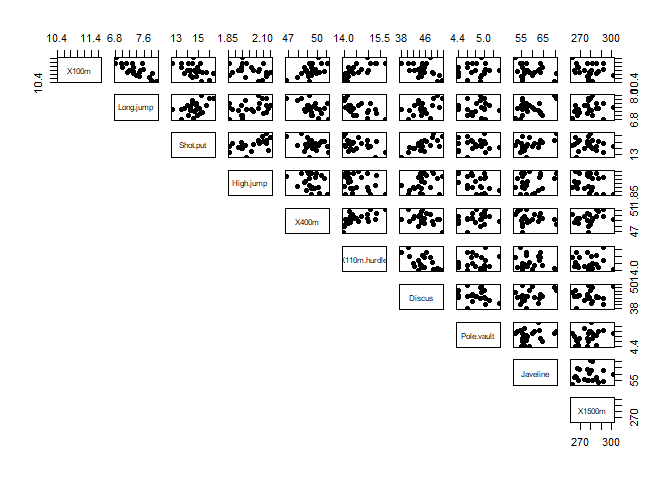
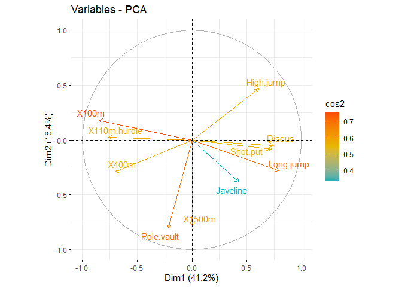
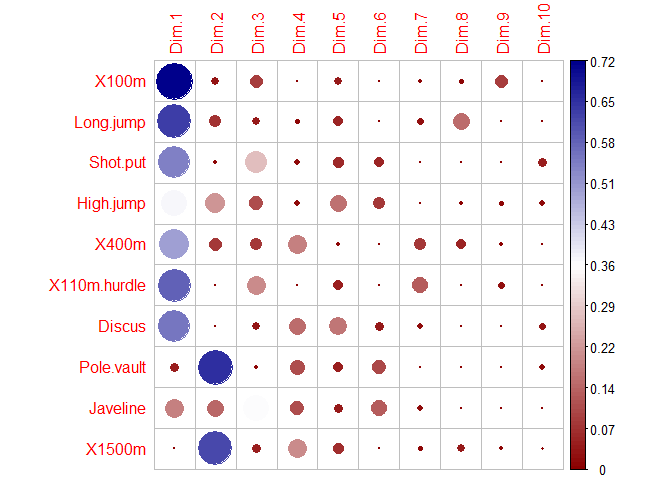
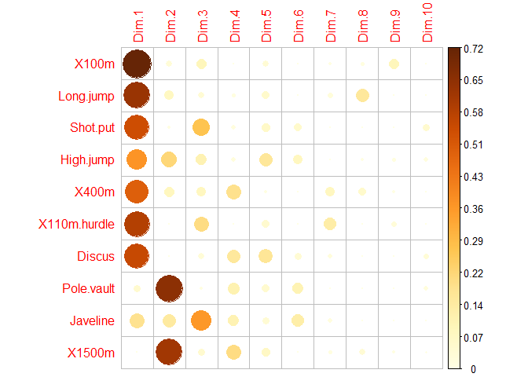
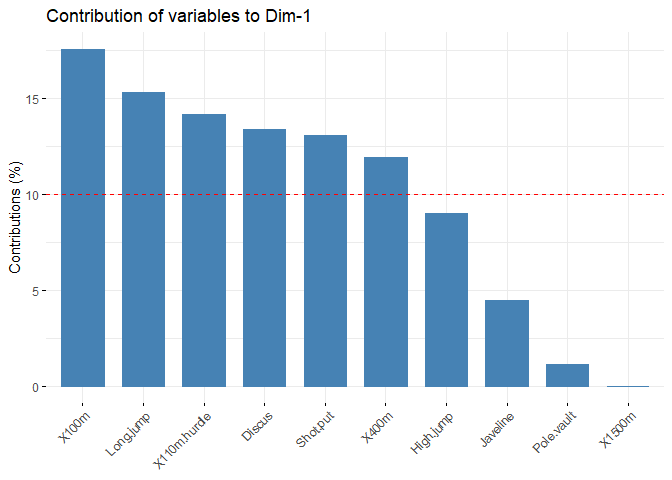
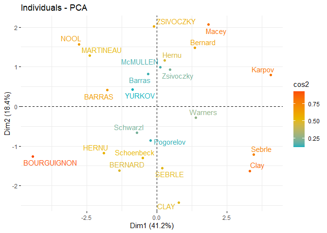
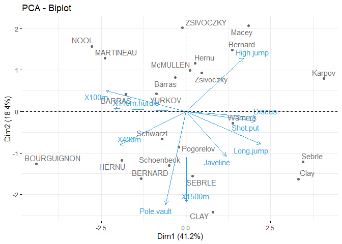
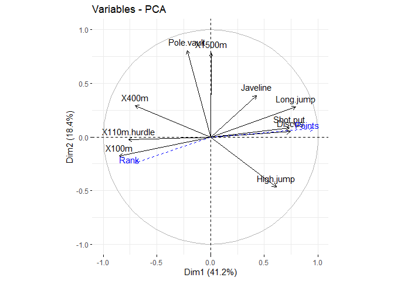

Chapter 5 PCA
================
Oktsa Dwika Rahmashari
2023-10-20

# PRINCIPLE COMPONENTS ANALYSIS (PCA)

PCA is concerned with explaining the variance-covariance structure of a
set of variables through a few linear combinations of these variables.
The objectives of PCA are data reduction and interpretation.

To explain PCA in R, decathlon2 dataset from factoextra will be used.

## Prepare the data or Input Part

### **Install the package for dataset**

Packages for the dataset

``` r
library("ggplot2")
library("factoextra")
```

    ## Warning: package 'factoextra' was built under R version 4.1.3

    ## Welcome! Want to learn more? See two factoextra-related books at https://goo.gl/ve3WBa

### Calling the dataset

``` r
data(decathlon2)
head(decathlon2)
```

    ##           X100m Long.jump Shot.put High.jump X400m X110m.hurdle Discus
    ## SEBRLE    11.04      7.58    14.83      2.07 49.81        14.69  43.75
    ## CLAY      10.76      7.40    14.26      1.86 49.37        14.05  50.72
    ## BERNARD   11.02      7.23    14.25      1.92 48.93        14.99  40.87
    ## YURKOV    11.34      7.09    15.19      2.10 50.42        15.31  46.26
    ## ZSIVOCZKY 11.13      7.30    13.48      2.01 48.62        14.17  45.67
    ## McMULLEN  10.83      7.31    13.76      2.13 49.91        14.38  44.41
    ##           Pole.vault Javeline X1500m Rank Points Competition
    ## SEBRLE          5.02    63.19  291.7    1   8217    Decastar
    ## CLAY            4.92    60.15  301.5    2   8122    Decastar
    ## BERNARD         5.32    62.77  280.1    4   8067    Decastar
    ## YURKOV          4.72    63.44  276.4    5   8036    Decastar
    ## ZSIVOCZKY       4.42    55.37  268.0    7   8004    Decastar
    ## McMULLEN        4.42    56.37  285.1    8   7995    Decastar

### Select the data

- 23 rows because from 27 athlete, there are only 23 active athlete (the
  first 23 data).

- 10 column, because we only apply PCA to the independent variables,
  which are the first 10 column

``` r
data = decathlon2[1:23,1:10] 
head(data[,1:6],4)
```

    ##         X100m Long.jump Shot.put High.jump X400m X110m.hurdle
    ## SEBRLE  11.04      7.58    14.83      2.07 49.81        14.69
    ## CLAY    10.76      7.40    14.26      1.86 49.37        14.05
    ## BERNARD 11.02      7.23    14.25      1.92 48.93        14.99
    ## YURKOV  11.34      7.09    15.19      2.10 50.42        15.31

### Explore the Data.

Check the Correlation

``` r
pairs(data[,1:10], pch = 19, lower.panel = NULL)
```

<!-- -->

To know weather each variable has linear correlation or not is by
drawing a diagonal line from each plot. If we can draw a diagonal line
and the dot is following the line, then the variables have linear
correlation. From the output, it shows that Long.jump and X100m have
negative linear correlation.

## Applying the PCA or Computation Part

To apply PCA, we can use prcomp() with standardization

We already save the data in variable **data**

### Get PC

``` r
res.pca = prcomp(data, scale = TRUE) 
summary(res.pca)
```

    ## Importance of components:
    ##                           PC1    PC2    PC3     PC4     PC5     PC6     PC7
    ## Standard deviation     2.0308 1.3559 1.1132 0.90523 0.83759 0.65029 0.55007
    ## Proportion of Variance 0.4124 0.1839 0.1239 0.08194 0.07016 0.04229 0.03026
    ## Cumulative Proportion  0.4124 0.5963 0.7202 0.80213 0.87229 0.91458 0.94483
    ##                            PC8     PC9   PC10
    ## Standard deviation     0.52390 0.39398 0.3492
    ## Proportion of Variance 0.02745 0.01552 0.0122
    ## Cumulative Proportion  0.97228 0.98780 1.0000

**Explanation:**

Scale = True means use correlation matrix

Scale = False means use covariance matrix

### Get Eigen Vector

Using \$rotation

``` r
eig_vec = res.pca$rotation
eig_vec
```

    ##                       PC1         PC2         PC3         PC4        PC5
    ## X100m        -0.418859080  0.13230683 -0.27089959  0.03708806 -0.2321476
    ## Long.jump     0.391064807 -0.20713320  0.17117519 -0.12746997  0.2783669
    ## Shot.put      0.361388111 -0.06298590 -0.46497777  0.14191803 -0.2970589
    ## High.jump     0.300413236  0.34309742 -0.29652805  0.15968342  0.4807859
    ## X400m        -0.345478567 -0.21400770 -0.25470839  0.47592968  0.1240569
    ## X110m.hurdle -0.376265119  0.01824645 -0.40325254 -0.01866477  0.2676975
    ## Discus        0.365965721 -0.03662510 -0.15857927  0.43636361 -0.4873988
    ## Pole.vault   -0.106985591 -0.59549862 -0.08449563 -0.37447391 -0.2646712
    ## Javeline      0.210864329 -0.28475723 -0.54270782 -0.36646463  0.2361698
    ## X1500m        0.002106782 -0.57855748  0.19715884  0.49491281  0.3142987
    ##                       PC6         PC7         PC8         PC9        PC10
    ## X100m         0.054398099 -0.16604375 -0.19988005 -0.76924639  0.12718339
    ## Long.jump    -0.051865558 -0.28056361 -0.75850657 -0.13094589  0.08509665
    ## Shot.put     -0.368739186 -0.01797323  0.04649571  0.12129309  0.62263702
    ## High.jump    -0.437716883  0.05118848  0.16111045 -0.28463225 -0.38244596
    ## X400m        -0.075796432  0.52012255 -0.44579641  0.20854176 -0.09784197
    ## X110m.hurdle  0.004048005 -0.67276768 -0.01592804  0.41058421 -0.04475363
    ## Discus        0.305315353 -0.25946615 -0.07550934  0.03391600 -0.49418361
    ## Pole.vault   -0.503563524 -0.01889413  0.06282691 -0.06540692 -0.39288155
    ## Javeline      0.556821016  0.24281145  0.10086127 -0.10268134 -0.01103627
    ## X1500m        0.064663250 -0.20245828  0.37119711 -0.25950868  0.17991689

**Example:** Get Eigen Vector from PC1 until PC3

``` r
eig_vec13 = res.pca$rotation[,1:3]
eig_vec13
```

    ##                       PC1         PC2         PC3
    ## X100m        -0.418859080  0.13230683 -0.27089959
    ## Long.jump     0.391064807 -0.20713320  0.17117519
    ## Shot.put      0.361388111 -0.06298590 -0.46497777
    ## High.jump     0.300413236  0.34309742 -0.29652805
    ## X400m        -0.345478567 -0.21400770 -0.25470839
    ## X110m.hurdle -0.376265119  0.01824645 -0.40325254
    ## Discus        0.365965721 -0.03662510 -0.15857927
    ## Pole.vault   -0.106985591 -0.59549862 -0.08449563
    ## Javeline      0.210864329 -0.28475723 -0.54270782
    ## X1500m        0.002106782 -0.57855748  0.19715884

### Get Eigen Value

Using sdev (sqrt eigen value)

``` r
eig_value = (res.pca$sdev)^2
eig_value
```

    ##  [1] 4.1242133 1.8385309 1.2391403 0.8194402 0.7015528 0.4228828 0.3025817
    ##  [8] 0.2744700 0.1552169 0.1219710

**Example:** Eigen value from PC1 to PC3

``` r
eig_value13 = (res.pca$sdev[1:3])^2
eig_value13
```

    ## [1] 4.124213 1.838531 1.239140

or we can use get_eigenvalue

``` r
get_eigenvalue(res.pca)
```

    ##        eigenvalue variance.percent cumulative.variance.percent
    ## Dim.1   4.1242133        41.242133                    41.24213
    ## Dim.2   1.8385309        18.385309                    59.62744
    ## Dim.3   1.2391403        12.391403                    72.01885
    ## Dim.4   0.8194402         8.194402                    80.21325
    ## Dim.5   0.7015528         7.015528                    87.22878
    ## Dim.6   0.4228828         4.228828                    91.45760
    ## Dim.7   0.3025817         3.025817                    94.48342
    ## Dim.8   0.2744700         2.744700                    97.22812
    ## Dim.9   0.1552169         1.552169                    98.78029
    ## Dim.10  0.1219710         1.219710                   100.00000

``` r
sum_eigval = sum((res.pca$sdev)^2) 
sum_eigval
```

    ## [1] 10

Summasion of Eigen Value is 10

### Get Coefficient or Correlation from Variable X and PC (Rho)

**Example: Rho from PC2 and X1**

``` r
eigen21 = res.pca$rotation[1,2] 
lamda2 = (res.pca$sdev[2])^2   
rho = eigen21*sqrt(lamda2) 
rho
```

    ## [1] 0.1793981

or to get all the correlation between each **X** and **PC**, we can use:

``` r
var = get_pca_var(res.pca)
var$cor
```

    ##                     Dim.1       Dim.2       Dim.3       Dim.4      Dim.5
    ## X100m        -0.850625692  0.17939806 -0.30155643  0.03357320 -0.1944440
    ## Long.jump     0.794180641 -0.28085695  0.19054653 -0.11538956  0.2331567
    ## Shot.put      0.733912733 -0.08540412 -0.51759781  0.12846837 -0.2488129
    ## High.jump     0.610083985  0.46521415 -0.33008517  0.14455012  0.4027002
    ## X400m        -0.701603377 -0.29017826 -0.28353292  0.43082552  0.1039085
    ## X110m.hurdle -0.764125197  0.02474081 -0.44888733 -0.01689589  0.2242200
    ## Discus        0.743209016 -0.04966086 -0.17652518  0.39500915 -0.4082391
    ## Pole.vault   -0.217268042 -0.80745110 -0.09405773 -0.33898477 -0.2216853
    ## Javeline      0.428226639 -0.38610928 -0.60412432 -0.33173454  0.1978128
    ## X1500m        0.004278487 -0.78448019  0.21947068  0.44800961  0.2632527
    ##                     Dim.6        Dim.7        Dim.8       Dim.9       Dim.10
    ## X100m         0.035374780 -0.091336386 -0.104716925 -0.30306448  0.044417974
    ## Long.jump    -0.033727883 -0.154330810 -0.397380703 -0.05158951  0.029719453
    ## Shot.put     -0.239789034 -0.009886612  0.024359049  0.04778655  0.217451948
    ## High.jump    -0.284644846  0.028157465  0.084405578 -0.11213822 -0.133566774
    ## X400m        -0.049289996  0.286106008 -0.233552216  0.08216041 -0.034170673
    ## X110m.hurdle  0.002632395 -0.370072158 -0.008344682  0.16176025 -0.015629914
    ## Discus        0.198544870 -0.142725641 -0.039559255  0.01336209 -0.172590426
    ## Pole.vault   -0.327464549 -0.010393176  0.032914942 -0.02576874 -0.137211339
    ## Javeline      0.362097598  0.133564318  0.052841099 -0.04045397 -0.003854347
    ## X1500m        0.042050151 -0.111367083  0.194469730 -0.10224014  0.062834809

## Selecting variable PC

### 1. Using Percentage

``` r
summary(res.pca)
```

    ## Importance of components:
    ##                           PC1    PC2    PC3     PC4     PC5     PC6     PC7
    ## Standard deviation     2.0308 1.3559 1.1132 0.90523 0.83759 0.65029 0.55007
    ## Proportion of Variance 0.4124 0.1839 0.1239 0.08194 0.07016 0.04229 0.03026
    ## Cumulative Proportion  0.4124 0.5963 0.7202 0.80213 0.87229 0.91458 0.94483
    ##                            PC8     PC9   PC10
    ## Standard deviation     0.52390 0.39398 0.3492
    ## Proportion of Variance 0.02745 0.01552 0.0122
    ## Cumulative Proportion  0.97228 0.98780 1.0000

If we want to reduce to 80% variable, we select only 4 pc (look at the
cumukative). Because the cumulative proportion in PC4 is 0.80213 = 80%.

Then transform the data and select only PC1 to PC4

``` r
new_coor = predict(res.pca,new_data = data)
```

    ## Warning: In predict.prcomp(res.pca, new_data = data) :
    ##  extra argument 'new_data' will be disregarded

``` r
new_coor[,1:4]
```

    ##                    PC1        PC2         PC3         PC4
    ## SEBRLE       0.1912074 -1.5541282 -0.62836882  0.08205241
    ## CLAY         0.7901217 -2.4204156  1.35688701  1.26984296
    ## BERNARD     -1.3292592 -1.6118687 -0.19614996 -1.92092203
    ## YURKOV      -0.8694134  0.4328779 -2.47398223  0.69723814
    ## ZSIVOCZKY   -0.1057450  2.0233632  1.30493117 -0.09929630
    ## McMULLEN     0.1185550  0.9916237  0.84355824  1.31215266
    ## MARTINEAU   -2.3923532  1.2849234 -0.89816842  0.37309771
    ## HERNU       -1.8910497 -1.1784614 -0.15641037  0.89130068
    ## BARRAS      -1.7744575  0.4125321  0.65817750  0.22872866
    ## NOOL        -2.7770058  1.5726757  0.60724821 -1.55548081
    ## BOURGUIGNON -4.4137335 -1.2635770 -0.01003734  0.66675478
    ## Sebrle       3.4514485 -1.2169193 -1.67816711 -0.80870696
    ## Clay         3.3162243 -1.6232908 -0.61840443 -0.31679906
    ## Karpov       4.0703560  0.7983510  1.01501662  0.31336354
    ## Macey        1.8484623  2.0638828 -0.97928455  0.58469073
    ## Warners      1.3873514 -0.2819083  1.99969621 -1.01959817
    ## Zsivoczky    0.4715533  0.9267436 -1.72815525 -0.18483138
    ## Hernu        0.2763118  1.1657260  0.17056375 -0.84869401
    ## Bernard      1.3672590  1.4780354  0.83137913  0.74531557
    ## Schwarzl    -0.7102777 -0.6584251  1.04075176 -0.92717510
    ## Pogorelov   -0.2143524 -0.8610557  0.29761010  1.35560294
    ## Schoenbeck  -0.4953166 -1.3000530  0.10300360 -0.24927712
    ## Barras      -0.3158867  0.8193681 -0.86169481 -0.58935985

### 2. Select PCA with eigenvalue \> mean of all eigenvalue

- Calculate the average of Eigen Value

``` r
avg=mean((res.pca$sdev)^2) 
avg
```

    ## [1] 1

or we can use this way:

``` r
res_eig = get_eigenvalue(res.pca)
mean(res_eig$eigenvalue)
```

    ## [1] 1

If we use scale = TRUE, the average of eigen value will always 1 and the
total variance is equal to the number of variable

``` r
res_eig
```

    ##        eigenvalue variance.percent cumulative.variance.percent
    ## Dim.1   4.1242133        41.242133                    41.24213
    ## Dim.2   1.8385309        18.385309                    59.62744
    ## Dim.3   1.2391403        12.391403                    72.01885
    ## Dim.4   0.8194402         8.194402                    80.21325
    ## Dim.5   0.7015528         7.015528                    87.22878
    ## Dim.6   0.4228828         4.228828                    91.45760
    ## Dim.7   0.3025817         3.025817                    94.48342
    ## Dim.8   0.2744700         2.744700                    97.22812
    ## Dim.9   0.1552169         1.552169                    98.78029
    ## Dim.10  0.1219710         1.219710                   100.00000

Since the eigen value of PC 1,2,3 \> mean of eigen value =1, then we use
PC1, PC2, and PC3.

Then Transform the data

``` r
new_coor1 = predict(res.pca,new_data = data)
```

    ## Warning: In predict.prcomp(res.pca, new_data = data) :
    ##  extra argument 'new_data' will be disregarded

``` r
new_coor1[,1:3]
```

    ##                    PC1        PC2         PC3
    ## SEBRLE       0.1912074 -1.5541282 -0.62836882
    ## CLAY         0.7901217 -2.4204156  1.35688701
    ## BERNARD     -1.3292592 -1.6118687 -0.19614996
    ## YURKOV      -0.8694134  0.4328779 -2.47398223
    ## ZSIVOCZKY   -0.1057450  2.0233632  1.30493117
    ## McMULLEN     0.1185550  0.9916237  0.84355824
    ## MARTINEAU   -2.3923532  1.2849234 -0.89816842
    ## HERNU       -1.8910497 -1.1784614 -0.15641037
    ## BARRAS      -1.7744575  0.4125321  0.65817750
    ## NOOL        -2.7770058  1.5726757  0.60724821
    ## BOURGUIGNON -4.4137335 -1.2635770 -0.01003734
    ## Sebrle       3.4514485 -1.2169193 -1.67816711
    ## Clay         3.3162243 -1.6232908 -0.61840443
    ## Karpov       4.0703560  0.7983510  1.01501662
    ## Macey        1.8484623  2.0638828 -0.97928455
    ## Warners      1.3873514 -0.2819083  1.99969621
    ## Zsivoczky    0.4715533  0.9267436 -1.72815525
    ## Hernu        0.2763118  1.1657260  0.17056375
    ## Bernard      1.3672590  1.4780354  0.83137913
    ## Schwarzl    -0.7102777 -0.6584251  1.04075176
    ## Pogorelov   -0.2143524 -0.8610557  0.29761010
    ## Schoenbeck  -0.4953166 -1.3000530  0.10300360
    ## Barras      -0.3158867  0.8193681 -0.86169481

## Graph of Variable

``` r
var = get_pca_var(res.pca)
var
```

    ## Principal Component Analysis Results for variables
    ##  ===================================================
    ##   Name       Description                                    
    ## 1 "$coord"   "Coordinates for the variables"                
    ## 2 "$cor"     "Correlations between variables and dimensions"
    ## 3 "$cos2"    "Cos2 for the variables"                       
    ## 4 "$contrib" "contributions of the variables"

To perform the ***coordinates*** of the variables or the
***correlation*** between the PCA and original data

``` r
var$coord
```

    ##                     Dim.1       Dim.2       Dim.3       Dim.4      Dim.5
    ## X100m        -0.850625692  0.17939806 -0.30155643  0.03357320 -0.1944440
    ## Long.jump     0.794180641 -0.28085695  0.19054653 -0.11538956  0.2331567
    ## Shot.put      0.733912733 -0.08540412 -0.51759781  0.12846837 -0.2488129
    ## High.jump     0.610083985  0.46521415 -0.33008517  0.14455012  0.4027002
    ## X400m        -0.701603377 -0.29017826 -0.28353292  0.43082552  0.1039085
    ## X110m.hurdle -0.764125197  0.02474081 -0.44888733 -0.01689589  0.2242200
    ## Discus        0.743209016 -0.04966086 -0.17652518  0.39500915 -0.4082391
    ## Pole.vault   -0.217268042 -0.80745110 -0.09405773 -0.33898477 -0.2216853
    ## Javeline      0.428226639 -0.38610928 -0.60412432 -0.33173454  0.1978128
    ## X1500m        0.004278487 -0.78448019  0.21947068  0.44800961  0.2632527
    ##                     Dim.6        Dim.7        Dim.8       Dim.9       Dim.10
    ## X100m         0.035374780 -0.091336386 -0.104716925 -0.30306448  0.044417974
    ## Long.jump    -0.033727883 -0.154330810 -0.397380703 -0.05158951  0.029719453
    ## Shot.put     -0.239789034 -0.009886612  0.024359049  0.04778655  0.217451948
    ## High.jump    -0.284644846  0.028157465  0.084405578 -0.11213822 -0.133566774
    ## X400m        -0.049289996  0.286106008 -0.233552216  0.08216041 -0.034170673
    ## X110m.hurdle  0.002632395 -0.370072158 -0.008344682  0.16176025 -0.015629914
    ## Discus        0.198544870 -0.142725641 -0.039559255  0.01336209 -0.172590426
    ## Pole.vault   -0.327464549 -0.010393176  0.032914942 -0.02576874 -0.137211339
    ## Javeline      0.362097598  0.133564318  0.052841099 -0.04045397 -0.003854347
    ## X1500m        0.042050151 -0.111367083  0.194469730 -0.10224014  0.062834809

If the value is negative, it means that the correlation between original
variable and the PC is opposite.

Try Calculate the correlation between PC1 and X100m

``` r
rho11 = res.pca$rotation[1,1]*sqrt(res_eig$eigenvalue[1])
rho11
```

    ## [1] -0.8506257

or we can use:

``` r
var$coord[1,1]
```

    ## [1] -0.8506257

Try Calculate the correlation between PC1 and Long Jump

``` r
rho12 = res.pca$rotation[2,1]*sqrt(res_eig$eigenvalue[1]) 
rho12
```

    ## [1] 0.7941806

``` r
var$coord[2,1]
```

    ## [1] 0.7941806

- Try to calculate the cos2 = squared of coord

``` r
var$cos2
```

    ##                     Dim.1        Dim.2       Dim.3        Dim.4      Dim.5
    ## X100m        7.235641e-01 0.0321836641 0.090936280 0.0011271597 0.03780845
    ## Long.jump    6.307229e-01 0.0788806285 0.036307981 0.0133147506 0.05436203
    ## Shot.put     5.386279e-01 0.0072938636 0.267907488 0.0165041211 0.06190783
    ## High.jump    3.722025e-01 0.2164242070 0.108956221 0.0208947375 0.16216747
    ## X400m        4.922473e-01 0.0842034209 0.080390914 0.1856106269 0.01079698
    ## X110m.hurdle 5.838873e-01 0.0006121077 0.201499837 0.0002854712 0.05027463
    ## Discus       5.523596e-01 0.0024662013 0.031161138 0.1560322304 0.16665918
    ## Pole.vault   4.720540e-02 0.6519772763 0.008846856 0.1149106765 0.04914437
    ## Javeline     1.833781e-01 0.1490803723 0.364966189 0.1100478063 0.03912992
    ## X1500m       1.830545e-05 0.6154091638 0.048167378 0.2007126089 0.06930197
    ##                     Dim.6        Dim.7        Dim.8        Dim.9       Dim.10
    ## X100m        1.251375e-03 0.0083423353 1.096563e-02 0.0918480768 1.972956e-03
    ## Long.jump    1.137570e-03 0.0238179990 1.579114e-01 0.0026614779 8.832459e-04
    ## Shot.put     5.749878e-02 0.0000977451 5.933633e-04 0.0022835540 4.728535e-02
    ## High.jump    8.102269e-02 0.0007928428 7.124302e-03 0.0125749811 1.784008e-02
    ## X400m        2.429504e-03 0.0818566479 5.454664e-02 0.0067503333 1.167635e-03
    ## X110m.hurdle 6.929502e-06 0.1369534023 6.963371e-05 0.0261663784 2.442942e-04
    ## Discus       3.942007e-02 0.0203706085 1.564935e-03 0.0001785453 2.978746e-02
    ## Pole.vault   1.072330e-01 0.0001080181 1.083393e-03 0.0006640282 1.882695e-02
    ## Javeline     1.311147e-01 0.0178394271 2.792182e-03 0.0016365234 1.485599e-05
    ## X1500m       1.768215e-03 0.0124026272 3.781848e-02 0.0104530472 3.948213e-03

### Correlation Circle

``` r
fviz_pca_var(res.pca,col.var = "black")
```

<!-- -->

Add color based on the value of cos2

``` r
fviz_pca_var(res.pca,col.var = "cos2",              
             gradient.cols = c("#00AFBB","#E7B800","#FC4E07"),             
             repel = TRUE #avoid text overlapping             
)
```

<!-- -->

The color indicates the value of correlation, orange means the variable
is perfectly represented by the PCs because the cos2 is high, blue means
the variable is not perfectly represented by the PCs because the cos2 is
low.

### Correlation Plot

``` r
library("corrplot") 
```

    ## Warning: package 'corrplot' was built under R version 4.1.3

    ## corrplot 0.92 loaded

``` r
corrplot(var$cos2, is.corr = FALSE, col = colorRampPalette(c("darkred","white","darkblue"))(100))
```

<!-- -->

``` r
corrplot(var$cos2, is.corr = FALSE)
```

<!-- -->

### Check Contribution of Variables

``` r
var$contrib
```

    ##                     Dim.1      Dim.2      Dim.3       Dim.4     Dim.5
    ## X100m        1.754429e+01  1.7505098  7.3386590  0.13755240  5.389252
    ## Long.jump    1.529317e+01  4.2904162  2.9300944  1.62485936  7.748815
    ## Shot.put     1.306014e+01  0.3967224 21.6204325  2.01407269  8.824401
    ## High.jump    9.024811e+00 11.7715838  8.7928883  2.54987951 23.115504
    ## X400m        1.193554e+01  4.5799296  6.4876363 22.65090599  1.539012
    ## X110m.hurdle 1.415754e+01  0.0332933 16.2612611  0.03483735  7.166193
    ## Discus       1.339309e+01  0.1341398  2.5147385 19.04132022 23.755756
    ## Pole.vault   1.144592e+00 35.4618611  0.7139512 14.02307063  7.005084
    ## Javeline     4.446377e+00  8.1086683 29.4531777 13.42963254  5.577615
    ## X1500m       4.438531e-04 33.4728757  3.8871610 24.49386930  9.878367
    ##                     Dim.6       Dim.7       Dim.8      Dim.9      Dim.10
    ## X100m         0.295915322  2.75705260  3.99520353 59.1740009  1.61756139
    ## Long.jump     0.269003613  7.87159392 57.53322220  1.7146826  0.72414393
    ## Shot.put     13.596858744  0.03230371  0.21618512  1.4712015 38.76768578
    ## High.jump    19.159607001  0.26202607  2.59565787  8.1015517 14.62649091
    ## X400m         0.574509906 27.05274658 19.87344405  4.3489667  0.95730504
    ## X110m.hurdle  0.001638634 45.26163460  0.02537025 16.8579392  0.20028870
    ## Discus        9.321746508  6.73226823  0.57016606  0.1150295 24.42174410
    ## Pole.vault   25.357622290  0.03569883  0.39472201  0.4278065 15.43559151
    ## Javeline     31.004964393  5.89573984  1.01729950  1.0543458  0.01217993
    ## X1500m        0.418133591  4.09893563 13.77872941  6.7344755  3.23700871

**Example: Check contribution of variables to PC1**

``` r
fviz_contrib(res.pca, choice = "var", axes = 1, top = 10)
```

<!-- -->

## Graph of Individuals

``` r
ind = get_pca_ind(res.pca) 
ind
```

    ## Principal Component Analysis Results for individuals
    ##  ===================================================
    ##   Name       Description                       
    ## 1 "$coord"   "Coordinates for the individuals" 
    ## 2 "$cos2"    "Cos2 for the individuals"        
    ## 3 "$contrib" "contributions of the individuals"

``` r
fviz_pca_ind(res.pca,col.ind = "cos2",           
             gradient.cols = c("#00AFBB","#E7B800","#FC4E07"),      
             repel = TRUE #avoid text overlapping          
             )
```

<!-- -->

``` r
head(ind$coord)
```

    ##                Dim.1      Dim.2      Dim.3       Dim.4       Dim.5      Dim.6
    ## SEBRLE     0.1912074 -1.5541282 -0.6283688  0.08205241  1.14261394 -0.4638976
    ## CLAY       0.7901217 -2.4204156  1.3568870  1.26984296 -0.80684837  1.3042002
    ## BERNARD   -1.3292592 -1.6118687 -0.1961500 -1.92092203  0.08234282 -0.4006287
    ## YURKOV    -0.8694134  0.4328779 -2.4739822  0.69723814  0.39885841  0.1028634
    ## ZSIVOCZKY -0.1057450  2.0233632  1.3049312 -0.09929630 -0.19702411  0.8955411
    ## McMULLEN   0.1185550  0.9916237  0.8435582  1.31215266  1.58587086  0.1865728
    ##                 Dim.7       Dim.8       Dim.9      Dim.10
    ## SEBRLE    -0.20796012  0.04346057 -0.65934414  0.03273238
    ## CLAY      -0.21291866  0.61724061 -0.06012536 -0.31716015
    ## BERNARD   -0.40643754  0.70385604  0.17008331 -0.09908142
    ## YURKOV    -0.32487448  0.11499613 -0.10952404 -0.11969720
    ## ZSIVOCZKY  0.08825624 -0.20234130 -0.52310310 -0.34842265
    ## McMULLEN   0.47828432  0.29308997 -0.10562320 -0.39317797

``` r
res.pca$x
```

    ##                    PC1        PC2         PC3         PC4           PC5
    ## SEBRLE       0.1912074 -1.5541282 -0.62836882  0.08205241  1.1426139415
    ## CLAY         0.7901217 -2.4204156  1.35688701  1.26984296 -0.8068483724
    ## BERNARD     -1.3292592 -1.6118687 -0.19614996 -1.92092203  0.0823428202
    ## YURKOV      -0.8694134  0.4328779 -2.47398223  0.69723814  0.3988584116
    ## ZSIVOCZKY   -0.1057450  2.0233632  1.30493117 -0.09929630 -0.1970241089
    ## McMULLEN     0.1185550  0.9916237  0.84355824  1.31215266  1.5858708644
    ## MARTINEAU   -2.3923532  1.2849234 -0.89816842  0.37309771 -2.2433515889
    ## HERNU       -1.8910497 -1.1784614 -0.15641037  0.89130068 -0.1267412520
    ## BARRAS      -1.7744575  0.4125321  0.65817750  0.22872866 -0.2338366980
    ## NOOL        -2.7770058  1.5726757  0.60724821 -1.55548081  1.4241839810
    ## BOURGUIGNON -4.4137335 -1.2635770 -0.01003734  0.66675478  0.4191518468
    ## Sebrle       3.4514485 -1.2169193 -1.67816711 -0.80870696 -0.0250530746
    ## Clay         3.3162243 -1.6232908 -0.61840443 -0.31679906  0.5691645854
    ## Karpov       4.0703560  0.7983510  1.01501662  0.31336354 -0.7974259553
    ## Macey        1.8484623  2.0638828 -0.97928455  0.58469073 -0.0002157834
    ## Warners      1.3873514 -0.2819083  1.99969621 -1.01959817 -0.0405401497
    ## Zsivoczky    0.4715533  0.9267436 -1.72815525 -0.18483138  0.4073029909
    ## Hernu        0.2763118  1.1657260  0.17056375 -0.84869401 -0.6894795441
    ## Bernard      1.3672590  1.4780354  0.83137913  0.74531557  0.8598016482
    ## Schwarzl    -0.7102777 -0.6584251  1.04075176 -0.92717510 -0.2887568007
    ## Pogorelov   -0.2143524 -0.8610557  0.29761010  1.35560294 -0.0150531057
    ## Schoenbeck  -0.4953166 -1.3000530  0.10300360 -0.24927712 -0.6452257128
    ## Barras      -0.3158867  0.8193681 -0.86169481 -0.58935985 -0.7797389436
    ##                     PC6         PC7          PC8          PC9        PC10
    ## SEBRLE      -0.46389755 -0.20796012  0.043460568 -0.659344137  0.03273238
    ## CLAY         1.30420016 -0.21291866  0.617240611 -0.060125359 -0.31716015
    ## BERNARD     -0.40062867 -0.40643754  0.703856040  0.170083313 -0.09908142
    ## YURKOV       0.10286344 -0.32487448  0.114996135 -0.109524039 -0.11969720
    ## ZSIVOCZKY    0.89554111  0.08825624 -0.202341299 -0.523103099 -0.34842265
    ## McMULLEN     0.18657283  0.47828432  0.293089967 -0.105623196 -0.39317797
    ## MARTINEAU   -0.45666350 -0.29975522 -0.291628488 -0.223417655 -0.61640509
    ## HERNU        0.43623496 -0.56609980 -1.529404317  0.006184409  0.55368016
    ## BARRAS       0.09026010  0.21594095  0.682583078 -0.669282042  0.53085420
    ## NOOL         0.49716399 -0.53205687 -0.433385655 -0.115777808 -0.09622142
    ## BOURGUIGNON -0.08200220 -0.59833739  0.563619921  0.525814030  0.05855882
    ## Sebrle      -0.08279306  0.01016177 -0.030585843 -0.847210682  0.21970353
    ## Clay         0.77715960  0.25750851 -0.580638301  0.409776590 -0.61601933
    ## Karpov      -0.32958134 -1.36365568  0.345306381  0.193055107  0.21721852
    ## Macey       -0.19728082 -0.26927772 -0.363219506  0.368260269  0.21249474
    ## Warners     -0.55673300 -0.26739400 -0.109470797  0.180283071  0.24208420
    ## Zsivoczky   -0.11383190  0.03991159  0.538039776  0.585966156 -0.14271715
    ## Hernu       -0.33168404  0.44308686  0.247293566  0.066908586 -0.20868256
    ## Bernard     -0.32806564  0.36357920  0.006165316  0.279488675  0.32067773
    ## Schwarzl    -0.68891640  0.56568604 -0.687053339 -0.008358849 -0.30211546
    ## Pogorelov   -1.59379599  0.78370119 -0.037623661 -0.130531397 -0.03697576
    ## Schoenbeck   0.16172381  0.85752368 -0.255850722  0.564222295  0.29680481
    ## Barras       1.17415412  0.94512710  0.365550568  0.102255763  0.61186706

## Graph Variable and Individuals

``` r
fviz_pca_biplot(res.pca, repel = TRUE, col.var = "#2E9FDF" , col.ind = "#696969")
```

<!-- -->

## Transform the new data by PCA

``` r
ind.sup = decathlon2[24:27,1:10] 
ind.sup.cord = predict(res.pca, newdata = ind.sup) 
ind.sup.cord
```

    ##                PC1         PC2       PC3        PC4         PC5        PC6
    ## KARPOV   0.7772521 -0.76237804 1.5971253  1.6863286 -0.73420295 -0.8764709
    ## WARNERS -0.3779697  0.11891968 1.7005146 -0.6908084 -0.03159013 -1.1580162
    ## Nool    -0.5468405 -1.93402211 0.4724184 -2.2283706 -0.24901831 -0.5459418
    ## Drews   -1.0848227 -0.01703198 2.9818031 -1.5006207 -0.31924693 -0.4645028
    ##                PC7         PC8         PC9       PC10
    ## KARPOV  -1.0746432  1.24674643 -1.09172761 -0.2155002
    ## WARNERS -0.3181706 -0.41754716 -0.69099653  0.5251023
    ## Nool    -0.4656852 -0.05883861  0.65860586 -0.2815011
    ## Drews    0.3406706  0.01529952 -0.01678235 -0.1657992

## Supplementary Elements

to handle qualitative data

**Install Package**

``` r
library("FactoMineR")
```

    ## Warning: package 'FactoMineR' was built under R version 4.1.3

### Computation Part

``` r
res.pca2 = PCA(decathlon2,ind.sup = 24:27, quanti.sup = 11:12, quali.sup = 13, graph = FALSE)
```

**Quantitative data**

``` r
res.pca2$quanti.sup
```

    ## $coord
    ##             Dim.1       Dim.2      Dim.3       Dim.4       Dim.5
    ## Rank   -0.7014777 -0.24519443 -0.1834294  0.05575186 -0.07382647
    ## Points  0.9637075  0.07768262  0.1580225 -0.16623092 -0.03114711
    ## 
    ## $cor
    ##             Dim.1       Dim.2      Dim.3       Dim.4       Dim.5
    ## Rank   -0.7014777 -0.24519443 -0.1834294  0.05575186 -0.07382647
    ## Points  0.9637075  0.07768262  0.1580225 -0.16623092 -0.03114711
    ## 
    ## $cos2
    ##            Dim.1       Dim.2      Dim.3      Dim.4        Dim.5
    ## Rank   0.4920710 0.060120310 0.03364635 0.00310827 0.0054503477
    ## Points 0.9287322 0.006034589 0.02497110 0.02763272 0.0009701427

**Qualitative Data**

``` r
res.pca2$quali.sup
```

    ## $coord
    ##              Dim.1      Dim.2       Dim.3      Dim.4      Dim.5
    ## Decastar -1.343451  0.1218097 -0.03789524  0.1808357  0.1343364
    ## OlympicG  1.231497 -0.1116589  0.03473730 -0.1657661 -0.1231417
    ## 
    ## $cos2
    ##              Dim.1       Dim.2        Dim.3      Dim.4       Dim.5
    ## Decastar 0.9051233 0.007440939 0.0007201669 0.01639956 0.009050062
    ## OlympicG 0.9051233 0.007440939 0.0007201669 0.01639956 0.009050062
    ## 
    ## $v.test
    ##              Dim.1      Dim.2      Dim.3      Dim.4      Dim.5
    ## Decastar -2.970766  0.4034256 -0.1528767  0.8971036  0.7202457
    ## OlympicG  2.970766 -0.4034256  0.1528767 -0.8971036 -0.7202457
    ## 
    ## $dist
    ## Decastar OlympicG 
    ## 1.412108 1.294433 
    ## 
    ## $eta2
    ##                 Dim.1      Dim.2       Dim.3      Dim.4      Dim.5
    ## Competition 0.4011568 0.00739783 0.001062332 0.03658159 0.02357972

**Visualize All Variables**

``` r
fviz_pca_var(res.pca2)
```

<!-- -->

**Individual Supplementary**

``` r
res.pca2$ind.sup
```

    ## $coord
    ##              Dim.1       Dim.2      Dim.3      Dim.4       Dim.5
    ## KARPOV   0.7947206  0.77951227 -1.6330203  1.7242283 -0.75070396
    ## WARNERS -0.3864645 -0.12159237 -1.7387332 -0.7063341 -0.03230011
    ## Nool    -0.5591306  1.97748871 -0.4830358 -2.2784526 -0.25461493
    ## Drews   -1.1092038  0.01741477 -3.0488182 -1.5343468 -0.32642192
    ## 
    ## $cos2
    ##              Dim.1        Dim.2      Dim.3      Dim.4        Dim.5
    ## KARPOV  0.05104677 4.911173e-02 0.21553730 0.24028620 0.0455487744
    ## WARNERS 0.02422707 2.398250e-03 0.49039677 0.08092862 0.0001692349
    ## Nool    0.02897149 3.623868e-01 0.02162236 0.48108780 0.0060077529
    ## Drews   0.09207094 2.269527e-05 0.69560547 0.17617609 0.0079736753
    ## 
    ## $dist
    ##   KARPOV  WARNERS     Nool    Drews 
    ## 3.517470 2.482899 3.284943 3.655527

## EXAMPLE 8.1:

I. Set up the matrix

``` r
S = matrix(c(1,-2,0,-2,5,0,0,0,2),3,3) 
S
```

    ##      [,1] [,2] [,3]
    ## [1,]    1   -2    0
    ## [2,]   -2    5    0
    ## [3,]    0    0    2

2.  Find the Eigen Value

``` r
res = eigen(S) 
res
```

    ## eigen() decomposition
    ## $values
    ## [1] 5.8284271 2.0000000 0.1715729
    ## 
    ## $vectors
    ##            [,1] [,2]      [,3]
    ## [1,] -0.3826834    0 0.9238795
    ## [2,]  0.9238795    0 0.3826834
    ## [3,]  0.0000000    1 0.0000000

``` r
Eig_val = res$values 
Eig_val
```

    ## [1] 5.8284271 2.0000000 0.1715729

3.  Find the Eigen Vectors

``` r
Eig_vec = res$vectors 
Eig_vec
```

    ##            [,1] [,2]      [,3]
    ## [1,] -0.3826834    0 0.9238795
    ## [2,]  0.9238795    0 0.3826834
    ## [3,]  0.0000000    1 0.0000000

4.  Calculate PCA

    Let x = \[x1 x2 x3\]T

<!-- -->

    x = matrix(c(x1,x2,x3),3,1)
    x

1.  PCA 1

    PC1 = e1^t(x) = 0.383x1 - 0.924x2 + 0

<!-- -->

    PC1 = e1%*%t(x)

2.  PCA 2

    PC2 = e2^t(X) = 0 + 0 + 1x3

<!-- -->

    PC2 = e2%*%t(x)

3.  PCA 3

    PC3 = e3^t(X) = 0.924x1 + 0.383x2 + 0

<!-- -->

    PC3 = e3%*%t(x)

Example : Let x = \[1,2,3\], the PCA is

``` r
x = matrix(c(1,2,3),3,1)
paste('matrix x is')
```

    ## [1] "matrix x is"

``` r
x
```

    ##      [,1]
    ## [1,]    1
    ## [2,]    2
    ## [3,]    3

``` r
e1 = Eig_vec[,1]
paste('The value of e1 is')
```

    ## [1] "The value of e1 is"

``` r
e1
```

    ## [1] -0.3826834  0.9238795  0.0000000

``` r
e2 = Eig_vec[,2]
paste('The value of e2 is')
```

    ## [1] "The value of e2 is"

``` r
e2
```

    ## [1] 0 0 1

``` r
e3 = Eig_vec[,3]
paste('The value of e3 is')
```

    ## [1] "The value of e3 is"

``` r
e3
```

    ## [1] 0.9238795 0.3826834 0.0000000

``` r
PC1 = e1%*%x
paste('The value of PC1 is')
```

    ## [1] "The value of PC1 is"

``` r
PC1
```

    ##          [,1]
    ## [1,] 1.465076

``` r
PC2 = e2%*%x
paste('The value of PC2 is')
```

    ## [1] "The value of PC2 is"

``` r
PC2
```

    ##      [,1]
    ## [1,]    3

``` r
PC3 = e3%*%x
paste('The value of PC3 is')
```

    ## [1] "The value of PC3 is"

``` r
PC3
```

    ##          [,1]
    ## [1,] 1.689246

So, for x = \[1,2,3\] in PC space is PC \[1.465076,3,1.689246\]

V. Compute the proportion of each PC

1.  PC1

``` r
Eig_val[1] 
```

    ## [1] 5.828427

``` r
prop1 = Eig_val[1]/sum(Eig_val) 
prop1
```

    ## [1] 0.7285534

2.  PC2

``` r
Eig_val[2] 
```

    ## [1] 2

``` r
prop2 = Eig_val[2]/sum(Eig_val) 
prop2
```

    ## [1] 0.25

3.  PC3

``` r
Eig_val[3] 
```

    ## [1] 0.1715729

``` r
prop3 = Eig_val[3]/sum(Eig_val) 
prop3
```

    ## [1] 0.02144661
